感谢该文出了ANGR的入门文章

> https://bluesadi.github.io/0x401RevTrain-Tools/angr/00_%E7%AC%A6%E5%8F%B7%E6%89%A7%E8%A1%8C%E5%8E%9F%E7%90%86/


# 符号执行原理

通常状态来讲，当我们运行一个程序输入，程序所执行的路径是唯一的

```C
int main(){
    x = input();
    y = input();
    z = 2 * y;
    if(x == z){
        if(x > y + 10){
            print("Path-1");
        }else{
            print("Path-2");
        }
    }else{
        print("Path-3");
    }
}
```


## **概念一 符号状态σ（*Symbolic State*）**

```
x = input();
y = input();
```

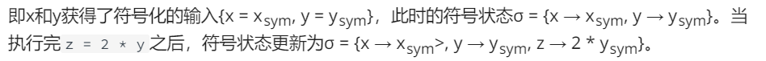


## **概念二 路径约束*（Path Constraint）*，简称PC**


符号执行需要为每一条路径维护一个符号状态σ和一个路径约束PC


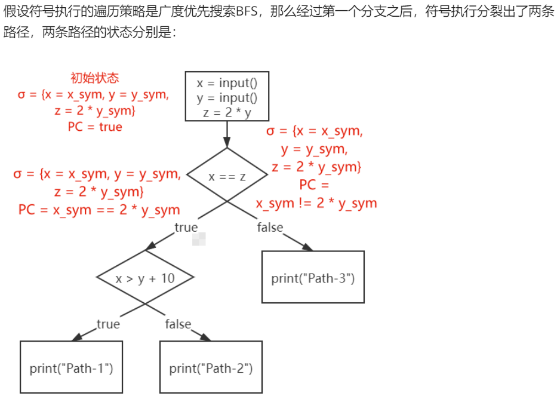

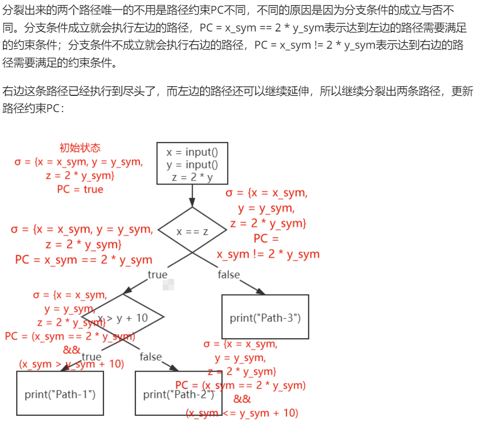

所以该程序执行到最后有3个状态，对应3条不同的路径

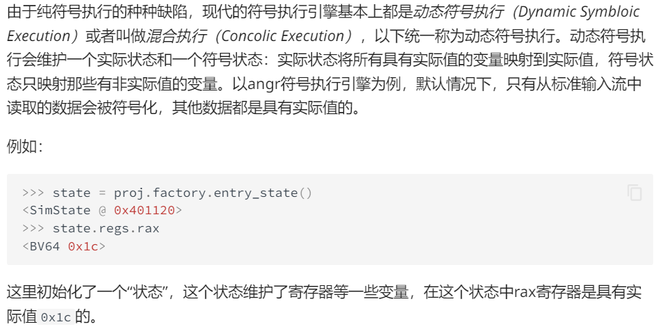


# ANGR 入门

## 加载二进制文件

加载一个二进制文件

```python
>>> import angr
>>> proj = angr.Project('example-1')
```

获取二进制文件的属性

```python
>>> proj.arch
<Arch AMD64 (LE)>
>>> proj.entry
4198688
>>> proj.filename
'example-1'
```


## 符号执行状态——SimStae

符号执行过程中要为每条路径维护一个符号状态σ和路径约束PC，对应angr中的SimState类

```python
>>> state = proj.factory.entry_state()
<SimState @ 0x401120>
```

**angr中的许多类都需要factory获得**，entry_state函数用来获取入口点的状态，也就是初始状态

同样可以查看属性

```python
>>> state.regs.rip
<BV64 0x401120>
>>> state.regs.rax
<BV64 0x1c>
>>> state.mem[proj.entry].int.resolved
<BV32 0xfa1e0ff3>
```

**在angr中，不论是具体值还是符号量都有相同的类型--claripy.ast.bv.BV，也就是BitVector的意思，BV后面的数字代表比特向量的位数**（符号化自己想要的值就是用这个！！）

BV可以通过claripy这个模块创建：

```python
>>> claripy.BVV(666, 32)        # 创建一个32位的有具体值的BV
<BV32 0x29a>
>>> claripy.BVS('sym_var', 32)  # 创建一个32位的符号值BV
<BV32 sym_var_97_32>
```

## 符号执行引擎——Simulation Managers

有了初始状态就可以符号执行，要符号执行得先创建一个符号执行引擎

```python
>>> simgr = proj.factory.simulation_manager(state)
<SimulationManager with 1 active>
```


注意自己编译的文件可能是ASLR的关系，设置地址不大行（现在刚学不知道如何写

```python

import claripy
import angr

proj = angr.Project('example-1')                
sym_flag = claripy.BVS('flag', 100 * 8)    

state = proj.factory.entry_state(stdin=sym_flag)
simgr = proj.factory.simgr(state)

simgr.explore(find=lambda s: b"Right" in s.posix.dumps(1))

s = simgr.found[0]
print(s.posix.dumps(1))

flag = s.posix.dumps(0)
print(flag)
```


# ANGR_explore

## 00_angr_find


拿官网的编译好的题目即可设置地址也行，地址就设置打印要打印right的其中一条汇编地址即可

```python
import angr

proj = angr.Project('00_angr_find')                  

state = proj.factory.entry_state()
simgr = proj.factory.simgr(state)

simgr.explore(find=0x804868F)
print(simgr.found[0].posix.dumps(0))
```


## 01_angr_avoid

该文件有非常多的分支，查看关键代码，其实should_succed不能被设置为0

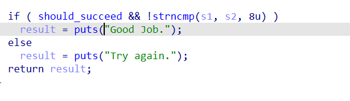

从引用中可以看到，该函数要把should_succeed设置为0，所以explore有个参数是avoid，设置该地址即可

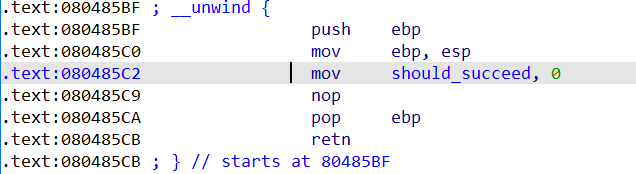

（不设置也没事，就是慢了点）

```python
import angr

proj = angr.Project('01_angr_avoid')                

state = proj.factory.entry_state()
simgr = proj.factory.simgr(state)

simgr.explore(find=0x80485F7, avoid=0x80485C2)
print(simgr.found[0].posix.dumps(0))
```


## 02_angr_find_condition

该题有大量混淆，不能确定哪个是真的right（其实F5后再TAB关键代表就可）如果找不到正确的地址angr就G了，所以除了find地址还有种办法

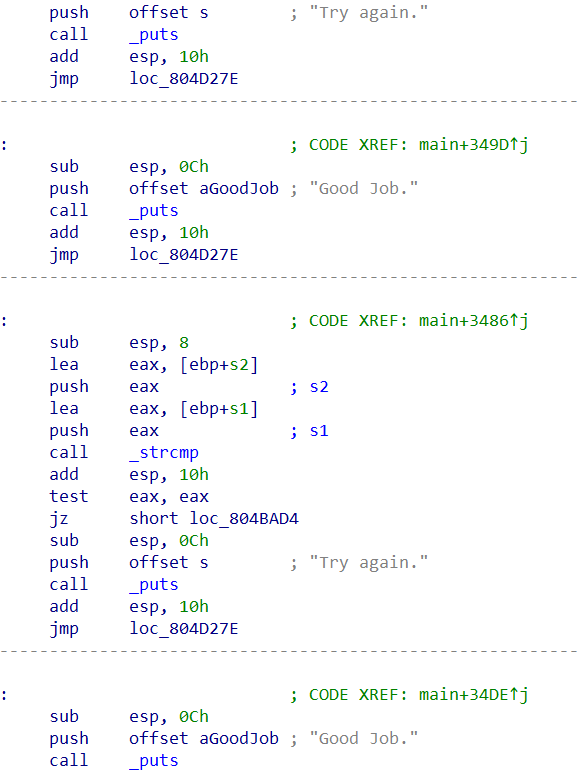

于是一种方法就是看字符串

```python
import angr

proj = angr.Project('02_angr_find_condition')                

state = proj.factory.entry_state()
simgr = proj.factory.simgr(state)

simgr.explore(
    find=lambda state: b'Good Job.' in state.posix.dumps(1),
    avoid=lambda state: b'Try again.' in state.posix.dumps(1))
print(simgr.found[0].posix.dumps(0))
```


# ANGR_symbolic

angr在默认状态下只会符号化从 **标准输入流** 中读取的数据，而实际情况下需要我们符号化其他数据，寄存器、某块内存，甚至还可以文件。

## 03_angr_symbolic_registers

那么该题要构造我们的输入，我们的输入为三次，进入不同的加密

分别存放到了eax ebx 与 edx，所以符号化这三个寄存器

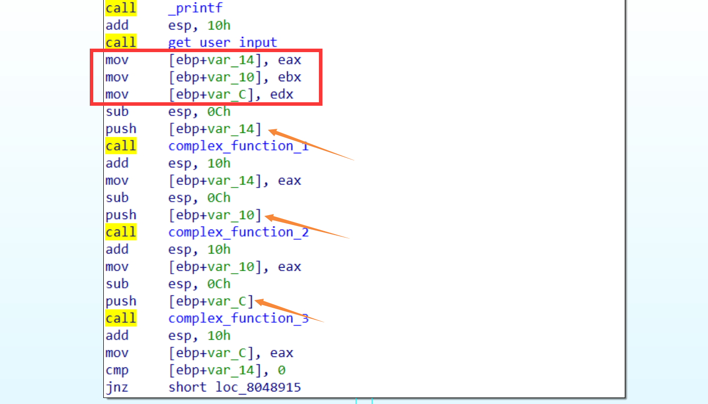

在angr入门记录过的 claripy.BVS，用来符号化我们想要的值

```python
password0 = claripy.BVS('password0', 32)
password1 = claripy.BVS('password1', 32)
password2 = claripy.BVS('password2', 32)

state.regs.eax = password0
state.regs.ebx = password1
state.regs.edx = password2
```

接着让angr跑到爆right的地方

```python
simgr = proj.factory.simgr(state)
simgr.explore(find = 0x804892A)
```

**符号执行的过程中每个状态都会内置一个约束求解器solver，求解器中保存了当前路径PC，所以	我们可以在当前状态手动添加新的约束，但既然已经跑到right，所以不需要加约束了，直接打印即可**

```python
solver = simgr.found[0].solver
print(f'password0: {hex(solver.eval(password0))}')
print(f'password1: {hex(solver.eval(password1))}')
print(f'password2: {hex(solver.eval(password2))}')
```

完整脚本

```python
import angr
import claripy

proj = angr.Project('03_angr_symbolic_registers')
state = proj.factory.blank_state(addr = 0x80488C7)

password0 = claripy.BVS('password0', 32)
password1 = claripy.BVS('password1', 32)
password2 = claripy.BVS('password2', 32)

state.regs.eax = password0
state.regs.ebx = password1
state.regs.edx = password2

simgr = proj.factory.simgr(state)
simgr.explore(find = 0x804892A)

solver = simgr.found[0].solver
print(f'password0: {hex(solver.eval(password0))}')
print(f'password1: {hex(solver.eval(password1))}')
print(f'password2: {hex(solver.eval(password2))}')
```

需要注意的

```python
state = proj.factory.blank_state(addr = 0x80488C7)
```

因为在0x80488C7之前的指令对我们的求解其实是没有任何作用的，包括get_user_input函数，因为接下来我们就要将get_user_input函数的结果符号化了，而不是让angr自动帮我们符号化通过scanf读取的数据

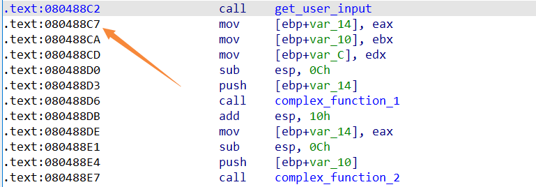

tips:

Q：直接在这里开始符号执行，那么初始状态是怎么样的？

A：像eax ecx edx与上下文无关，也不会造成栈爆炸之类，且用blank_state获取的状态处于未初始化也没关系，因为马上要被符号化

Q：那么ESP、EBP呢

A：用blank_state获取的状态，angr会给esp一个默认的值，这样不会让接下来的函数爆炸，而ebp没有赋予一个值不过没关系

```
>>> state.regs.esp
<BV32 0x7fff0000>
```


## 04_angr_symbolic_stack

铁咩，自己算半天算不明白，原来是认知错误，pwn👴一来就看出端倪，弄懂了算偏移发现文件有问题，我说怎么IDA里的地址都和别人的不一样，之前还好，现在是答案都跑不出来了，结果LN的附件一下就行，铁咩

这题要符号化堆栈，依然不需要scanf不过需要正确的ebp值，而具体ebp什么不重要（因为要取ebp + varC之类的值），重要的是与esp的偏移地址

那么首先算可得

```python
state.regs.ebp = state.regs.esp + 40
```

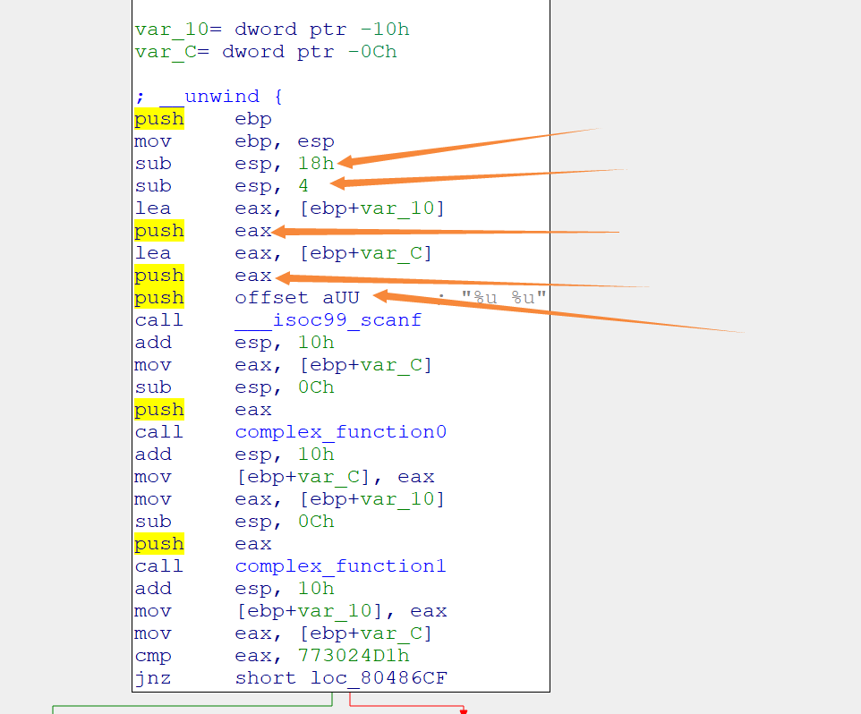

随后我们要让符号化的值push到ebp + var_C相应的位置

```python
state.regs.esp = state.regs.ebp - 0xC + 4
password0 = claripy.BVS('password0', 32)
password1 = claripy.BVS('password1', 32)
state.stack_push(password0)
state.stack_push(password1)
state.regs.esp = state.regs.ebp - 40
```

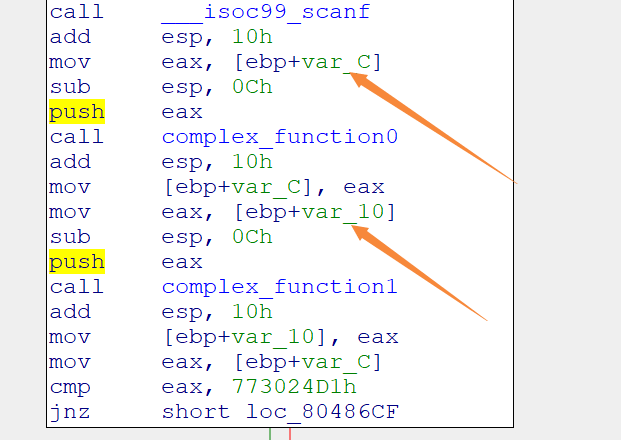

所以为什么是 -C + 4？？我就是卡在这了

双击点入相应变量，这里的 + 的是负数，实际是 ebp - C 才是正确的偏移

而 + 4 是因为第一个变量存放的是 8 - 12 这四个字节的内存，然后再push两个符号化的值就正好符号我们内存放input的变量

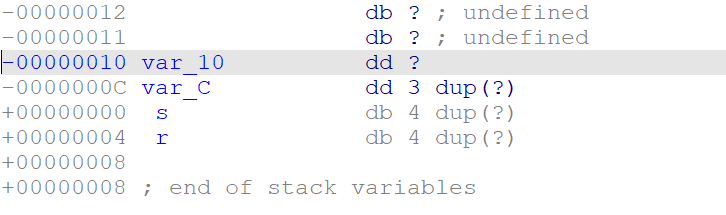

解毕

```python
import angr
import claripy

proj = angr.Project('../dist/04_angr_symbolic_stack')
state = proj.factory.blank_state(addr=0x8048694)

state.regs.ebp = state.regs.esp + 40
state.regs.esp = state.regs.ebp - 0xC + 4
password0 = claripy.BVS('password0', 32)
password1 = claripy.BVS('password1', 32)
state.stack_push(password0)
state.stack_push(password1)
state.regs.esp = state.regs.ebp - 40

simgr = proj.factory.simgr(state)
simgr.explore(find=0x80486E1)
solver = simgr.found[0].solver
print(f'password0: {hex(solver.eval(password0))}')
print(f'password1: {hex(solver.eval(password1))}')
```


## 05_angr_symbolic_memory

该题是存放到指定的内存，那么我们直接在scanf后符号化四个值，再放入指定的内存区域即可

```C
int __cdecl main(int argc, const char **argv, const char **envp)
{
  int i; // [esp+Ch] [ebp-Ch]

  memset(user_input, 0, 0x21u);
  printf("Enter the password: ");
  __isoc99_scanf("%8s %8s %8s %8s", user_input, &unk_A1BA1C8, &unk_A1BA1D0, &unk_A1BA1D8);
  for ( i = 0; i <= 31; ++i )
    *(_BYTE *)(i + 169583040) = complex_function(*(char *)(i + 169583040), i);
  if ( !strncmp(user_input, "NJPURZPCDYEAXCSJZJMPSOMBFDDLHBVN", 0x20u) )
    puts("Good Job.");
  else
    puts("Try again.");
  return 0;
}
```

BUT！今天我用windows上跑的，出现了个神奇问题，就是路径问题

**vscode的路径是指向工作文件夹的！！**就算你的py文件和目标文件在同一文件夹下也不行，得移过来

然后一把梭了  

```python
import angr
import claripy

proj = angr.Project('05_angr_symbolic_memory', load_options={'auto_load_libs': False})
state = proj.factory.blank_state(addr = 0x8048601)

password0 = claripy.BVS('password0', 64)
password1 = claripy.BVS('password1', 64)
password2 = claripy.BVS('password2', 64)
password3 = claripy.BVS('password3', 64)

state.mem[0xA1BA1C0].uint64_t = password0
state.mem[0xA1BA1C0 + 8].uint64_t = password1
state.mem[0xA1BA1C0 + 16].uint64_t = password2
state.mem[0xA1BA1C0 + 24].uint64_t = password3

simgr = proj.factory.simgr(state)
simgr.explore(find = 0x804866D)

solver = simgr.found[0].solver
print(f'password0: {solver.eval(password0, cast_to=bytes)}')
print(f'password1: {solver.eval(password1, cast_to=bytes)}')
print(f'password2: {solver.eval(password2, cast_to=bytes)}')
print(f'password3: {solver.eval(password3, cast_to=bytes)}')
```


## 06_angr_symbolic_dynamic_memory


```python
import angr
import claripy

proj = angr.Project('06_angr_symbolic_dynamic_memory')
state = proj.factory.blank_state(addr = 0x80486AF)

password0 = claripy.BVS('password0', 64)
password1 = claripy.BVS('password1', 64)

state.mem[0x804A6C0].uint64_t = password0
state.mem[0x804A6C0 + 8].uint64_t = password1
state.mem[0xA2DEF74].uint32_t = 0x804A6C0
state.mem[0xA2DEF7C].uint32_t = 0x804A6C0 + 8

simgr = proj.factory.simgr(state)
simgr.explore(find = 0x8048775)
sol = simgr.found[0].solver
print(sol.eval(password0, cast_to=bytes))
print(sol.eval(password1, cast_to=bytes))
```

