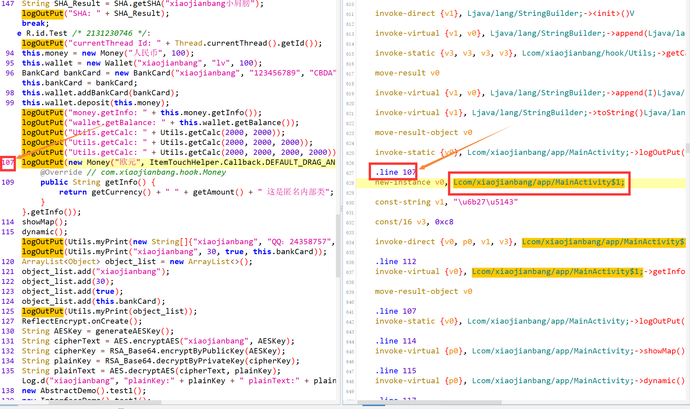
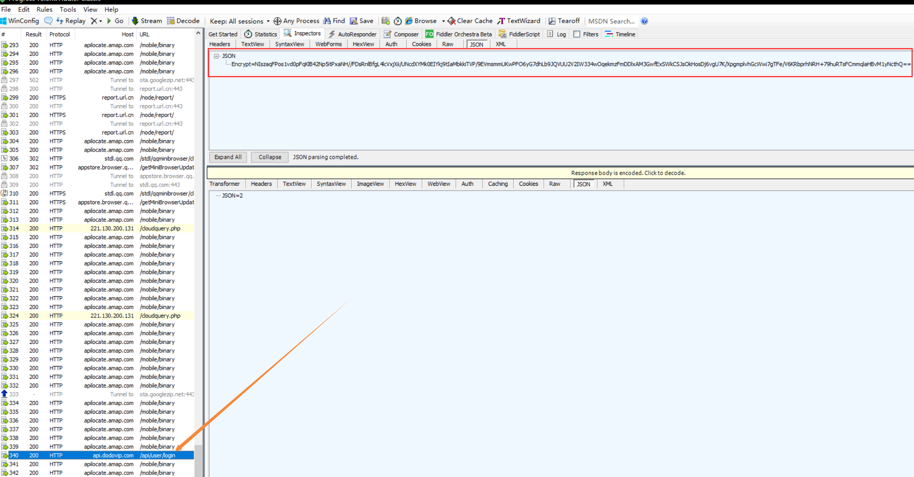
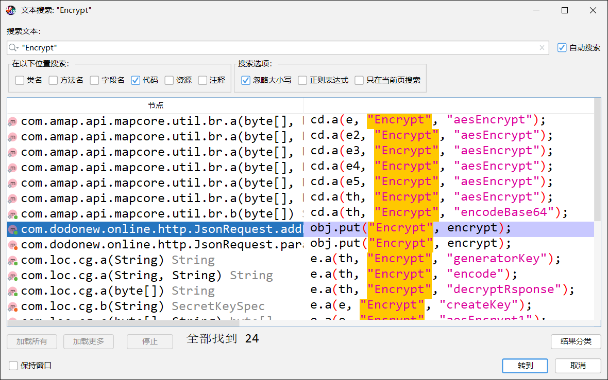
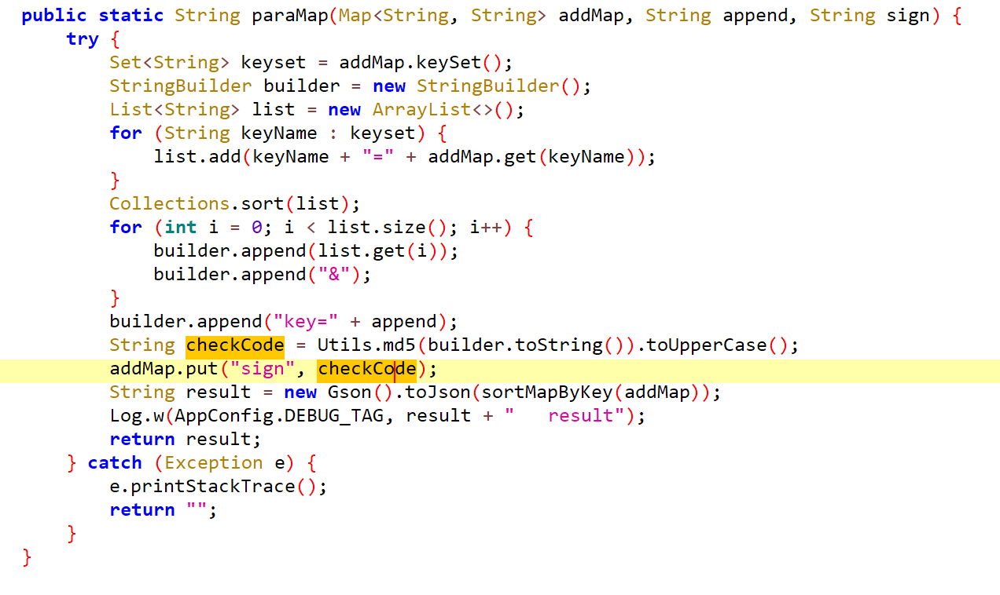
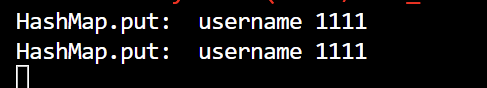
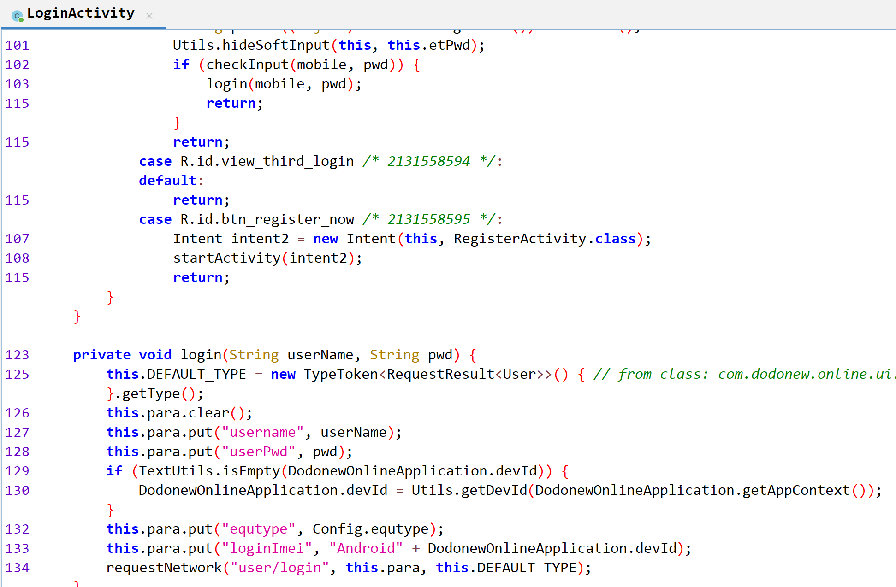

# 《Android应用安全实践》

## Frida 逆向环境搭建

也许哪天刷刷机

## Frida 框架Java层应用

### 2.1 Hook 方法

#### 2.1.1 Hook 静态方法和实例方法

要Hook的方法如下，第一个例子是hook了个setFlag，作用是在其getInfo中会打印我们hook后的值

```java
package com.xiaojianbang.hook;

/* loaded from: classes.dex */
public class Money {
    private static String flag;
    private int amount;
    private String currency;

    public static void setFlag(String flag2) {
        flag = flag2;
    }
    
    public String getInfo() {
        return this.currency + ": " + this.amount + ": " + flag;
    }
}
```

那么hook脚本为，再在手机上按TEST即可在控制台上打印

- setFlag属于money类所以先定位到 Java.use("com.xiaojianbang.hook.Money") 该类
- 再使用 **implementation 直接覆写**静态方法 setFlag
- Hook 代码中参数是**不需要指定类型**，只要求**数量上对应**

```js
function test(){
    Java.perform(function(){
        var money = Java.use("com.xiaojianbang.hook.Money");

        money.setFlag.implementation = function(a){
            console.log("money.setFlag param:", a);
            return this .setFlag("Hacked by P.Z");
        };

        money.getInfo.implementation = function(){
            var result = this.getInfo();
            console.log("money.getInfo:", result);
            return result;
        };
    })
};

test();
```

随后启动我们的js脚本到程序内

```
frida -U -f com.xiaojianbang.app -l .\HelloFrida.js -o fridaHook.txt --no-pause
```

常用参数

```
-U 连接USB设备
-F 附加最前面的应用
-f 主动启动进程
-l 加载script脚本文件
-o 输出日志
--no-pause 启动主线程运行应用
```


#### 2.1.2 Hook 构造方法

什么是构造方法，简单来说，凡是关键字 new 后跟随的基本都是构造方法

Java 构造方法在对象创建时被调用（像python的init），它的**方法名和类名必须相同**，而且必须没有显示返回类型。

```java
package com.xiaojianbang.hook;

/* loaded from: classes.dex */
public class Money {
    private static String flag;
    private int amount;
    private String currency;

    public Money(String currency, int amount) {
        this.currency = currency;
        this.amount = amount;
    }
}
```

那么在js脚本中hook构造方法就是通过 **$init** 覆写构造方法，注意参数对应即可（but 我找不到原因Hook不到

```js
function test(){
    Java.perform(function(){
        var money = Java.use("com.xiaojianbang.hook.Money");

        money.$init.implementation = function(a, b){
            console.log("money.$init param:", a, b);
            return this.$init("WTF", 100000);
        };

    })
};

test();
```


#### 2.1.3 Hook 重载方法

方法重载是一个类多态性的表现，简单来说，就是一个类里有多个方法名字相同

而他们的区别就是**参数不同和返回值不同**，所以这两个是区分重载的重大区别。

```java
package com.xiaojianbang.hook;


/* loaded from: classes.dex */
public class Utils {
	public static int getCalc(int a, int b) {
        return a + b;
    }

    public static int getCalc(int a, int b, int c) {
        return a + b + c;
    }

    public static int getCalc(int a, int b, int c, int d) {
        return a + b + c + d;
    }
}
```

这三个名字一样，而我们该如何 Hook，要对方法进行Hook需要分别两步。

**第一步**

先对重载方法的不同参数签名视而不见，直接进行重载方法的覆写，并加载 Hook 脚本

```js
function test(){
    Java.perform(function(){
        var Utils = Java.use("com.xiaojianbang.hook.Utils");

        Utils.getCalc.implementation = function(){
            return this.getCalc();
        };

    })
};

test();
```

而这一步当然会报错，是frida来告诉我们该如何编写重载，报错信息如下

```
[Pixel 3 XL::com.xiaojianbang.app]-> Error: getCalc(): has more than one overload, use .overload(<signature>) to choose from:
        .overload('int', 'int')
        .overload('int', 'int', 'int')
        .overload('int', 'int', 'int', 'int')
    at X (frida/node_modules/frida-java-bridge/lib/class-factory.js:563)
    at K (frida/node_modules/frida-java-bridge/lib/class-factory.js:558)
    at set (frida/node_modules/frida-java-bridge/lib/class-factory.js:925)
```

**第二步**

借助刚刚的报错提示，编写正确的 Hook 代码

```js
function test(){
    Java.perform(function(){
        var Utils = Java.use("com.xiaojianbang.hook.Utils");

        Utils.getCalc.overload('int', 'int').implementation = function(a, b){
            console.log("Utils.getCalc params:", a, b);
            return this.getCalc(a, b);
        };

    })
};

test();
```

（感觉既然知道参数个数，直接知道overload不就好了）


#### 2.1.4 Hook 方法的所有重载

而三个重载如刚刚的方法要重写三遍，十个就要写十遍，那么当然是太慢了。

那么首先看overloads的返回值

```js
function test(){
    Java.perform(function(){
        var Utils = Java.use("com.xiaojianbang.hook.Utils");

        console.log(Utils.getCalc.overloads);
        console.log(Utils.getCalc.overloads.length);

    })
};

test();
```

如下

```
function e() {
    [native code]
},function e() {
    [native code]
},function e() {
    [native code]
}
3
```

书上一眼丁真推荐 overloads方法返回的是一个包含所有重载方法的数组，如上只能知道个数，不是关键的是参数个数。

那么该问题就是靠 JavaScript 的 arguments 来完成，里边存放着参数列表

> 而该 agruments 对象包含了函数调用的参数数组，详情如下
>
> https://www.runoob.com/js/js-function-parameters.html

即可编写臃肿的if elif 代码

```js
function test(){
        Java.perform(function(){
            var Utils=Java.use("com.xiaojianbang.hook.Utils");
            var overloadArr=Utils.getCalc.overloads;
            for(var i=0;i<overloadArr.length;i++){
                overloadArr[i].implementation=function(){
                    var params="";
                    for(var j=0;j<arguments.length;j++){
                        params+=arguments[j]+" ";
                        console.log(arguments[j])
                    };
                    console.log("utils.getCalc is called! params is:",params);
                    if (arguments.length==2){
                        return this.getCalc(arguments[0],arguments[1]);
                    }else if (arguments.length==3){
                        return this.getCalc(arguments[0],arguments[1],arguments[2]);
                    }else if(arguments.length==4){
                        return this.getCalc(arguments[0],arguments[1],arguments[2],arguments[3]);
                    };
                }
            }
        })
    };
    test();
```

 于是再进行优化，在对象中自带两个方法，一个是call方法也是如上之前的都是call方法，参数是用逗号隔开传入

而apply方法是所有参数放在一个数组传入，于是就可以简化代码

```js
function test(){
    Java.perform(function(){
        var Utils = Java.use("com.xiaojianbang.hook.Utils");
        var overloadArr = Utils.getCalc.overloads;

        for ( var i = 0; i < overloadArr.length; i++ ){
            overloadArr[i].implementation = function(){
                var params = "";
                for (var j = 0; j < arguments.length; j++ ){
                    params += arguments[j] + " ";
                }
                console.log("Utils.getCalc is called! param is:", params); // 上面这个for循环和这个纯纯为了打印看
                return this.getCalc.apply(this, arguments);
            }
        }

    })
};

test();
```

最后还有个小知识点，也就是this的指代对象

```js
        Utils.getCalc.overload('int','int').implementation=function(a,b){
            console.log("Utils.getCalc params:",a,b);
            return this.getCalc(a,b);
        };

     Utils.getCalc.overload('int','int').implementation=function(a,b){
            console.log("Utils.getCalc params:",a,b);
            return Utils.getCalc(a,b);
        };
```

注意return后面的 this.getCalc(a,b) 和 Utils.getCalc(a,b)

如果是静态方法那么 this 和 Utils 是等价的

如果是非静态方法，那么必须用  this

> 今天难得运动了一下，好累也好爽 -- 2022.10.12


#### 2.1.5 对象参数的构造

部分方法中的参数是对象，那么写法也会有相应变动

```java
package com.xiaojianbang.hook;

import java.util.ArrayList;

/* loaded from: classes.dex */
public class Wallet {

    public boolean deposit(Money money) {
        if (money == null || money.getAmount() <= 0) {
            return false;
        }
        this.balance += money.getAmount();
        return true;
    }
    
}
```

而这里用的是Money类的中的构造方法，铁咩，碰到这个就出问题，依然没有找到解决办法

```js
function test(){
    Java.perform(function(){
        var Walletils = Java.use("com.xiaojianbang.hook.Wallet");
        var Money = Java.use("com.xiaojianbang.hook.Money");
 
        Walletils.deposit.implementation = function(a){
            console.log("moneyClass", a.getInfo());
            return this.deposit(Money.$new("???", 111)); // 真的是服了，遇到Money的构造方法都不行，弄了一早上，而且书上代码还有点问题是没想到的
        }

    })
};

test();
```


#### 2.1.6 主动调用 Java 函数

目前为止，介绍的方法都是被动Hook，也就是函数执行被触发。

而要主动动调，其分两种

- 静态方法
- 实例方法
  1. 创建新对象
  2. 获取已有对象


**静态方法**

也就是定位类后主动调用即可

```js
function test(){
    Java.perform(function(){
        var money=Java.use("com.xiaojianbang.hook.Money");
        money.setFlag("P.Z");
    })
};
test();
```


**实例方法**

1. 创建新对象

主动调用就解决问题了，嘶，那么之前为什么hook到了但是不行呢

```js
function test(){
    Java.perform(function(){
        var moneyClass = Java.use("com.xiaojianbang.hook.Money");
        var moneyObj = moneyClass.$new("???", 111);

        console.log(moneyObj.getInfo());

    })
};

test();
```


2. 获取已有对象

使用 java.choose 方法获取已有对象，其有两个参数

第一个参数是 想要找到的类

第二个参数是 一个回调函数

onMatch: 每找到一次即调用一次

onComplete: 所有对象搜索完后调用一次


于是学习了此种方法就想着解决之前Hook不到构造方法的情况，所以得出结论

用java.choose看了下hook到了，而且很多对象，也就是每点击一下TEST按钮就会新起一个对象，所以每次传进来打印出来的就是MainActivity传进来的新对象，而不是我们hook到的对象

所以只要每保存一下运行了java.choose就能显示之前hook到的对象（太怪了，那别人是怎么hook到的

```js
function test(){
    Java.perform(function(){
        var moneyClass = Java.use("com.xiaojianbang.hook.Money");
        moneyClass.$init.implementation = function(a, b){
            console.log(a, b);
           return this.$init("hookInit", 1111111);
        };

        Java.choose("com.xiaojianbang.hook.Money",{
            onMatch:function(obj){
                console.log(obj.getInfo());
            },
            onComplete:function(){
                console.log("over!");
            }
        })
        // var moneyObj = moneyClass.$new("newObj", 2222222);
        // console.log(moneyObj.getInfo());

    })
};

test();
```


### 2.2 Hook类

包括获取和修改类的字段、Hook 内部类和匿名类、枚举所有已加载的类、枚举类的所有方法和 Hook 类的所有方法


#### 2.2.1 获取和修改类的字段

- 一种是静态字段，只要拿到类就可以方法

- 一种是实例字段，要拿到对象才能访问


那么静态字段，直接value获取即可

```js
function test(){
    Java.perform(function(){
        var moneyClass = Java.use("com.xiaojianbang.hook.Money");
        
        console.log(moneyClass.flag.value);

        moneyClass.flag.value = "Change Answer";

        console.log(moneyClass.flag.value);

    })
};

test();
```

中间插入一个之前用过的方法就创建新对象，直接new后直接用即可

```js
function test(){
    Java.perform(function(){
        var moneyClass = Java.use("com.xiaojianbang.hook.Money");
        
        var moneyObj = moneyClass.$new("???", 111);
        console.log(moneyObj.currency.value);
        moneyObj.currency.value = "Change Answer";
        console.log(moneyObj.currency.value)

    })
};

test();
```


而对于实例字段，得上Java.choose

```js
function test(){
    Java.perform(function(){
        var moneyClass = Java.use("com.xiaojianbang.hook.Money");

        Java.choose("com.xiaojianbang.hook.Money",{
            onMatch:function(obj){
                console.log(obj.currency.value);
            },
            onComplete:function(){
                console.log("over!");
            }
        })

    })
};

test();
```

这时候要注意一个事情如果一个类中的方法名和字段名相同

要加字段名前加下划线即可，方法名获取方式不变


#### 2.2.2 Hook 内部类和匿名类

在 Java 中，可以将一个类定义在另一个类或一个方法中，这种类称为内部类

```java
public class Wallet {

    /* loaded from: classes.dex */
    public class InnerStructure {
        private ArrayList<BankCard> bankCardsList = new ArrayList<>();

        public InnerStructure() {
        }

        public String toString() {
            return this.bankCardsList.toString();
        }
    }
}
```

那么该如何定位该内部类呢，于是就有个神奇的写法（书上不仅是字打错，还有个莫名其妙的空格...我怀疑是机器扫描上去的）

```js
function test(){
    Java.perform(function(){
        var Wallet$InnerStructure = Java.use("com.xiaojianbang.hook.Wallet$InnerStructure");
        console.log(Wallet$InnerStructure);
    
    Java.choose("com.xiaojianbang.hook.Wallet$InnerStructure",{
        onMatch:function(obj){
            console.log(obj.bankCardsList.value);
        },
        onComplete:function(){
            console.log("over!");
        }

    })
    
    })
};

test();
```


那么什么是匿名类呢，就是一个没有名字的类，是内部类的简化写法，本质上是继承该类或者实现接口的子类匿名对象

如在onCreate中，存在一个匿名类的调用

```java
logOutPut(new Money("欧元", ItemTouchHelper.Callback.DEFAULT_DRAG_ANIMATION_DURATION) { // from class: com.xiaojianbang.app.MainActivity.1
                        @Override // com.xiaojianbang.hook.Money
                        public String getInfo() {
                            return getCurrency() + " " + getAmount() + " 这是匿名内部类";
                        }
                    }.getInfo());
```

匿名类的特点是new关键字后面跟类或者接口，加花括号的意思就是定义一个类

这里就是复写了Money类的 getInfo 方法

那么普通的覆写Money类的getInfo并不能Hook到匿名类

这个时候！需要看Smail语法，可以发现对应的 Smail 语法为 com/xiaojianbang/app/MainActivity$1

（定位想对应的 Smail 语句比较鸡肋，只能找行号）



于是 Hook 代码如下

```js
function test(){
    Java.perform(function(){
    var MoenyClass = Java.use("com.xiaojianbang.app.MainActivity$1");

    MoenyClass.getInfo.implementation = function(){
        var result = this.getInfo();
        console.log(result);
        return result;
    }
    
    })
};

test();
```


#### 2.2.3 枚举所有已加载的类和枚举类的所有方法

枚举所有已加载的类

```js
function test(){
    Java.perform(function(){

        console.log(Java.enumerateClassLoadersSync().join('\n'));
    
    })
};

test();
```

获取类中

- 所有方法
- 构造方法
- 字段
- 内部类

```js
function test(){
    Java.perform(function(){

        var walletClass = Java.use("com.xiaojianbang.hook.Wallet");
        var methods = walletClass.class.getDeclaredMethods(); // 所有方法
        var constructor = walletClass.class.getDeclaredConstructors(); // 构造方法

        for ( var i = 0; i < methods.length; i++ ){
            console.log(methods[i].getName());
        };

        for ( var i = 0; i < constructor.length; i++ ){
            console.log(constructor[i].getName());
        };

        
        var fields = walletClass.class.getDeclaredFields(); // 字段
        var classes = walletClass.class.getDeclaredClasses(); // 内部类

        for ( var i = 0; i < fields.length; i++ ){
            console.log(fields[i].getName());
        };

        for ( var i = 0; i < classes.length; i++ ){
            console.log(classes[i].getName());
        };
    
    })
};

test();
```


#### 2.2.4 Hook 类的所有方法

js 中 for 每次循环都是一次全新的独立块作用域，而 let 声明的变量传入 for 循环作用域不会发生变化，不受外界影响

```js
function test(){
    Java.perform(function(){
        var Utils=Java.use("com.xiaojianbang.hook.Utils");
        var methods=Utils.class.getDeclaredMethods();

        for(let k = 0; k < methods.length; k++){
            let methodName = methods[k].getName(); // 如果这里改成 var 都导致这个变量传入内层循环也就是下面那个循环出现报错，原因是js的for循环都是全新的独立作用域
            var overloadArr = Utils[methods[k].getName()].overloads;

            console.log("fun:", methodName);
            for(var i = 0; i < overloadArr.length; i++){
                overloadArr[i].implementation = function(){
                    var params = "";
                    for (var j = 0;j < arguments.length; j++){
                        params += arguments[j]+" ";
                    };
                    console.log("utils." + methodName + " is called! params is:", params);
                    return this[methodName].apply(this, arguments);
                }
            }
        };
});
};

test();
```


### 2. 3 实战：某嘟牛协议分析

我真的究极懒狗，好像是好几个星期前做的例子到现在还没记录笔记，Frida也没学很久，学数学英语RE也能不停啊。--2022.11.16

#### Fiddler

首先是手机抓包装Fiddler，跟着这篇全部解决

> https://blog.csdn.net/weixin_42575020/article/details/105406978

接着Google手机到底哪里自己设置代码根本找不到，于是找到命令

> 注意这边的 ip 要与手机同一局域网，如现在我的就是 10.20.73.177

```
设置代理：

adb shell settings put global http_proxy ip:port

如：

adb shell settings put global http_proxy 127.0.0.1:8888

移除代理（需三条指令全部执行，部分机型可能需要重启手机才能完全移除代理）：

adb shell settings delete global http_proxy

adb shell settings delete global global_http_proxy_host

adb shell settings delete global global_http_proxy_port

adb reboot


关闭代理
adb shell settings put global http_proxy : 0
```

随后在该app上输入账号密码点击登录按钮发现该包



```
{"Encrypt":"NIszaqFPos1vd0pFqKlB42Np5itPxaNH\/\/FDsRnlBfgL4lcVxjXii\/UNcdXYMk0EIYkj9tIaMbkk\niTVP\/9EVmsmmUKwPFO6yG7dhLb9JQVUU2V2IW334wOqekmzFmDDlxAM3GwfExSWkCSJsOkHosDj6\nvgU7K\/XpgmplvhGcWwi7gTFe\/V6KRbprhNRH+79huRTsFCmmqlaHBvM1yNcthQ==\n"}
```


#### 寻觅追踪

由该Encrypt查询到有 24 个结果，而Json请求就两个于是进行Frida验证到底是调用了哪个



然而paraMap注入后按登录按钮并无回显

```js
        var jsonRequest = Java.use("com.dodonew.online.http.JsonRequest")

        jsonRequest.paraMap.implementation = function(a){
            console.log("paraMap is called!");
            return this.paraMap(a);
        }
```

这时一般考虑几种情况

- 应用在执行这个操作时，没有调用这个方法，寻找其他节点
- 代码错误导致Hook失败
- 通过主动调用上层函数触发Hook方法

由此我们尝试另一个节点发现成功回显了！


#### Hacked by P.Z

那么我们只要Hook出这串密文的所有明文就是成功！

首先是点入 encodeDesMap Hook该类重载该方法

```
String encrypt = RequestUtil.encodeDesMap(code, this.desKey, this.desIV);
```

由于多态所以要重载

```js
        var encodeDesMap = Java.use("com.dodonew.online.http.RequestUtil");
        encodeDesMap.encodeDesMap.overload("java.lang.String", "java.lang.String", "java.lang.String").implementation = function(a, b, c){
            console.log("You get in encodeDesMap!");
            console.log("data: ", a);
            console.log("desKey: ", b);
            console.log("desIv: ", c);
            console.log("result: ", this.encodeDesMap(a, b, c));
            
            return this.encodeDesMap(a, b, c);
        };
```

由此直接得到明文

```
data:  {"equtype":"ANDROID","loginImei":"Androidnull","sign":"169A36DFF28570BD036867A41C7BC192","timeStamp":"1668591562756","userPwd":"123456","username":"123456"}
desKey:  65102933
desIv:  32028092
result:  NIszaqFPos1vd0pFqKlB42Np5itPxaNH//FDsRnlBfgL4lcVxjXii/UNcdXYMk0EOzeKm2E2Df20
7SalGAeVSvbNyCwJYGbGcJ1T26Jaee5iLEZYw9iPbHA0nMFCh4nlylx9eIN16UyyvpYSWcUwDdeF
zSvvWKCHJGZEXXzQ7P5XUz9OvwCVyvLfAyup+9BN5JABmzMPdZ+Lcx+IhoWFkQ==
```

那么接着就是sign，密码与账号都获得，其他都是固定或是时间

从这可知data那么一串就是上一行的code所传入，这里就是sign产生的地方

```
String code = RequestUtil.paraMap(addMap, Config.BASE_APPEND, "sign");
```

同样点入paraMap，可以发现sign的生成过程是把addMap依次取出随后用 = 连接加到list中，最后调用MD5加密



那么直接Hook MD5即可（这里我看了半天以为没hook到，最后发现是给框遮住了...nnd）

```js
        var md5Str = Java.use("com.dodonew.online.util.Utils");
        md5Str.md5.implementation = function(a){
            console.log("md5Str: ", a);
            return this.md5(a);
        };
```

完整代码

```js
function test(){
    Java.perform(function(){
        
        var jsonRequest = Java.use("com.dodonew.online.http.JsonRequest")

        // jsonRequest.paraMap.implementation = function(a){
        //     console.log("paraMap is called!");
        //     return this.paraMap(a);
        // }

        jsonRequest.addRequestMap.overload("java.util.Map", "int").implementation = function(a, b){
            console.log("You get in jsonRequest!");
            return this.addRequestMap(a, b);
        };

        var encodeDesMap = Java.use("com.dodonew.online.http.RequestUtil");
        encodeDesMap.encodeDesMap.overload("java.lang.String", "java.lang.String", "java.lang.String").implementation = function(a, b, c){
            console.log("You get in encodeDesMap!");
            console.log("data: ", a);
            console.log("desKey: ", b);
            console.log("desIv: ", c);
            console.log("result: ", this.encodeDesMap(a, b, c));
            
            return this.encodeDesMap(a, b, c);
        };

        var md5Str = Java.use("com.dodonew.online.util.Utils");
        md5Str.md5.implementation = function(a){
            console.log("md5Str: ", a);
            return this.md5(a);
        };

    })
};

test();
```

```
frida -U -F -l dodonew.js --no-pause
```

Get Flag!

```
You get in jsonRequest!
md5Str:  equtype=ANDROID&loginImei=Androidnull&timeStamp=1668591562756&userPwd=123456&username=123456&key=sdlkjsdljf0j2fsjk
You get in encodeDesMap!
data:  {"equtype":"ANDROID","loginImei":"Androidnull","sign":"169A36DFF28570BD036867A41C7BC192","timeStamp":"1668591562756","userPwd":"123456","username":"123456"}
desKey:  65102933
desIv:  32028092
result:  NIszaqFPos1vd0pFqKlB42Np5itPxaNH//FDsRnlBfgL4lcVxjXii/UNcdXYMk0EOzeKm2E2Df20
7SalGAeVSvbNyCwJYGbGcJ1T26Jaee5iLEZYw9iPbHA0nMFCh4nlylx9eIN16UyyvpYSWcUwDdeF
zSvvWKCHJGZEXXzQ7P5XUz9OvwCVyvLfAyup+9BN5JABmzMPdZ+Lcx+IhoWFkQ==
```


## 关键代码快速定位

在实际程序开发中，有一些关键字符串，可以使用字符串加密的方法加以隐藏；若程序中有一些关键的类，可以使用反射调用的方式加以隐藏，隐藏后很难使用常规方法直接定位到关键代码。

本章将介绍这类 App 应用程序的关键代码快速定位的方法。

书上给了一段例子

- 该例子经过了字符串加密和反射调用某些系统类，使得代码比较难理解，这个混淆效果是 dexlib2 自动实现的
- 恢复了字符串加密是可以审计出其实是反射调用 Java 的标准算法 MD5
- 这种方式是可以防御直接搜索，但无法防御 Hook

从该案例可以看出，只要 APP 想要调用系统函数，不管如何混淆，最终在调用的时候，系统函数的类名和方法名都是不变的，而 APP 开发中会不可避免的使用系统函数，因此，通过 hook 一些系统函数来定位关键代码，这就是逆向的第一步。


### 3.1 集合的 Hook

本节讲解 Android 应用中集合的 Hook，包括定位散列表 HashMap、定位动态数组 ArrayList 和打印函数堆栈，打印函数堆栈很重要。


#### 3.1.1 Hook HashMap 定位散列表

APP 在处理数据、提交数据时，通常会将数据存放于集合中，而 HashMap 又是其中比较常用的，因此可以通过 Hook HashMap 的 put 方法来定位代码的关键位置。

```js
function main(){
  Java.perform(function(){
      var hashMap = Java.use("java.util.HashMap");
      hashMap.put.implementation = function(a, b){
        if (a == "username"){
          console.log("HashMap.put: ", a, b);
        }
        return this.put(a, b);
      }
  });
}

main();
// frida -U -F -l hook.js --no-pause
```

通过判断一下来获取想要的数据



与 HashMap 类一样常用的还有 LinkedHashMap、ConcurrentHashMap，当 hook 这个没有得到想要的结果，可以去尝试其他的。另外 HashSet 和 LinkedHashSet 也较为常用，但这两个的底层调用是 HashMap 和 LinkedHashMap。


#### 3.1.2 打印函数栈

从刚刚一小节得知，这个 app 将数据存放于 HashMap 中，如果能知道哪个函数调用了 HashMap 的 put 方法，就可以定位到关键代码的所在位置了，此时就需要打印函数栈来获取函数调用的流程。

在 Java 代码中打印函数栈，可以使用 Log 类的 getStackTraceString 方法

```java
Log.getStackTraceString(new Throwable());
```

这是通过异常来获取当前函数栈的信息。如果要在 Frida 中使用，可以主动调用 Log 类的 getStackTraceString 方法，再传入 Throwable 类即可。

```js
function showStacks(){
    Java.perform(function(){
        console.log(
            Java.use("android.util.Log").getStackTraceString(
                    Java.use("java.lang.Throwable").$new()));
    });
}
```

在任意想要打印函数栈的地方调用 showStacks 即可，但有些系统函数较为常用，打印函数栈之前，需要先做过滤，不然容易崩溃，也就是匹配上我们要看的用户名，随后查看信息。

```js
function showStacks(){
  Java.perform(function(){
      console.log(
          Java.use("android.util.Log").getStackTraceString(
                  Java.use("java.lang.Throwable").$new()));
  });
}


function main(){
  Java.perform(function(){
      var hashMap = Java.use("java.util.HashMap");
      hashMap.put.implementation = function(a, b){
        if (a == "username"){
          showStacks();
          console.log("HashMap.put: ", a, b);
        }
        return this.put(a, b);
      }
  });
}

main();
// frida -U -F -l hook.js --no-pause


[Pixel 3 XL::嘟嘟牛在线]-> java.lang.Throwable
        at java.util.HashMap.put(Native Method)
        at com.dodonew.online.ui.LoginActivity.login(LoginActivity.java:127)  
        at com.dodonew.online.ui.LoginActivity.onClick(LoginActivity.java:103)
        at android.view.View.performClick(View.java:7259)
        at android.view.View.performClickInternal(View.java:7236)
        at android.view.View.access$3600(View.java:801)
        at android.view.View$PerformClick.run(View.java:27892)
        at android.os.Handler.handleCallback(Handler.java:883)
        at android.os.Handler.dispatchMessage(Handler.java:100)
        at android.os.Looper.loop(Looper.java:214)
        at android.app.ActivityThread.main(ActivityThread.java:7356)
        at java.lang.reflect.Method.invoke(Native Method)
        at com.android.internal.os.RuntimeInit$MethodAndArgsCaller.run(RuntimeInit.java:492)
        at com.android.internal.os.ZygoteInit.main(ZygoteInit.java:930)

HashMap.put:  username 1111
```

可以发现 onClick 和 login就是两个可疑的方法，所在的类为 LoginActivity，其他都是系统类，没有 app 的具体业务逻辑。

直接搜索该类找到，可以发现找到关键的代码逻辑



接下来需要一点 HashMap 的基本知识

> https://www.runoob.com/java/java-hashmap.html

login 函数将各种参数放入 HashMap 中，然后调用 requestNetwork 开始提交数据。


#### 3.1.3 Hook ArrayList 定位动态数组

Java 集合 ArrayList 在开发中也很常用，也可以作为关键代码所在位置之一。

依然以该 app 为例子，Hook ArrayList 的 add 方法

```

```


## Frida框架so层基本应用

### 获取 Module

#### 通过模块名来获取 Module

Module 提供了很多模块相关的操作，如 枚举导出表、导入表、符号表，获取导出函数地址、模块基地址等等

```js
    var module = Process.findModuleByName("libxiaojianbang.so");
    console.log(JSON.stringify(module));
```

还有个类似的方法是 getModuleByName，不过该 方法如果没找到是报错，而 find 是返回 null，所以 find 彳亍！

JSON.stringify 可以用来打印 Module 对象的一些属性。


#### 通过地址来获取 Module

```
Process.findModuleByName(address)
```

传入的地址为模块的任意一地址即可，也就是说得到了一共函数地址，就能通过该方法来快速知道该函数注册在哪个 so 文件中定义的。

函数原型

```
function findModuleByAddress(address: NativePointerValue): Module | null;
```

其中 NativePointerValue 就是 NativePointer，在 Frida 中用来表示指针。

