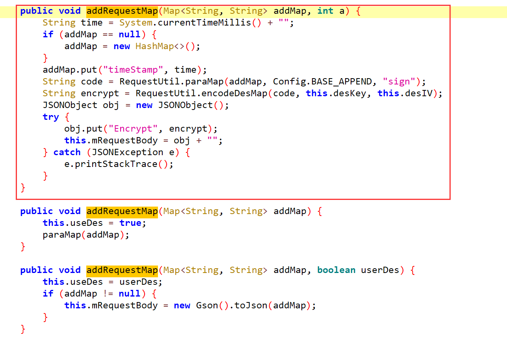
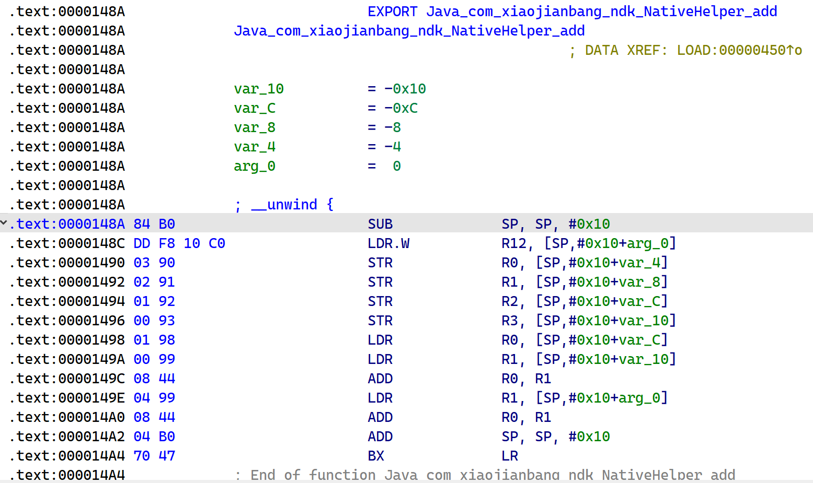

# 《Android应用安全实践》

## Frida 逆向环境搭建

也许哪天刷刷机

## Frida 框架Java层应用

### 2.1 Hook 方法

#### 2.1.1 Hook 静态方法和实例方法

要Hook的方法如下，第一个例子是hook了个setFlag，作用是在其getInfo中会打印我们hook后的值

```java
package com.xiaojianbang.hook;

/* loaded from: classes.dex */
public class Money {
    private static String flag;
    private int amount;
    private String currency;

    public static void setFlag(String flag2) {
        flag = flag2;
    }
    
    public String getInfo() {
        return this.currency + ": " + this.amount + ": " + flag;
    }
}
```

那么hook脚本为，再在手机上按TEST即可在控制台上打印

- setFlag属于money类所以先定位到 Java.use("com.xiaojianbang.hook.Money") 该类
- 再使用 **implementation 直接覆写**静态方法 setFlag
- Hook 代码中参数是**不需要指定类型**，只要求**数量上对应**

```js
function test(){
    Java.perform(function(){
        var money = Java.use("com.xiaojianbang.hook.Money");

        money.setFlag.implementation = function(a){
            console.log("money.setFlag param:", a);
            return this .setFlag("Hacked by P.Z");
        };

        money.getInfo.implementation = function(){
            var result = this.getInfo();
            console.log("money.getInfo:", result);
            return result;
        };
    })
};

test();
```

随后启动我们的js脚本到程序内

```
frida -U -f com.xiaojianbang.app -l .\HelloFrida.js -o fridaHook.txt --no-pause
```

常用参数

```
-U 连接USB设备
-F 附加最前面的应用
-f 主动启动进程
-l 加载script脚本文件
-o 输出日志
--no-pause 启动主线程运行应用
```


#### 2.1.2 Hook 构造方法

什么是构造方法，简单来说，凡是关键字 new 后跟随的基本都是构造方法

Java 构造方法在对象创建时被调用（像python的init），它的**方法名和类名必须相同**，而且必须没有显示返回类型。

```java
package com.xiaojianbang.hook;

/* loaded from: classes.dex */
public class Money {
    private static String flag;
    private int amount;
    private String currency;

    public Money(String currency, int amount) {
        this.currency = currency;
        this.amount = amount;
    }
}
```

那么在js脚本中hook构造方法就是通过 **$init** 覆写构造方法，注意参数对应即可（but 我找不到原因Hook不到

```js
function test(){
    Java.perform(function(){
        var money = Java.use("com.xiaojianbang.hook.Money");

        money.$init.implementation = function(a, b){
            console.log("money.$init param:", a, b);
            return this.$init("WTF", 100000);
        };

    })
};

test();
```


#### 2.1.3 Hook 重载方法

方法重载是一个类多态性的表现，简单来说，就是一个类里有多个方法名字相同

而他们的区别就是**参数不同和返回值不同**，所以这两个是区分重载的重大区别。

```java
package com.xiaojianbang.hook;


/* loaded from: classes.dex */
public class Utils {
	public static int getCalc(int a, int b) {
        return a + b;
    }

    public static int getCalc(int a, int b, int c) {
        return a + b + c;
    }

    public static int getCalc(int a, int b, int c, int d) {
        return a + b + c + d;
    }
}
```

这三个名字一样，而我们该如何 Hook，要对方法进行Hook需要分别两步。

**第一步**

先对重载方法的不同参数签名视而不见，直接进行重载方法的覆写，并加载 Hook 脚本

```js
function test(){
    Java.perform(function(){
        var Utils = Java.use("com.xiaojianbang.hook.Utils");

        Utils.getCalc.implementation = function(){
            return this.getCalc();
        };

    })
};

test();
```

而这一步当然会报错，是frida来告诉我们该如何编写重载，报错信息如下

```
[Pixel 3 XL::com.xiaojianbang.app]-> Error: getCalc(): has more than one overload, use .overload(<signature>) to choose from:
        .overload('int', 'int')
        .overload('int', 'int', 'int')
        .overload('int', 'int', 'int', 'int')
    at X (frida/node_modules/frida-java-bridge/lib/class-factory.js:563)
    at K (frida/node_modules/frida-java-bridge/lib/class-factory.js:558)
    at set (frida/node_modules/frida-java-bridge/lib/class-factory.js:925)
```

**第二步**

借助刚刚的报错提示，编写正确的 Hook 代码

```js
function test(){
    Java.perform(function(){
        var Utils = Java.use("com.xiaojianbang.hook.Utils");

        Utils.getCalc.overload('int', 'int').implementation = function(a, b){
            console.log("Utils.getCalc params:", a, b);
            return this.getCalc(a, b);
        };

    })
};

test();
```

（感觉既然知道参数个数，直接知道overload不就好了）


#### 2.1.4 Hook 方法的所有重载

而三个重载如刚刚的方法要重写三遍，十个就要写十遍，那么当然是太慢了。

那么首先看overloads的返回值

```js
function test(){
    Java.perform(function(){
        var Utils = Java.use("com.xiaojianbang.hook.Utils");

        console.log(Utils.getCalc.overloads);
        console.log(Utils.getCalc.overloads.length);

    })
};

test();
```

如下

```
function e() {
    [native code]
},function e() {
    [native code]
},function e() {
    [native code]
}
3
```

书上一眼丁真推荐 overloads方法返回的是一个包含所有重载方法的数组，如上只能知道个数，不是关键的是参数个数。

那么该问题就是靠 JavaScript 的 arguments 来完成，里边存放着参数列表

> 而该 agruments 对象包含了函数调用的参数数组，详情如下
>
> https://www.runoob.com/js/js-function-parameters.html

即可编写臃肿的if elif 代码

```js
function test(){
        Java.perform(function(){
            var Utils=Java.use("com.xiaojianbang.hook.Utils");
            var overloadArr=Utils.getCalc.overloads;
            for(var i=0;i<overloadArr.length;i++){
                overloadArr[i].implementation=function(){
                    var params="";
                    for(var j=0;j<arguments.length;j++){
                        params+=arguments[j]+" ";
                        console.log(arguments[j])
                    };
                    console.log("utils.getCalc is called! params is:",params);
                    if (arguments.length==2){
                        return this.getCalc(arguments[0],arguments[1]);
                    }else if (arguments.length==3){
                        return this.getCalc(arguments[0],arguments[1],arguments[2]);
                    }else if(arguments.length==4){
                        return this.getCalc(arguments[0],arguments[1],arguments[2],arguments[3]);
                    };
                }
            }
        })
    };
    test();
```

 于是再进行优化，在对象中自带两个方法，一个是call方法也是如上之前的都是call方法，参数是用逗号隔开传入

而apply方法是所有参数放在一个数组传入，于是就可以简化代码

```js
function test(){
    Java.perform(function(){
        var Utils = Java.use("com.xiaojianbang.hook.Utils");
        var overloadArr = Utils.getCalc.overloads;

        for ( var i = 0; i < overloadArr.length; i++ ){
            overloadArr[i].implementation = function(){
                var params = "";
                for (var j = 0; j < arguments.length; j++ ){
                    params += arguments[j] + " ";
                }
                console.log("Utils.getCalc is called! param is:", params); // 上面这个for循环和这个纯纯为了打印看
                return this.getCalc.apply(this, arguments);
            }
        }

    })
};

test();
```

最后还有个小知识点，也就是this的指代对象

```js
        Utils.getCalc.overload('int','int').implementation=function(a,b){
            console.log("Utils.getCalc params:",a,b);
            return this.getCalc(a,b);
        };

     Utils.getCalc.overload('int','int').implementation=function(a,b){
            console.log("Utils.getCalc params:",a,b);
            return Utils.getCalc(a,b);
        };
```

注意return后面的 this.getCalc(a,b) 和 Utils.getCalc(a,b)

如果是静态方法那么 this 和 Utils 是等价的

如果是非静态方法，那么必须用  this

> 今天难得运动了一下，好累也好爽 -- 2022.10.12


#### 2.1.5 对象参数的构造

部分方法中的参数是对象，那么写法也会有相应变动

```java
package com.xiaojianbang.hook;

import java.util.ArrayList;

/* loaded from: classes.dex */
public class Wallet {

    public boolean deposit(Money money) {
        if (money == null || money.getAmount() <= 0) {
            return false;
        }
        this.balance += money.getAmount();
        return true;
    }
    
}
```

而这里用的是Money类的中的构造方法，铁咩，碰到这个就出问题，依然没有找到解决办法

```js
function test(){
    Java.perform(function(){
        var Walletils = Java.use("com.xiaojianbang.hook.Wallet");
        var Money = Java.use("com.xiaojianbang.hook.Money");
 
        Walletils.deposit.implementation = function(a){
            console.log("moneyClass", a.getInfo());
            return this.deposit(Money.$new("???", 111)); // 真的是服了，遇到Money的构造方法都不行，弄了一早上，而且书上代码还有点问题是没想到的
        }

    })
};

test();
```


#### 2.1.6 主动调用 Java 函数

目前为止，介绍的方法都是被动Hook，也就是函数执行被触发。

而要主动动调，其分两种

- 静态方法
- 实例方法
  1. 创建新对象
  2. 获取已有对象


**静态方法**

也就是定位类后主动调用即可

```js
function test(){
    Java.perform(function(){
        var money=Java.use("com.xiaojianbang.hook.Money");
        money.setFlag("P.Z");
    })
};
test();
```


**实例方法**

1. 创建新对象

主动调用就解决问题了，嘶，那么之前为什么hook到了但是不行呢

```js
function test(){
    Java.perform(function(){
        var moneyClass = Java.use("com.xiaojianbang.hook.Money");
        var moneyObj = moneyClass.$new("???", 111);

        console.log(moneyObj.getInfo());

    })
};

test();
```


2. 获取已有对象

使用 java.choose 方法获取已有对象，其有两个参数

第一个参数是 想要找到的类

第二个参数是 一个回调函数

onMatch: 每找到一次即调用一次

onComplete: 所有对象搜索完后调用一次


于是学习了此种方法就想着解决之前Hook不到构造方法的情况，所以得出结论

用java.choose看了下hook到了，而且很多对象，也就是每点击一下TEST按钮就会新起一个对象，所以每次传进来打印出来的就是MainActivity传进来的新对象，而不是我们hook到的对象

所以只要每保存一下运行了java.choose就能显示之前hook到的对象（太怪了，那别人是怎么hook到的

```js
function test(){
    Java.perform(function(){
        var moneyClass = Java.use("com.xiaojianbang.hook.Money");
        moneyClass.$init.implementation = function(a, b){
            console.log(a, b);
           return this.$init("hookInit", 1111111);
        };

        Java.choose("com.xiaojianbang.hook.Money",{
            onMatch:function(obj){
                console.log(obj.getInfo());
            },
            onComplete:function(){
                console.log("over!");
            }
        })
        // var moneyObj = moneyClass.$new("newObj", 2222222);
        // console.log(moneyObj.getInfo());

    })
};

test();
```


### 2.2 Hook类

包括获取和修改类的字段、Hook 内部类和匿名类、枚举所有已加载的类、枚举类的所有方法和 Hook 类的所有方法


#### 2.2.1 获取和修改类的字段

- 一种是静态字段，只要拿到类就可以方法

- 一种是实例字段，要拿到对象才能访问


那么静态字段，直接value获取即可

```js
function test(){
    Java.perform(function(){
        var moneyClass = Java.use("com.xiaojianbang.hook.Money");
        
        console.log(moneyClass.flag.value);

        moneyClass.flag.value = "Change Answer";

        console.log(moneyClass.flag.value);

    })
};

test();
```

中间插入一个之前用过的方法就创建新对象，直接new后直接用即可

```js
function test(){
    Java.perform(function(){
        var moneyClass = Java.use("com.xiaojianbang.hook.Money");
        
        var moneyObj = moneyClass.$new("???", 111);
        console.log(moneyObj.currency.value);
        moneyObj.currency.value = "Change Answer";
        console.log(moneyObj.currency.value)

    })
};

test();
```


而对于实例字段，得上Java.choose

```js
function test(){
    Java.perform(function(){
        var moneyClass = Java.use("com.xiaojianbang.hook.Money");

        Java.choose("com.xiaojianbang.hook.Money",{
            onMatch:function(obj){
                console.log(obj.currency.value);
            },
            onComplete:function(){
                console.log("over!");
            }
        })

    })
};

test();
```

这时候要注意一个事情如果一个类中的方法名和字段名相同

要加字段名前加下划线即可，方法名获取方式不变


#### 2.2.2 Hook 内部类和匿名类

在 Java 中，可以将一个类定义在另一个类或一个方法中，这种类称为内部类

```java
public class Wallet {

    /* loaded from: classes.dex */
    public class InnerStructure {
        private ArrayList<BankCard> bankCardsList = new ArrayList<>();

        public InnerStructure() {
        }

        public String toString() {
            return this.bankCardsList.toString();
        }
    }
}
```

那么该如何定位该内部类呢，于是就有个神奇的写法（书上不仅是字打错，还有个莫名其妙的空格...我怀疑是机器扫描上去的）

```js
function test(){
    Java.perform(function(){
        var Wallet$InnerStructure = Java.use("com.xiaojianbang.hook.Wallet$InnerStructure");
        console.log(Wallet$InnerStructure);
    
    Java.choose("com.xiaojianbang.hook.Wallet$InnerStructure",{
        onMatch:function(obj){
            console.log(obj.bankCardsList.value);
        },
        onComplete:function(){
            console.log("over!");
        }

    })
    
    })
};

test();
```


那么什么是匿名类呢，就是一个没有名字的类，是内部类的简化写法，本质上是继承该类或者实现接口的子类匿名对象

如在onCreate中，存在一个匿名类的调用

```java
logOutPut(new Money("欧元", ItemTouchHelper.Callback.DEFAULT_DRAG_ANIMATION_DURATION) { // from class: com.xiaojianbang.app.MainActivity.1
                        @Override // com.xiaojianbang.hook.Money
                        public String getInfo() {
                            return getCurrency() + " " + getAmount() + " 这是匿名内部类";
                        }
                    }.getInfo());
```

匿名类的特点是new关键字后面跟类或者接口，加花括号的意思就是定义一个类

这里就是复写了Money类的 getInfo 方法

那么普通的覆写Money类的getInfo并不能Hook到匿名类

这个时候！需要看Smail语法，可以发现对应的 Smail 语法为 com/xiaojianbang/app/MainActivity$1

（定位想对应的 Smail 语句比较鸡肋，只能找行号）


于是 Hook 代码如下

```js
function test(){
    Java.perform(function(){
    var MoenyClass = Java.use("com.xiaojianbang.app.MainActivity$1");

    MoenyClass.getInfo.implementation = function(){
        var result = this.getInfo();
        console.log(result);
        return result;
    }
    
    })
};

test();
```


#### 2.2.3 枚举所有已加载的类和枚举类的所有方法

枚举所有已加载的类

```js
function test(){
    Java.perform(function(){

        console.log(Java.enumerateClassLoadersSync().join('\n'));
    
    })
};

test();
```

获取类中

- 所有方法
- 构造方法
- 字段
- 内部类

```js
function test(){
    Java.perform(function(){

        var walletClass = Java.use("com.xiaojianbang.hook.Wallet");
        var methods = walletClass.class.getDeclaredMethods(); // 所有方法
        var constructor = walletClass.class.getDeclaredConstructors(); // 构造方法

        for ( var i = 0; i < methods.length; i++ ){
            console.log(methods[i].getName());
        };

        for ( var i = 0; i < constructor.length; i++ ){
            console.log(constructor[i].getName());
        };

        
        var fields = walletClass.class.getDeclaredFields(); // 字段
        var classes = walletClass.class.getDeclaredClasses(); // 内部类

        for ( var i = 0; i < fields.length; i++ ){
            console.log(fields[i].getName());
        };

        for ( var i = 0; i < classes.length; i++ ){
            console.log(classes[i].getName());
        };
    
    })
};

test();
```


#### 2.2.4 Hook 类的所有方法

js 中 for 每次循环都是一次全新的独立块作用域，而 let 声明的变量传入 for 循环作用域不会发生变化，不受外界影响

```js
function test(){
    Java.perform(function(){
        var Utils=Java.use("com.xiaojianbang.hook.Utils");
        var methods=Utils.class.getDeclaredMethods();

        for(let k = 0; k < methods.length; k++){
            let methodName = methods[k].getName(); // 如果这里改成 var 都导致这个变量传入内层循环也就是下面那个循环出现报错，原因是js的for循环都是全新的独立作用域
            var overloadArr = Utils[methods[k].getName()].overloads;

            console.log("fun:", methodName);
            for(var i = 0; i < overloadArr.length; i++){
                overloadArr[i].implementation = function(){
                    var params = "";
                    for (var j = 0;j < arguments.length; j++){
                        params += arguments[j]+" ";
                    };
                    console.log("utils." + methodName + " is called! params is:", params);
                    return this[methodName].apply(this, arguments);
                }
            }
        };
});
};

test();
```


### 2. 3 实战：某嘟牛协议分析

我真的究极懒狗，好像是好几个星期前做的例子到现在还没记录笔记，Frida也没学很久，学数学英语RE也能不停啊。--2022.11.16

#### Fiddler

首先是手机抓包装Fiddler，跟着这篇全部解决

> https://blog.csdn.net/weixin_42575020/article/details/105406978

接着Google手机到底哪里自己设置代码根本找不到，于是找到命令

> 注意这边的 ip 要与手机同一局域网，如现在我的就是 10.20.73.177

```
设置代理：

adb shell settings put global http_proxy ip:port

如：

adb shell settings put global http_proxy 127.0.0.1:8888

移除代理（需三条指令全部执行，部分机型可能需要重启手机才能完全移除代理）：

adb shell settings delete global http_proxy

adb shell settings delete global global_http_proxy_host

adb shell settings delete global global_http_proxy_port

adb reboot

（如果因为代理问题网不行了，打这几条命令估计就可以了）


关闭代理
adb shell settings put global http_proxy : 0
```

随后在该app上输入账号密码点击登录按钮发现该包


```
{"Encrypt":"NIszaqFPos1vd0pFqKlB42Np5itPxaNH\/\/FDsRnlBfgL4lcVxjXii\/UNcdXYMk0EIYkj9tIaMbkk\niTVP\/9EVmsmmUKwPFO6yG7dhLb9JQVUU2V2IW334wOqekmzFmDDlxAM3GwfExSWkCSJsOkHosDj6\nvgU7K\/XpgmplvhGcWwi7gTFe\/V6KRbprhNRH+79huRTsFCmmqlaHBvM1yNcthQ==\n"}
```


#### 寻觅追踪

由该Encrypt查询到有 24 个结果，而Json请求就两个于是进行Frida验证到底是调用了哪个


然而paraMap注入后按登录按钮并无回显

```js
        var jsonRequest = Java.use("com.dodonew.online.http.JsonRequest")

        jsonRequest.paraMap.implementation = function(a){
            console.log("paraMap is called!");
            return this.paraMap(a);
        }
```

这时一般考虑几种情况

- 应用在执行这个操作时，没有调用这个方法，寻找其他节点
- 代码错误导致Hook失败
- 通过主动调用上层函数触发Hook方法

由此我们尝试另一个节点发现成功回显了！




#### Hacked by P.Z

那么我们只要Hook出这串密文的所有明文就是成功！

首先是点入 encodeDesMap Hook该类重载该方法

```
String encrypt = RequestUtil.encodeDesMap(code, this.desKey, this.desIV);
```

由于多态所以要重载

```js
        var encodeDesMap = Java.use("com.dodonew.online.http.RequestUtil");
        encodeDesMap.encodeDesMap.overload("java.lang.String", "java.lang.String", "java.lang.String").implementation = function(a, b, c){
            console.log("You get in encodeDesMap!");
            console.log("data: ", a);
            console.log("desKey: ", b);
            console.log("desIv: ", c);
            console.log("result: ", this.encodeDesMap(a, b, c));
            
            return this.encodeDesMap(a, b, c);
        };
```

由此直接得到明文

```
data:  {"equtype":"ANDROID","loginImei":"Androidnull","sign":"169A36DFF28570BD036867A41C7BC192","timeStamp":"1668591562756","userPwd":"123456","username":"123456"}
desKey:  65102933
desIv:  32028092
result:  NIszaqFPos1vd0pFqKlB42Np5itPxaNH//FDsRnlBfgL4lcVxjXii/UNcdXYMk0EOzeKm2E2Df20
7SalGAeVSvbNyCwJYGbGcJ1T26Jaee5iLEZYw9iPbHA0nMFCh4nlylx9eIN16UyyvpYSWcUwDdeF
zSvvWKCHJGZEXXzQ7P5XUz9OvwCVyvLfAyup+9BN5JABmzMPdZ+Lcx+IhoWFkQ==
```

那么接着就是sign，密码与账号都获得，其他都是固定或是时间

从这可知data那么一串就是上一行的code所传入，这里就是sign产生的地方

```
String code = RequestUtil.paraMap(addMap, Config.BASE_APPEND, "sign");
```

同样点入paraMap，可以发现sign的生成过程是把addMap依次取出随后用 = 连接加到list中，最后调用MD5加密


那么直接Hook MD5即可（这里我看了半天以为没hook到，最后发现是给框遮住了...nnd）

```js
        var md5Str = Java.use("com.dodonew.online.util.Utils");
        md5Str.md5.implementation = function(a){
            console.log("md5Str: ", a);
            return this.md5(a);
        };
```

完整代码

```js
function test(){
    Java.perform(function(){
        
        var jsonRequest = Java.use("com.dodonew.online.http.JsonRequest")

        // jsonRequest.paraMap.implementation = function(a){
        //     console.log("paraMap is called!");
        //     return this.paraMap(a);
        // }

        jsonRequest.addRequestMap.overload("java.util.Map", "int").implementation = function(a, b){
            console.log("You get in jsonRequest!");
            return this.addRequestMap(a, b);
        };

        var encodeDesMap = Java.use("com.dodonew.online.http.RequestUtil");
        encodeDesMap.encodeDesMap.overload("java.lang.String", "java.lang.String", "java.lang.String").implementation = function(a, b, c){
            console.log("You get in encodeDesMap!");
            console.log("data: ", a);
            console.log("desKey: ", b);
            console.log("desIv: ", c);
            console.log("result: ", this.encodeDesMap(a, b, c));
            
            return this.encodeDesMap(a, b, c);
        };

        var md5Str = Java.use("com.dodonew.online.util.Utils");
        md5Str.md5.implementation = function(a){
            console.log("md5Str: ", a);
            return this.md5(a);
        };

    })
};

test();
```

```
frida -U -F -l dodonew.js --no-pause
```

Get Flag!

```
You get in jsonRequest!
md5Str:  equtype=ANDROID&loginImei=Androidnull&timeStamp=1668591562756&userPwd=123456&username=123456&key=sdlkjsdljf0j2fsjk
You get in encodeDesMap!
data:  {"equtype":"ANDROID","loginImei":"Androidnull","sign":"169A36DFF28570BD036867A41C7BC192","timeStamp":"1668591562756","userPwd":"123456","username":"123456"}
desKey:  65102933
desIv:  32028092
result:  NIszaqFPos1vd0pFqKlB42Np5itPxaNH//FDsRnlBfgL4lcVxjXii/UNcdXYMk0EOzeKm2E2Df20
7SalGAeVSvbNyCwJYGbGcJ1T26Jaee5iLEZYw9iPbHA0nMFCh4nlylx9eIN16UyyvpYSWcUwDdeF
zSvvWKCHJGZEXXzQ7P5XUz9OvwCVyvLfAyup+9BN5JABmzMPdZ+Lcx+IhoWFkQ==
```


## 关键代码快速定位

在实际程序开发中，有一些关键字符串，可以使用字符串加密的方法加以隐藏；若程序中有一些关键的类，可以使用反射调用的方式加以隐藏，隐藏后很难使用常规方法直接定位到关键代码。

本章将介绍这类 App 应用程序的关键代码快速定位的方法。

书上给了一段例子

- 该例子经过了字符串加密和反射调用某些系统类，使得代码比较难理解，这个混淆效果是 dexlib2 自动实现的
- 恢复了字符串加密是可以审计出其实是反射调用 Java 的标准算法 MD5
- 这种方式是可以防御直接搜索，但无法防御 Hook

从该案例可以看出，只要 APP 想要调用系统函数，不管如何混淆，最终在调用的时候，系统函数的类名和方法名都是不变的，而 APP 开发中会不可避免的使用系统函数，因此，通过 hook 一些系统函数来定位关键代码，这就是逆向的第一步。


### 3.1 集合的 Hook

本节讲解 Android 应用中集合的 Hook，包括定位散列表 HashMap、定位动态数组 ArrayList 和打印函数堆栈，打印函数堆栈很重要。


#### 3.1.1 Hook HashMap 定位散列表

APP 在处理数据、提交数据时，通常会将数据存放于集合中，而 HashMap 又是其中比较常用的，因此可以通过 Hook HashMap 的 put 方法来定位代码的关键位置。

```js
function main(){
  Java.perform(function(){
      var hashMap = Java.use("java.util.HashMap");
      hashMap.put.implementation = function(a, b){
        if (a == "username"){
          console.log("HashMap.put: ", a, b);
        }
        return this.put(a, b);
      }
  });
}

main();
// frida -U -F -l hook.js --no-pause
```

通过判断一下来获取想要的数据


与 HashMap 类一样常用的还有 LinkedHashMap、ConcurrentHashMap，当 hook 这个没有得到想要的结果，可以去尝试其他的。另外 HashSet 和 LinkedHashSet 也较为常用，但这两个的底层调用是 HashMap 和 LinkedHashMap。


#### 3.1.2 打印函数栈

从刚刚一小节得知，这个 app 将数据存放于 HashMap 中，如果能知道哪个函数调用了 HashMap 的 put 方法，就可以定位到关键代码的所在位置了，此时就需要打印函数栈来获取函数调用的流程。

在 Java 代码中打印函数栈，可以使用 Log 类的 getStackTraceString 方法

```java
Log.getStackTraceString(new Throwable());
```

这是通过异常来获取当前函数栈的信息。如果要在 Frida 中使用，可以主动调用 Log 类的 getStackTraceString 方法，再传入 Throwable 类即可。

```js
function showStacks(){
    Java.perform(function(){
        console.log(
            Java.use("android.util.Log").getStackTraceString(
                    Java.use("java.lang.Throwable").$new()));
    });
}
```

在任意想要打印函数栈的地方调用 showStacks 即可，但有些系统函数较为常用，打印函数栈之前，需要先做过滤，不然容易崩溃，也就是匹配上我们要看的用户名，随后查看信息。

```js
function showStacks(){
  Java.perform(function(){
      console.log(
          Java.use("android.util.Log").getStackTraceString(
                  Java.use("java.lang.Throwable").$new()));
  });
}


function main(){
  Java.perform(function(){
      var hashMap = Java.use("java.util.HashMap");
      hashMap.put.implementation = function(a, b){
        if (a == "username"){
          showStacks();
          console.log("HashMap.put: ", a, b);
        }
        return this.put(a, b);
      }
  });
}

main();
// frida -U -F -l hook.js --no-pause
```

```
[Pixel 3 XL::嘟嘟牛在线]-> java.lang.Throwable
        at java.util.HashMap.put(Native Method)
        at com.dodonew.online.ui.LoginActivity.login(LoginActivity.java:127)  
        at com.dodonew.online.ui.LoginActivity.onClick(LoginActivity.java:103)
        at android.view.View.performClick(View.java:7259)
        at android.view.View.performClickInternal(View.java:7236)
        at android.view.View.access$3600(View.java:801)
        at android.view.View$PerformClick.run(View.java:27892)
        at android.os.Handler.handleCallback(Handler.java:883)
        at android.os.Handler.dispatchMessage(Handler.java:100)
        at android.os.Looper.loop(Looper.java:214)
        at android.app.ActivityThread.main(ActivityThread.java:7356)
        at java.lang.reflect.Method.invoke(Native Method)
        at com.android.internal.os.RuntimeInit$MethodAndArgsCaller.run(RuntimeInit.java:492)
        at com.android.internal.os.ZygoteInit.main(ZygoteInit.java:930)

HashMap.put:  username 1111
```

可以发现 onClick 和 login就是两个可疑的方法，所在的类为 LoginActivity，其他都是系统类，没有 app 的具体业务逻辑。

直接搜索该类找到，可以发现找到关键的代码逻辑


接下来需要一点 HashMap 的基本知识

> https://www.runoob.com/java/java-hashmap.html

login 函数将各种参数放入 HashMap 中，然后调用 requestNetwork 开始提交数据。


#### 3.1.3 Hook ArrayList 定位动态数组

Java 集合 ArrayList 在开发中也很常用，也可以作为关键代码所在位置之一。

依然以该 app 为例子，Hook ArrayList 的 add 方法，并过滤一下找函数栈

```js
function showStacks(){
  Java.perform(function(){
      console.log(
          Java.use("android.util.Log").getStackTraceString(
                  Java.use("java.lang.Throwable").$new()));
  });
}


function main(){
  Java.perform(function(){
      var arrayList = Java.use("java.util.ArrayList");
      arrayList.add.overload('java.lang.Object').implementation = function(a) {
        if (a.equals("username=12345678"))
        {
          showStacks();
          console.log("ArrayList.add: ", a);
        } 
        return this.add(a);
      }
      // arrayList.add.overload('int', 'java.lang.Object').implementation = function(a, b){
      //   console.log("ArrayList.add: ", a, b);
      //   return this.add(a, b);
      // }
  });
}

main();
// frida -U -F -l hook.js --no-pause
```

```
java.lang.Throwable
        at java.util.ArrayList.add(Native Method)
        at com.dodonew.online.http.RequestUtil.paraMap(RequestUtil.java:71)
        at com.dodonew.online.http.JsonRequest.addRequestMap(JsonRequest.java:112)
        at com.dodonew.online.ui.LoginActivity.requestNetwork(LoginActivity.java:161)
        at com.dodonew.online.ui.LoginActivity.login(LoginActivity.java:134)
        at com.dodonew.online.ui.LoginActivity.onClick(LoginActivity.java:103)
        at android.view.View.performClick(View.java:7259)
        at android.view.View.performClickInternal(View.java:7236)
        at android.view.View.access$3600(View.java:801)
        at android.view.View$PerformClick.run(View.java:27892)
        at android.os.Handler.handleCallback(Handler.java:883)
        at android.os.Handler.dispatchMessage(Handler.java:100)
        at android.os.Looper.loop(Looper.java:214)
        at android.app.ActivityThread.main(ActivityThread.java:7356)
        at java.lang.reflect.Method.invoke(Native Method)
        at com.android.internal.os.RuntimeInit$MethodAndArgsCaller.run(RuntimeInit.java:492)
        at com.android.internal.os.ZygoteInit.main(ZygoteInit.java:930)

ArrayList.add:  username=12345678
```

来到 paraMap 函数

```java
    public static String paraMap(Map<String, String> addMap, String append, String sign) {
        try {
            Set<String> keyset = addMap.keySet();
            StringBuilder builder = new StringBuilder();
            List<String> list = new ArrayList<>();
            for (String keyName : keyset) {
                list.add(keyName + "=" + addMap.get(keyName));
            }
            Collections.sort(list);
            for (int i = 0; i < list.size(); i++) {
                builder.append(list.get(i));
                builder.append("&");
            }
            builder.append("key=" + append);
            String checkCode = Utils.md5(builder.toString()).toUpperCase();
            addMap.put("sign", checkCode);
            String result = new Gson().toJson(sortMapByKey(addMap));
            Log.w(AppConfig.DEBUG_TAG, result + "   result");
            return result;
        } catch (Exception e) {
            e.printStackTrace();
            return "";
        }
    }

```

- 该代码先把 HashMap 的数据放入 ArrayList，再进行排序
- 之后放入 String-Builder，拼接成字符串后 MD5 加密得到 sign 值

### 3.2 组件与事件的 Hook

该节中讲解如何利用组件和事件的 Hook 进行 快速定位，包括 定位提示、定位组件 和 定位按钮点击事件。


#### 3.2.1 Hook Toast 定位提示

依然以某嘟牛登录为例，该 App 在登录失败后，会弹出一个提示：账户或密码错误，根据弹出组件的样式可以猜测使用的 Toast 组件，如果要 Toast 显示出来就要使用到 Toast 类中的 show 方法。

```js
function showStacks(){
  Java.perform(function(){
      console.log(
          Java.use("android.util.Log").getStackTraceString(
                  Java.use("java.lang.Throwable").$new()));
  });
}


function main(){
  Java.perform(function(){
      var toast = Java.use("android.widget.Toast");
      toast.show.implementation = function() {
        showStacks();
        console.log("Toast.show()");
        return this.show();
      }
  });
}

main();
// frida -U -F -l hook.js --no-pause
```

```
java.lang.Throwable
        at android.widget.Toast.show(Native Method)
        at com.dodonew.online.util.ToastMsg.showToastMsg(ToastMsg.java:66)
        at com.dodonew.online.base.ProgressActivity.showToast(ProgressActivity.java:81)
        at com.dodonew.online.ui.LoginActivity$2.onResponse(LoginActivity.java:156)
        at com.dodonew.online.ui.LoginActivity$2.onResponse(LoginActivity.java:145)
        at com.dodonew.online.http.JsonBaseRequest.deliverResponse(JsonBaseRequest.java:25)
        at com.android.volley.ExecutorDelivery$ResponseDeliveryRunnable.run(ExecutorDelivery.java:99)
        at android.os.Handler.handleCallback(Handler.java:883)
        at android.os.Handler.dispatchMessage(Handler.java:100)
        at android.os.Looper.loop(Looper.java:214)
        at android.app.ActivityThread.main(ActivityThread.java:7356)
        at java.lang.reflect.Method.invoke(Native Method)
        at com.android.internal.os.RuntimeInit$MethodAndArgsCaller.run(RuntimeInit.java:492)
        at com.android.internal.os.ZygoteInit.main(ZygoteInit.java:930)

Toast.show()
```

可以看到调用栈里有 onResponse 函数，有可能是请求时设置的回调函数，直接去代码里搜索。

其中 requestNetwork 就是发起登录请求的地方，其中 onResponse 函数就是设置的回调函数，当进入 addRequestMap 函数中，可以发现此处是用来加密的。

```java
    private void requestNetwork(final String cmd, Map<String, String> para, Type type) {
        showProgress();
        String url = "http://api.dodovip.com/api/" + cmd;
        this.request = new JsonRequest(this, url, "", new Response.Listener<RequestResult>() { // from class: com.dodonew.online.ui.LoginActivity.2
            @Override // com.android.volley.Response.Listener
            public void onResponse(RequestResult requestResult) {
                if (requestResult.code.equals(a.e)) {
                    if (cmd.equals("user/login")) {
                        DodonewOnlineApplication.loginUser = (User) requestResult.data;
                        DodonewOnlineApplication.loginLabel = "mobile";
                        Utils.saveJson(LoginActivity.this, DodonewOnlineApplication.loginLabel, Config.LOGINLABEL_JSON);
                        LoginActivity.this.intentMainActivity();
                    }
                } else {
                    LoginActivity.this.showToast(requestResult.message);
                }
                LoginActivity.this.dissProgress();
            }
        }, this, type);
        this.request.addRequestMap(para, 0);
        DodonewOnlineApplication.addRequest(this.request, this);
    }

```

如果登录时不输入账号密码，直接点击登录按钮，可以看到函数栈如下。

```
java.lang.Throwable
        at android.widget.Toast.show(Native Method)
        at com.dodonew.online.util.ToastMsg.showToastMsg(ToastMsg.java:66)
        at com.dodonew.online.base.ProgressActivity.showToast(ProgressActivity.java:81)
        at com.dodonew.online.ui.LoginActivity.checkInput(LoginActivity.java:89)
        at com.dodonew.online.ui.LoginActivity.onClick(LoginActivity.java:102)
        at android.view.View.performClick(View.java:7259)
        at android.view.View.performClickInternal(View.java:7236)
        at android.view.View.access$3600(View.java:801)
        at android.view.View$PerformClick.run(View.java:27892)
        at android.os.Handler.handleCallback(Handler.java:883)
        at android.os.Handler.dispatchMessage(Handler.java:100)
        at android.os.Looper.loop(Looper.java:214)
        at android.app.ActivityThread.main(ActivityThread.java:7356)
        at java.lang.reflect.Method.invoke(Native Method)
        at com.android.internal.os.RuntimeInit$MethodAndArgsCaller.run(RuntimeInit.java:492)
        at com.android.internal.os.ZygoteInit.main(ZygoteInit.java:930)

Toast.show()
```

checkInput 和 onClick 代码如下

```java
    private boolean checkInput(String mobile, String pwd) {
        String msg = "";
        if (TextUtils.isEmpty(mobile)) {
            msg = "手机号码不能为空";
        } else if (TextUtils.isEmpty(pwd)) {
            msg = "登录密码不能为空";
        }
        if (TextUtils.isEmpty(msg)) {
            return true;
        }
        showToast(msg);
        return false;
    }

    @Override // android.view.View.OnClickListener
    public void onClick(View v) {
        switch (v.getId()) {
            case R.id.btn_forget_password /* 2131558592 */:
                Intent intent = new Intent(this, FindPasswordActivity.class);
                startActivity(intent);
                return;
            case R.id.btn_login /* 2131558593 */:
                String mobile = ((Object) this.etMobile.getText()) + "".trim();
                String pwd = ((Object) this.etPwd.getText()) + "".trim();
                Utils.hideSoftInput(this, this.etPwd);
                if (checkInput(mobile, pwd)) {
                    login(mobile, pwd);
                    return;
                }
                return;
            case R.id.view_third_login /* 2131558594 */:
            default:
                return;
            case R.id.btn_register_now /* 2131558595 */:
                Intent intent2 = new Intent(this, RegisterActivity.class);
                startActivity(intent2);
                return;
        }
    }

```

可以发现 app 程序给的提示信息越多，关键代码就越容易被定位。


#### 3.2.2 Hook findViewById 定位组件

在实际开发中，经常会使用 AppCompatActivity 类的 findViewById 方法，通过组件 id 来获取组件，再通过点击事件来进行。

以该程序的登录按钮为例，通过 SDK 中的 uiautomatorviewer 来查看组件 id，然而我的 SDK 报错？？也没找到解决办法

```
-Djava.ext.dirs=lib\x86_64;lib is not supported.  Use -classpath instead.
Error: Could not create the Java Virtual Machine.
Error: A fatal exception has occurred. Program will exit.
```

如果成功就会发现登录按钮的 id 为 btn_login，接着用 frida 来查看 id 对应的数值

```js
function showStacks(){
  Java.perform(function(){
      console.log(
          Java.use("android.util.Log").getStackTraceString(
                  Java.use("java.lang.Throwable").$new()));
  });
}


function main(){
  Java.perform(function(){
      var btn_login_id = Java.use("com.dodonew.online.R$id").btn_login.value;
      console.log("btn login id: ", btn_login_id);
  });
}

main();
// frida -U -F -l hook.js --no-pause
```

```
btn login id:  2131558593
```

接下来 Hook AppCompatActivity 类的 findViewById 方法，来查看调用栈即可定位到登录按钮组件的代码位置，然而怎么都 hook 不上，想起了在第二章的 money 类，不过这次想起或许以 spawn 的方式启动来 hook，attach 可能 hook 的时机不对

```python
device = frida.get_usb_device()
pid = device.spawn(["com.dodonew.online"])    # 以挂起方式创建进程
process = device.attach(pid)
script = process.create_script(jsCode)
script.load()
device.resume(pid)  # 加载完脚本, 恢复进程运行
sys.stdin.read()
```

于是这样 hook，不得不说估计看的是一本书，不过依然 hook 不上，程序直接闪退，估计 hook 把程序干烂了，所以我继续去翻，翻到另一本的 hook 法，感觉比较合理，随即就正常启动程序并且 Hook 到了

```python
import frida, sys, time

jsCode = """
function showStacks(){
  Java.perform(function(){
      console.log(
          Java.use("android.util.Log").getStackTraceString(
                  Java.use("java.lang.Throwable").$new()));
  });
}


function main(){
  Java.perform(function(){
      var btn_login_id = Java.use("com.dodonew.online.R$id").btn_login.value;
      console.log("btn login id: ", btn_login_id);
      var appCompatActivity = Java.use("android.support.v7.app.AppCompatActivity");
      appCompatActivity.findViewById.implementation = function(a) {
        console.log("[findViewById Hook success] parameter: ", a);
        if (a == btn_login_id) {
          showStacks();
          console.log("appCompatActivity.findViewById: ", a);
        }
        return this.findViewById(a);
      }
  });
}

main();
"""


device = frida.get_usb_device()
pid = device.spawn(["com.dodonew.online"])
device.resume(pid)
time.sleep(1)
session = device.attach(pid)
script = session.create_script(jsCode)
script.load()
input()
```

```
btn login id:  2131558593
[findViewById Hook success] parameter:  2131558825
[findViewById Hook success] parameter:  2131558826
[findViewById Hook success] parameter:  2131558828
[findViewById Hook success] parameter:  2131558830
[findViewById Hook success] parameter:  2131558563
[findViewById Hook success] parameter:  2131558567
[findViewById Hook success] parameter:  2131558593
java.lang.Throwable
        at android.app.Activity.findViewById(Native Method)
        at com.dodonew.online.ui.LoginActivity.initEvent(LoginActivity.java:67)
        at com.dodonew.online.ui.LoginActivity.onCreate(LoginActivity.java:48)
        at android.app.Activity.performCreate(Activity.java:7825)
        at android.app.Activity.performCreate(Activity.java:7814)
        at android.app.Instrumentation.callActivityOnCreate(Instrumentation.java:1306)
        at android.app.ActivityThread.performLaunchActivity(ActivityThread.java:3245)
        at android.app.ActivityThread.handleLaunchActivity(ActivityThread.java:3409)
        at android.app.servertransaction.LaunchActivityItem.execute(LaunchActivityItem.java:83)
        at android.app.servertransaction.TransactionExecutor.executeCallbacks(TransactionExecutor.java:135)
        at android.app.servertransaction.TransactionExecutor.execute(TransactionExecutor.java:95)
        at android.app.ActivityThread$H.handleMessage(ActivityThread.java:2016)
        at android.os.Handler.dispatchMessage(Handler.java:107)
        at android.os.Looper.loop(Looper.java:214)
        at android.app.ActivityThread.main(ActivityThread.java:7356)
        at java.lang.reflect.Method.invoke(Native Method)
        at com.android.internal.os.RuntimeInit$MethodAndArgsCaller.run(RuntimeInit.java:492)
        at com.android.internal.os.ZygoteInit.main(ZygoteInit.java:930)

appCompatActivity.findViewById:  2131558593
```

​	不过依然有个小疑问

- 为什么以 frida 命令的方式 -f 启动也会闪退（估计也是和上面上面那个脚本一样，hook的时机不对）

于是找到调用链，进入 initEvent 函数查看

```java
    private void initEvent() {
        findViewById(R.id.btn_login).setOnClickListener(this);
        findViewById(R.id.btn_forget_password).setOnClickListener(this);
        findViewById(R.id.btn_register_now).setOnClickListener(this);
    }
```


#### 3.2.3 Hook setOnClickListener 定位按钮点击事件

在实际开发中，按钮事件的绑定，通常使用 View 里面的 setOnClickListener 函数，因此可以 hook 该函数定位按钮绑定点击事件的代码位置。

同样以该程序登录按钮为例

1. 通过 SDK 中的 uiautomatorviewer 查看组件 id
2. 发现登录按钮 id 为 btn_login
3. Hook setOnClickListener并使用 frida 来获取登录按钮的数值
4. 对比组件 id，打印函数栈

```python
import frida, sys, time

jsCode = """
function showStacks(){
  Java.perform(function(){
      console.log(
          Java.use("android.util.Log").getStackTraceString(
                  Java.use("java.lang.Throwable").$new()));
  });
}


function main(){
  Java.perform(function(){
      var btn_login_id = Java.use("com.dodonew.online.R$id").btn_login.value;
      console.log("btn login id: ", btn_login_id);
      var view = Java.use("android.view.View");
      view.setOnClickListener.implementation = function(a) {
          if (this.getId() == btn_login_id) {
              showStacks();
              console.log("view.id: " + this.getId());
              console.log("view.setOnClickListener is called!");
          }
          return this.setOnClickListener(a);
      }
  });
}

main();
"""


device = frida.get_usb_device()
pid = device.spawn(["com.dodonew.online"])
device.resume(pid)
time.sleep(1)
session = device.attach(pid)
script = session.create_script(jsCode)
script.load()
input()
```

```
btn login id:  2131558593
java.lang.Throwable
        at android.view.View.setOnClickListener(Native Method)
        at com.dodonew.online.ui.LoginActivity.initEvent(LoginActivity.java:67)
        at com.dodonew.online.ui.LoginActivity.onCreate(LoginActivity.java:48)
        at android.app.Activity.performCreate(Activity.java:7825)
        at android.app.Activity.performCreate(Activity.java:7814)
        at android.app.Instrumentation.callActivityOnCreate(Instrumentation.java:1306)
        at android.app.ActivityThread.performLaunchActivity(ActivityThread.java:3245)
        at android.app.ActivityThread.handleLaunchActivity(ActivityThread.java:3409)
        at android.app.servertransaction.LaunchActivityItem.execute(LaunchActivityItem.java:83)
        at android.app.servertransaction.TransactionExecutor.executeCallbacks(TransactionExecutor.java:135)
        at android.app.servertransaction.TransactionExecutor.execute(TransactionExecutor.java:95)
        at android.app.ActivityThread$H.handleMessage(ActivityThread.java:2016)
        at android.os.Handler.dispatchMessage(Handler.java:107)
        at android.os.Looper.loop(Looper.java:214)
        at android.app.ActivityThread.main(ActivityThread.java:7356)
        at java.lang.reflect.Method.invoke(Native Method)
        at com.android.internal.os.RuntimeInit$MethodAndArgsCaller.run(RuntimeInit.java:492)
        at com.android.internal.os.ZygoteInit.main(ZygoteInit.java:930)

view.id: 2131558593
view.setOnClickListener is called!
```

之后的代码就只贴出 js 代码，默认以spawn启动睡一秒再加载js代码来Hook程序。

从这个调用栈可以知道 setOncClickListener 上一级是 initEvent，所以单机登录按钮后，会触发同一个类下定义的 onClick 函数，也可以定位到关键函数。


### 3.3 常用类的 Hook

在本节中，会讲解常用类的 Hook 来实现关键代码的快速定位，包括定位 用户输入、定位JSON数据、定位排序算法、定位字符串转化、定位字符串操作和定位 Base64 编码。


#### 3.3.1 Hook TextUtils 定位用户输入

在实际开发中，从 EditText 组件中获取用户输入的数据后，通常要判断是否为空，就可能会使用到 TextUtils 的 isEmpty 方法，这是定位到关键代码的方法之一，不过这个比较容易自己实现所以不优先考虑，这个依然用某牛作为例子。

```js
function showStacks(){
  Java.perform(function(){
      console.log(
          Java.use("android.util.Log").getStackTraceString(
                  Java.use("java.lang.Throwable").$new()));
  });
}


function main(){
  Java.perform(function(){
      var textUtils = Java.use("android.text.TextUtils");
      textUtils.isEmpty.implementation = function(a) {
        if (a == "12345678") {
          showStacks();
          console.log("TextUtils.isEmpty: ", a);
        }
        return this.isEmpty(a);
      }
  });
}

main();
```

点击一次按钮即可发现调用栈找到关键函数

```
TextUtils.isEmpty:  12345678
java.lang.Throwable
        at android.text.TextUtils.isEmpty(Native Method)
        at com.dodonew.online.ui.LoginActivity.checkInput(LoginActivity.java:81)
        at com.dodonew.online.ui.LoginActivity.onClick(LoginActivity.java:102)
        at android.view.View.performClick(View.java:7259)
        at android.view.View.performClickInternal(View.java:7236)
        at android.view.View.access$3600(View.java:801)
        at android.view.View$PerformClick.run(View.java:27892)
        at android.os.Handler.handleCallback(Handler.java:883)
        at android.os.Handler.dispatchMessage(Handler.java:100)
        at android.os.Looper.loop(Looper.java:214)
        at android.app.ActivityThread.main(ActivityThread.java:7356)
        at java.lang.reflect.Method.invoke(Native Method)
        at com.android.internal.os.RuntimeInit$MethodAndArgsCaller.run(RuntimeInit.java:492)
        at com.android.internal.os.ZygoteInit.main(ZygoteInit.java:930)
```


#### 3.3.2 Hook JSONObject 定位 JSON 数据

在协议逆向中，客户端与服务端进行数据交互时，通常会使用 JSON 数据作为其中间数据进行交互。

这时候就会有一些 JSON 解析相关的类，如 

JSONObject

- 这个类使用的比较少，因为不好用

Gson

- 这个使用的相对较多，但 Gson 不是系统类，可以被混淆

尝试 Hook 某牛的 JSONObject 类的 put 和 getString 方法啊，打印函数栈

```js
function showStacks(){
  Java.perform(function(){
      console.log(
          Java.use("android.util.Log").getStackTraceString(
                  Java.use("java.lang.Throwable").$new()));
  });
}


function main(){
  Java.perform(function(){
      var JSONObject = Java.use("org.json.JSONObject");
      JSONObject.put.overload('java.lang.String', 'java.lang.Object').implementation = function(a, b) {
        showStacks();
        console.log("JSONObject.put: ", a, b);
        return this.put(a, b);
      }

      JSONObject.getString.implementation = function(a) {
        showStacks();
        var result = this.getString(a);
        console.log("JSONObject.getString", a, result);
        return result;
      }
  });
}

main();
```

```
java.lang.Throwable
        at org.json.JSONObject.put(Native Method)
        at com.dodonew.online.http.JsonRequest.addRequestMap(JsonRequest.java:116)
        at com.dodonew.online.ui.LoginActivity.requestNetwork(LoginActivity.java:161)
        at com.dodonew.online.ui.LoginActivity.login(LoginActivity.java:134)
        at com.dodonew.online.ui.LoginActivity.onClick(LoginActivity.java:103)
        at android.view.View.performClick(View.java:7259)
        at android.view.View.performClickInternal(View.java:7236)
        at android.view.View.access$3600(View.java:801)
        at android.view.View$PerformClick.run(View.java:27892)
        at android.os.Handler.handleCallback(Handler.java:883)
        at android.os.Handler.dispatchMessage(Handler.java:100)
        at android.os.Looper.loop(Looper.java:214)
        at android.app.ActivityThread.main(ActivityThread.java:7356)
        at java.lang.reflect.Method.invoke(Native Method)
        at com.android.internal.os.RuntimeInit$MethodAndArgsCaller.run(RuntimeInit.java:492)
        at com.android.internal.os.ZygoteInit.main(ZygoteInit.java:930)

JSONObject.put:  Encrypt NIszaqFPos1vd0pFqKlB42Np5itPxaNH//FDsRnlBfgL4lcVxjXii/UNcdXYMk0EKKwKT83MJV3w
n9UH/0aC9QR62XNqK5gvtAKKlqvr0gYHP6Wv21pfIAEltPWq2jXnzUerAo/cFy4/VvASBSJagVJt
oUwVbsySZjTwG2MU/BaK7d9s2aAzTBiw223P7Kocpm5izsa+MiXHE6pv3Os3vQ==
```

JSONObject 类的 put 有很多重载方法，这里只是其中一种。

从上述输出结果来看，通过 Hook JSONObject 类的 put 方法，定位到的是数据提交的地方，每次点击看到回显依然可以通过这个调用链找到关键代码。而 Hook getString 方法定位到的是返回相应解析的地方（不过我这里没 hook 到）。


#### 3.3.3 HookCollections 定位排序算法

在 app 应用程序请求数据时，为了确保数据不被篡改，通常会在请求参数上加上一个 sign 签名算法，这个签名算法一般使用摘要算法进行加密，该 sign 有以下几个特点

- 明文不一样，摘要结果肯定不一样（实际存在哈希碰撞）
- 摘要结果不可逆
- 摘要的长度固定

**一般 App 在进行数据签名的时候，会对数据进行排序。**因为摘要结果不可逆，服务端需要根据接收的数据来复现算法，以此来对比摘要结果，而排序可以保证不会因为参数顺序不同而导致摘要结果不同。

开发中比较常用的排序有 Collections 的 sort 方法、Arrays 的 sort 方法等，当然也可以自写排序算法。依然以某牛为例子，尝试 Hook Collections 的 sort 方法，打印函数栈

```
java.lang.Throwable
        at java.util.Collections.sort(Native Method)
        at com.dodonew.online.http.RequestUtil.paraMap(RequestUtil.java:73)
        at com.dodonew.online.http.JsonRequest.addRequestMap(JsonRequest.java:112)
        at com.dodonew.online.ui.LoginActivity.requestNetwork(LoginActivity.java:161)
        at com.dodonew.online.ui.LoginActivity.login(LoginActivity.java:134)
        at com.dodonew.online.ui.LoginActivity.onClick(LoginActivity.java:103)
        at android.view.View.performClick(View.java:7259)
        at android.view.View.performClickInternal(View.java:7236)
        at android.view.View.access$3600(View.java:801)
        at android.view.View$PerformClick.run(View.java:27892)
        at android.os.Handler.handleCallback(Handler.java:883)
        at android.os.Handler.dispatchMessage(Handler.java:100)
        at android.os.Looper.loop(Looper.java:214)
        at android.app.ActivityThread.main(ActivityThread.java:7356)
        at java.lang.reflect.Method.invoke(Native Method)
        at com.android.internal.os.RuntimeInit$MethodAndArgsCaller.run(RuntimeInit.java:492)
        at com.android.internal.os.ZygoteInit.main(ZygoteInit.java:930)

Collections.sort List:  function toString() {
    [native code]
}
java.lang.Throwable
        at java.util.Collections.sort(Native Method)
        at java.util.Collections.sort(Collections.java:159)
        at java.util.Collections.sort(Native Method)
        at com.dodonew.online.http.RequestUtil.paraMap(RequestUtil.java:73)
        at com.dodonew.online.http.JsonRequest.addRequestMap(JsonRequest.java:112)
        at com.dodonew.online.ui.LoginActivity.requestNetwork(LoginActivity.java:161)
        at com.dodonew.online.ui.LoginActivity.login(LoginActivity.java:134)
        at com.dodonew.online.ui.LoginActivity.onClick(LoginActivity.java:103)
        at android.view.View.performClick(View.java:7259)
        at android.view.View.performClickInternal(View.java:7236)
        at android.view.View.access$3600(View.java:801)
        at android.view.View$PerformClick.run(View.java:27892)
        at android.os.Handler.handleCallback(Handler.java:883)
        at android.os.Handler.dispatchMessage(Handler.java:100)
        at android.os.Looper.loop(Looper.java:214)
        at android.app.ActivityThread.main(ActivityThread.java:7356)
        at java.lang.reflect.Method.invoke(Native Method)
        at com.android.internal.os.RuntimeInit$MethodAndArgsCaller.run(RuntimeInit.java:492)
        at com.android.internal.os.ZygoteInit.main(ZygoteInit.java:930)

Collections.sort List Comparator:  [object Object]	
```

同样可以从调用链中找到关键函数，其中有一点就是 a.toString() 之后得到的是 [object Object]，如果要看到集合中的内容，就需要使用 Java.cast 进行向下转型。Collections 的 sort 方法可以接收 List 接口，一般传入的是实现了该接口的 ArrayList 集合。

```js
function showStacks(){
  Java.perform(function(){
      console.log(
          Java.use("android.util.Log").getStackTraceString(
                  Java.use("java.lang.Throwable").$new()));
  });
}


function main(){
  Java.perform(function(){
      var collections = Java.use("java.util.Collections");

      collections.sort.overload('java.util.List', 'java.util.Comparator').implementation = function(a, b) {
        showStacks();
        var result = Java.cast(a, Java.use("java.util.ArrayList"));
        console.log("Collections.sort List Comparator: ", result.toString());
        return this.sort(a, b);
      }
  });
}

main();
```

```
java.lang.Throwable
        at java.util.Collections.sort(Native Method)
        at java.util.Collections.sort(Collections.java:159)
        at com.dodonew.online.http.RequestUtil.paraMap(RequestUtil.java:73)
        at com.dodonew.online.http.JsonRequest.addRequestMap(JsonRequest.java:112)
        at com.dodonew.online.ui.LoginActivity.requestNetwork(LoginActivity.java:161)
        at com.dodonew.online.ui.LoginActivity.login(LoginActivity.java:134)
        at com.dodonew.online.ui.LoginActivity.onClick(LoginActivity.java:103)
        at android.view.View.performClick(View.java:7259)
        at android.view.View.performClickInternal(View.java:7236)
        at android.view.View.access$3600(View.java:801)
        at android.view.View$PerformClick.run(View.java:27892)
        at android.os.Handler.handleCallback(Handler.java:883)
        at android.os.Handler.dispatchMessage(Handler.java:100)
        at android.os.Looper.loop(Looper.java:214)
        at android.app.ActivityThread.main(ActivityThread.java:7356)
        at java.lang.reflect.Method.invoke(Native Method)
        at com.android.internal.os.RuntimeInit$MethodAndArgsCaller.run(RuntimeInit.java:492)
        at com.android.internal.os.ZygoteInit.main(ZygoteInit.java:930)

Collections.sort List Comparator:  [timeStamp=1690765681941, loginImei=Androidnull, equtype=ANDROID, userPwd=111111, username=111111]
```

向下转型，说实话没太搞懂感觉就是个强转类型

> https://blog.csdn.net/xyh269/article/details/52231944

java.cast

```
用法:
public T[] cast(Object obj)

参数：此方法接受参数obj，它是要转换的对象

返回值：此方法以对象形式转换后返回指定的对象
```


#### 3.3.4 Hook String  定位字符串转换

**通常的在数据加密之前，把字符串转换为字节，这时候可能会使用到 String 类的 getBytes 方法。**

```js
function showStacks(){
  Java.perform(function(){
      console.log(
          Java.use("android.util.Log").getStackTraceString(
                  Java.use("java.lang.Throwable").$new()));
  });
}


function main(){
  Java.perform(function(){
      var str = Java.use("java.lang.String");
      str.getBytes.overload().implementation = function() {
        showStacks();
        var result = this.getBytes();
        var newStr = str.$new(result);
        console.log("str.getBytes: ", newStr);

        return result;
    	}
      str.getBytes.overload('java.lang.String').implementation = function(a) {
        showStacks();
        var result = this.getBytes(a);
        var newStr = str.$new(result, a);
        console.log("str.getBytes: ", newStr);

        return result;
    	}
  });
}

main();
```

```
java.lang.Throwable
        at java.lang.String.getBytes(Native Method)
        at com.dodonew.online.http.RequestUtil.encodeDesMap(RequestUtil.java:129)
        at com.dodonew.online.http.JsonRequest.addRequestMap(JsonRequest.java:113)
        at com.dodonew.online.ui.LoginActivity.requestNetwork(LoginActivity.java:161)
        at com.dodonew.online.ui.LoginActivity.login(LoginActivity.java:134)
        at com.dodonew.online.ui.LoginActivity.onClick(LoginActivity.java:103)
        at android.view.View.performClick(View.java:7259)
        at android.view.View.performClickInternal(View.java:7236)
        at android.view.View.access$3600(View.java:801)
        at android.view.View$PerformClick.run(View.java:27892)
        at android.os.Handler.handleCallback(Handler.java:883)
        at android.os.Handler.dispatchMessage(Handler.java:100)
        at android.os.Looper.loop(Looper.java:214)
        at android.app.ActivityThread.main(ActivityThread.java:7356)
        at java.lang.reflect.Method.invoke(Native Method)
        at com.android.internal.os.RuntimeInit$MethodAndArgsCaller.run(RuntimeInit.java:492)
        at com.android.internal.os.ZygoteInit.main(ZygoteInit.java:930)

str.getBytes:  {"equtype":"ANDROID","loginImei":"Androidnull","sign":"69E12F67DB85D6BF26DCFA2D49B2422B","timeStamp":"1690809525529","userPwd":"rrrrer","username":"1234568"}

java.lang.Throwable
        at java.lang.String.getBytes(Native Method)
        at android.util.Base64.decode(Base64.java:119)
        at com.dodonew.online.util.DesSecurity.decrypt64(DesSecurity.java:54)
        at com.dodonew.online.http.RequestUtil.decodeDesJson(RequestUtil.java:174)
        at com.dodonew.online.http.JsonRequest.parseNetworkResponse(JsonRequest.java:82)
        at com.android.volley.NetworkDispatcher.run(NetworkDispatcher.java:121)

str.getBytes:  2v+DC2gq7Rs2vBLjHBwgrO0gyauGMTE6
```

String 的 getBytes 方法存在很多重载形式，建议把这些方法全部重载，或者使用 Objection 来自动化 Hook 该方法的所有重载形式。


#### 3.3.5 Hook StringBuilder 定位字符串操作

​	**Java 中的字符串是只读的，对字符串进行修改、拼接等操作其实都会创建新的字符串来返回。**

如果有大量的字符串要修改、拼接效率是极低的，所以就会使用到 StringBuilder 来避免大量频繁创建的字符串，因此可以尝试 Hook StringBuilder 的 toString 方法来定位关键代码。

```js
function showStacks(){
  Java.perform(function(){
      console.log(
          Java.use("android.util.Log").getStackTraceString(
                  Java.use("java.lang.Throwable").$new()));
  });
}


function main(){
  Java.perform(function(){
      var stringBuilder = Java.use("java.lang.StringBuilder");
      stringBuilder.toString.implementation = function() {
        var result = this.toString.apply(this, arguments);
        if (result == "username=12345678") {
          showStacks();
          console.log("stringBuilder.toString is called! ", result);
        }
        return result;
      }
  });
}

main();
```

```
java.lang.Throwable
        at java.lang.StringBuilder.toString(Native Method)
        at com.dodonew.online.http.RequestUtil.paraMap(RequestUtil.java:71)
        at com.dodonew.online.http.JsonRequest.addRequestMap(JsonRequest.java:112)
        at com.dodonew.online.ui.LoginActivity.requestNetwork(LoginActivity.java:161)
        at com.dodonew.online.ui.LoginActivity.login(LoginActivity.java:134)
        at com.dodonew.online.ui.LoginActivity.onClick(LoginActivity.java:103)
        at android.view.View.performClick(View.java:7259)
        at android.view.View.performClickInternal(View.java:7236)
        at android.view.View.access$3600(View.java:801)
        at android.view.View$PerformClick.run(View.java:27892)
        at android.os.Handler.handleCallback(Handler.java:883)
        at android.os.Handler.dispatchMessage(Handler.java:100)
        at android.os.Looper.loop(Looper.java:214)
        at android.app.ActivityThread.main(ActivityThread.java:7356)
        at java.lang.reflect.Method.invoke(Native Method)
        at com.android.internal.os.RuntimeInit$MethodAndArgsCaller.run(RuntimeInit.java:492)
        at com.android.internal.os.ZygoteInit.main(ZygoteInit.java:930)

stringBuilder.toString is called!  username=12345678
```

即使代码中直接字符串相加，类似 "PZ" + "FRIDA"，实际编译以后，依然使用的是 StringBuilder，与 StringBuilder 的同类函数还有 StringBuffer，在程序不崩溃的前提下可以一起 Hook。


#### 3.3.6 Hook Base64 定位编码

加密数据之后，需要进行 Base64 编码或者 Hex 编码，这时候可以尝试 Hook Base64 的 encodeToString 方法来定位关键代码所在位置，这个方法也容易实现所以不优先考虑。

```
function showStacks(){
  Java.perform(function(){
      console.log(
          Java.use("android.util.Log").getStackTraceString(
                  Java.use("java.lang.Throwable").$new()));
  });
}


function main(){
  Java.perform(function(){
      var base64 = Java.use("android.util.Base64");
      base64.encodeToString.overload('[B', 'int').implementation = function(a, b) {
        showStacks();
        var result = this.encodeToString(a, b);
        console.log("Base64.encodeToString: ", JSON.stringify(a), result);
        return result;
      }
  });
}

main();
```

```
java.lang.Throwable
        at android.util.Base64.encodeToString(Native Method)
        at com.dodonew.online.util.DesSecurity.encrypt64(DesSecurity.java:49)
        at com.dodonew.online.http.RequestUtil.encodeDesMap(RequestUtil.java:129)
        at com.dodonew.online.http.JsonRequest.addRequestMap(JsonRequest.java:113)
        at com.dodonew.online.ui.LoginActivity.requestNetwork(LoginActivity.java:161)
        at com.dodonew.online.ui.LoginActivity.login(LoginActivity.java:134)
        at com.dodonew.online.ui.LoginActivity.onClick(LoginActivity.java:103)
        at android.view.View.performClick(View.java:7259)
        at android.view.View.performClickInternal(View.java:7236)
        at android.view.View.access$3600(View.java:801)
        at android.view.View$PerformClick.run(View.java:27892)
        at android.os.Handler.handleCallback(Handler.java:883)
        at android.os.Handler.dispatchMessage(Handler.java:100)
        at android.os.Looper.loop(Looper.java:214)
        at android.app.ActivityThread.main(ActivityThread.java:7356)
        at java.lang.reflect.Method.invoke(Native Method)
        at com.android.internal.os.RuntimeInit$MethodAndArgsCaller.run(RuntimeInit.java:492)
        at com.android.internal.os.ZygoteInit.main(ZygoteInit.java:930)

Base64.encodeToString:  [52,-117,51,106,-95,79,-94,-51,111,119,74,69,-88,-87,65,-29,99,105,-26,43,79,-59,-93,71,-1,-15,67,-79,25,-27,5,-8,11,-30,87,21,-58,53,-30,-117,-11,13,113,-43,-40,50,77,4,40,-84,10,79,-51,-52,37,93,-54,-6,-96,111,-127,-121,51,-7,-104,108,80,-72,-97,112,36,77,95,127,123,-79,-101,5,-79,53,86,68,-73,80,-73,-95,110,-53,87,-62,-64,93,113,-94,85,28,-7,67,56,-126,-108,98,-65,20,-104,8,16,42,79,124,-68,-15,-5,49,-21,-4,-120,-95,-80,63,-72,-90,3,-91,-101,-7,32,102,-118,91,-128,94,-39,114,31,66,102,-27,-7,45,50,-81,-24,63,-93,-85,38,-64,-4,45,36,-75,57,91,-50,59,-76,-40,-83,109] NIszaqFPos1vd0pFqKlB42Np5itPxaNH//FDsRnlBfgL4lcVxjXii/UNcdXYMk0EKKwKT83MJV3K
+qBvgYcz+ZhsULifcCRNX397sZsFsTVWRLdQt6Fuy1fCwF1xolUc+UM4gpRivxSYCBAqT3y88fsx
6/yIobA/uKYDpZv5IGaKW4Be2XIfQmbl+S0yr+g/o6smwPwtJLU5W847tNitbQ==
```

android.util.Base64 的 encodeToString 方法有两个重载方法，上述只用了一个。其他编码相关类有 java.net.URLEncoder、java.util.Base64 和 okio.Base64、okio.ByteString 等。


### 3.4 其他类的定位

本节会对关键代码中一些不常用的类进行 Hook，包括定位接口的实现类和定位抽象类的实现类。

（等我推进以下Android 那边的进度）


### 3.5 实战：去除应用程序的强制升级

在某些应用程序中经常会出现强制升级，无法使用旧版本，如果按取消就会强制退出。

如果想强制绕过升级有两种方法：

1. 通过页面跳转
2. 通过 Hook 定位，去除强制升级

第一种在 Objection 的使用中会介绍，现在来讲第二种

书上给的例子界面烂了...（接下来假设例子没烂）

首先进入程序进行版本更新前会弹出提示信息，根据提示信息的样式猜测使用了 Toast 组件，于是进行 Toast Hook，可以发现一个名为 com.xxx.util.UpgraderUtil $11 $2.run 的方法，然后用 Objection 来 Hook 该类下的所有方法（而该工具在第四章介绍，为什么这边就用上了？？）

于是找到关键类 Upgrader，随后找到关键函数

```java
    public static int a(Context context) {
        try {
            if (h == null) {
                h = context.getPackageName();
            }
            return context.getPackageManager().getPackageInfo(h, 0).versionCode;
        } catch (PackageManager.NameNotFoundException e) {
            return -1;
        }
    }
```

该函数通过 Context 获得包管理器，之后从包相关信息中取出当前 App 应用程序的 versionCode，从 APP 的弹窗可知最新版本为 6.0.5，因此可以 Hook 该函数将返回值修改为最新版本。

```js
var upgraderUtil = Java.use("com.xxxx.util.UpgraderUtil");
upgraderUtil.a.overload('android.content.Context').implementation = function (context) {
    showStacks();
    var result = this.a(context);
    console.log("versionCode: ", result);
    return 605;
}
```

随后就不会出现弹出强制升级的页面，此外还可以找到强制升级的上级函数，更改上级函数的调用，也可以去除强制升级。

尝试将 com.xxx.util.Upgrader.b(java.lang.String) 的函数体设置为空，也可以去除强制升级

```js
      upgrader.b.overload('java.lang.String').implementation = function(context) {
        return false;
      }
```


**小结**

关键代码定位方法喝多，基本的思路就是 Hook 一些不变的函数，并打印调用栈的信息。定位的思路不止可以用于 Java 层函数，对于 so 层函数也是使用的。


## 算法"自吐"脚本开发

Android 应用使用的加密大部分底层是基于现有的密码学算法，所以只要把现行常用的密码学加密的通用方法进行 Hook，就可以覆盖市面上大部分的 Android 应用，配合堆栈打印还可以直接定位加密点。

本章讲解 MD5、MAC、数字签名算法三种加密的自吐框架开发，开发过程大同小异后续可以自己开发其他加密的框架开发。


### 4.1 工具函数封装

常用函数的封装，因为是对 Java 层进行 Hook，所有的代码需要放在 Java.perform。

第一个封装的是堆栈打印

```js
function showStacks(){
  Java.perform(function(){
      console.log(
          Java.use("android.util.Log").getStackTraceString(
                  Java.use("java.lang.Throwable").$new()));
  });
}
```

Base64

```js
    function toBase64(data){
        var ByteString=Java.use("com.android.okhttp.okio.ByteString");
        console.log("ByteString:",ByteString);
        console.log(ByteString.of(data).base64());
    }
```

HEX、UTF8 这两个在 ByteString 类里也有，直接照写 base64 也可，因为是吐 java 层的加密，所以这些代码都写在 Java.perform 中

```js
Java.perform(function(){
    var ByteString = Java.use("com.android.okhttp.okio.ByteString");
    function toBase64(data) {
        console.log(" Base64: ", ByteString.of(data).base64());
    }
    function toHex(data) {
        console.log(" Hex: ", ByteString.of(data).hex());
    }
    function toUtf8(data) {
        console.log(" Utf8: ", ByteString.of(data).utf8());
    }
    toBase64([48,49,50,51,52]);
    toUtf8([48,49,50,51,52]);
    toHex([48,49,50,51,52]);
})
```


### 4.2 Frida Hook MD5 算法

如果用 Java 代码编写 MD5 加密算法，通常使用 java.security.MessageDigest 类，该类为应用提供消息摘要算法的功能。MessageDigest 对象初始化之后，数据通过它使用 update 方法进行处理，一旦更新的数据都被更新，就要调用 digest 方法来完成哈希计算。所以 update 和 digest 是我们 hook 的目标。

Java 编写的 MD5 如下

```java
package com.xiaojianbang.encrypt;

import java.security.MessageDigest;
import okio.ByteString;

/* loaded from: classes.dex */
public class MD5 {
    public static String getMD5(String plainText) throws Exception {
        MessageDigest md5 = MessageDigest.getInstance("MD5");
        md5.update((plainText + "saltstr").getBytes());
        byte[] digest = md5.digest();
        return ByteString.of(digest).hex();
    }
}
```


#### 4.2.1 Hook MD5 算法 update 方法

首先找到 java.security.MessageDigest 类，得到相应的对象，因为 update 有多个重载，所以先来个报错报出所有的重载参数的类型

```js
    var messageDigest = Java.use("java.security.MessageDigest");
    messageDigest.update.implementation = function (data) {}
```

得到4种不同的重载方法，一般用于

```
void update(byte input)
// 使用指定的字节更新摘要
void update(byte[] input)
// 使用指定的字节数组更新摘要
void update(byte[] input, int offset, int len)
// 使用指定的字节数组从指定的偏移量更新摘要
void update(ByteBuffer input)
// 使用指定的 ByteBuffer 更新摘要
```

秉持大而全的原则进行 hook 

```js
 var messageDigest = Java.use("java.security.MessageDigest");
    messageDigest.update.overload('byte').implementation = function (data) {
        console.log("MessageDigest.update('byte') is called!");
        return this.update(data);
    }
    messageDigest.update.overload('java.nio.ByteBuffer').implementation = function (data) {
        console.log("MessageDigest.update('java.nio.ByteBuffer') is called!");
        return this.update(data);
    }
    messageDigest.update.overload('[B').implementation = function (data) {
        console.log("MessageDigest.update('[B') is called!");
        var algorithm = this.getAlgorithm();
        var tag = algorithm + " update data";
        toUtf8(tag, data);
        toHex(tag, data);
        toBase64(tag, data);
        console.log("=================================================");
        return this.update(data);
    }
    messageDigest.update.overload('[B', 'int', 'int').implementation = 
function (data, start, length) {
        console.log("MessageDigest.update('[B', 'int', 'int') is called!");
        var algorithm = this.getAlgorithm();
        var tag = algorithm + " update data";
        toUtf8(tag, data);
        toHex(tag, data);
        toBase64(tag, data);
        console.log("=========================================", start, length);
        return this.update(data, start, length);
    }
```

hook 的思路就是

- 打印要加密的数据
- log 出该有的日志，方便查看


#### 4.2.2 Hook MD5 算法 digest 方法

同样通过报错获得三个方法的重载

首先是第一个重载方法，没有任何参数，但是返回一个字节数组，得到返回值打印即可

```
byte[] digest()
// 通过执行最后的操作（如填充）来完成哈希计算
```

第二个重载方法如下，需要将参数提出输出，再取出方法名，输出三种不同编码打印 digest 计算后的结果

```
byte[] digest(byte[] input)
// 使用指定的字节数组对摘要执行最终的更新，然后完成摘要计算
```

第三个重载方法

```
byte[] digest(byte[] buf, int offset, int len)
// 通过执行最后的操作（如填充）来完成哈希计算
```

这里的hook和上一节的差不多就不放了


### 4.3 Frida Hook MAC 算法

MAC 算法即为消息认证码算法，作为一种携带密钥的 hash 函数，通过来验证所传输消息的完整性，我们 Hook 的对象就是 update 方法和 doFinal 方法。

在 java 编写MAC方法如下

```java
package com.xiaojianbang.encrypt;

import javax.crypto.Mac;
import javax.crypto.spec.SecretKeySpec;
import okio.ByteString;

/* loaded from: classes.dex */
public class MAC {
    public static String getMAC(String plainText) throws Exception {
        SecretKeySpec hmacMD5Key = new SecretKeySpec("a123456789".getBytes(), 1, 8, "HmacSHA1");
        Mac hmacMD5 = Mac.getInstance("HmacSHA1");
        hmacMD5.init(hmacMD5Key);
        hmacMD5.update(plainText.getBytes());
        byte[] bytes = hmacMD5.doFinal("saltstr".getBytes());
        return ByteString.of(bytes).hex();
    }
}
```

要获得密钥可以通过 SecretKeySpec 对象或者 init 方法，此外 update 和 doFinal 方法发种的参数也需要获取。


#### 4.3.1 Hook MAC 算法密钥

同样先通过报销得到  init 方法的所有重载，得到两个重载方法

```
void int(Key key)
// 使用给定的键初始化此 Mac 对象
void init(Key key, AlgorithmParameterSpec params)
// 使用给定的键和算法参数初始化此 Mac 对象
```

那么对密钥的获取就直接 Hook 即可，注意的是 SecretKeySpec 类下存在一个方法

```
byte[] getEncoded()
// 返回此密钥的密钥材料
```

通过该方法就可以拿到 key 对象的密钥字节数组了


#### 4.3.2 Hook MAC 算法 update 方法

MAC 算法的 update 方法可以直接使用 MD5 加密的 hook 函数，只需要对类名和内部细节加以修改。

如果在测试应用种 Hook MAC 函数，会发现 update 方法输出了两次，因为 doFinal 方法内部还是会调用 update 方法加以调用，因此接下来 Hook MAC 算法的 doFinal 方法时，就不需要对输入参数进行打印输出，只需要关注输出结果。


#### 4.3.3 Hook MAC 算法 doFinal 方法

该方法的思路和之前 Hook 方法基本一致，存在三个重载方法

```
byte[] doFinal()
// 完成 MAC 操作
byte[] doFinal(byte[] input)
// 处理给定字节数组并完成 MAC 操作
void doFinal(byte[] output, int outOffset)
// 完成 MAC 操作
```

书上只给了第一个重载方法的 hook，剩下的可以对照练习。


### 4.4 Frida Hook 数字签名算法

数字签名一般由发送者通过一个单向函数对要传送的消息进行加密产生一个其他人无法伪造一段加密串，用于认证消息的来源并检测消息是否被修改。接收者用发送者的公钥对所收到的 用发送者私钥加密的消息解密后，就可以确定消息的来源以及完整性。

在 java 层的数字签名如下

```java
package com.xiaojianbang.encrypt;

import android.util.Log;
import java.security.PrivateKey;
import java.security.PublicKey;
import java.security.Signature;
import java.util.Arrays;
import okio.ByteString;

/* loaded from: classes.dex */
public class Signature_ {
    public static String getSignature(String data) throws Exception {
        PrivateKey privateKey = RSA_Base64.generatePrivateKey();
        Log.d("xiaojianbang", "Signature privateKey: " + Arrays.toString(privateKey.getEncoded()));
        Signature sha256withRSA = Signature.getInstance("SHA256withRSA");
        sha256withRSA.initSign(privateKey);
        sha256withRSA.update(data.getBytes());
        byte[] sign = sha256withRSA.sign();
        return ByteString.of(sign).base64();
    }

    public static boolean verifySignature(String data, String sign) throws Exception {
        PublicKey publicKey = RSA_Base64.generatePublicKey();
        Log.d("xiaojianbang", "Signature publicKey: " + Arrays.toString(publicKey.getEncoded()));
        Signature sha256withRSA = Signature.getInstance("SHA256withRSA");
        sha256withRSA.initVerify(publicKey);
        sha256withRSA.update(data.getBytes());
        return sha256withRSA.verify(ByteString.decodeBase64(sign).toByteArray());
    }
}
```

数字签名的 Hook 代码与先前的基本一致，因此这里只对 Signature 对象中的 update 和 sign 进行 Hook，注意其中私钥没法通过 getEncoded 方法得到明文，如果遇到此类算法可以通过反编译 Android 应用获得该值。

至于 verfySignature 方法不需要考虑，因为数字签名算法的思想，通常是客户端签名，服务端验证。


#### 4.4.1 Hook 数字签名算法 update 方法

同样通过报错获得 4 个重载方法

```
void update(byte b)
// 更新要由一个字节签名或验证的数据
void update(byte[] data)
// 使用指定的字节数组更新要签名或验证的数据
void update(byte[] data, int off, int len)
// 使用指定的字节数组从指定的偏移量更新要签名或验证的数据
void update(ByteBuffer data)
// 使用指定的 ByteBuffer 更新要签名或验证的数据
```

和之前hook的思路一样，输出会发现 update 方法输出了 4 次，前两次是客户端，后两次是服务端，又因为只含有一个参数的重载方法底层调用了含有三个参数的重载方法，因此查看输出结果，只需要查看含有三个参数的重载方法即可


#### 4.4.2 Hook 数字签名算法 sign 方法

sign 方法有两个重载

```
byte[] sign()
// 返回所有更新的数据的签名字节
int sign(byte[] outbuf, int offset, int len)
// 完成签名操作并将签名字节存储在 outbuf 中，从 offset 开始
```


书上说扫二维码查看完整代码，🐎呢？于是网上找了一个较为完整的自吐脚本.jpg


### 4.5 Objection 辅助 Hook

该工具实际上做了对 Frida 框架的进一步封装，通过输入一系列的命令即可完成 Hook，不过无法对 so 代码进行 Hook，目前介绍的方法都是对 Java 层进行 Hook。


#### 4.5.1 Objection 的安装与基本使用

直接 pip 安装即可，通常使用以下命令附加 Android 应用，不过要在 Android 端线开启 frida-server

```
objection -g [packageName] explore
```

如果 Objection 没有找到进行，会以 spawn 方式启动进程，在 objection 中，有一些必须熟练掌握的命令

1. 查找相关方法
   - 列出所有已经加载的类：android hooking list classes
   - 列出类的所有方法：android hooking list class_methods < 路径.类名 >
   - 在所有已加载的类中搜索包含特定关键字的类：android hooking search classes < pattern >

2. Hook 相关方法
   - Hook 类的所有方法（不包含构造方法）：android hooking watch class < 路径.类名 >
   - Hook 类的构造方法：android hooking watch class_method < 路径.类名.$init >
   - Hook 方法的所有重载：android hooking watch class_method < 路径.类名.方法名 >
   - Hook 方法的参数、返回值和调用栈：android hooking watch class_method < 路径.类名.方法名 > --dump-args --dump-return --dump-backtrace
   - Hook 单个重载函数，需要指定参数类型，多个参数用逗号隔开：android hooking watch class_method < 路径.类名.方法名 > "< 参数类型 >"
   - 查看 Hook 了多少个类：jobs list
   - 取消 Hook：jobs kill < taskId >

接下来讲解在 Objection 中如何搜索实例，以及如何通过实例去调用**静态**和**实例方法**，启动 frida server

```
objection.exe -g com.xiaojianbang.app explore
```


先通过该命令在 堆 中搜索实例

```
android heap search instances <类名>
```

于是搜索 com.xiaojianbang.hook.Wallet 该类，一开始是没有返回值的，要按下 TEST 按钮，再次运行命令，才会创建 Wallet 对象


现在可以通过这里的 Hashcode 去调用静态和实例方法


如果是调用带有参数的方法，需要该命令，进入后就可以开始编写 js 代码，clazz用来代表当前类


再来看看 Objection 的非标准端口和 spawn。如果当前启动的 frida-server 是标准端口，则直接使用 Objection 即可完成附加，但如果是非标准端口则使用如下命令启动

```
./frida-server -l 0.0.0.0:8888
```

这时再使用 Objection 附近的进程就发现无法进行连接了？？（书上这话是不是搓了）

再来介绍三个新的命令行参数

- -N：指定 network
- -h：指定 host，默认 127.0.0.1
- -p：指定 port，默认 27042

借助上述即可完成对 ip 和 端口的连接

```
objection -N -h <IP> -p <Port> -g <进程名> explore
```

之前介绍的 Hook，是启动 Android 应用后才去 Hook，如果想在安卓应用启动前就进行 Hook 也是可以

```
objection -g <进程名> explore --startup-command "android hooking watch class '<路径.类名>'"
```


#### 4.5.2 实战：某电竞界面跳转

配套例子里没找到这个，不过内容也比较简单，讲述一个程序出生在异常界面，随后通过 objection 跳转到正常界面。

先通过命令查看当前异常界面的 activity

```
android hooking list activities
```

然后发现一个异常一个正常，随后跳转到正常界面

```
android intent launch_activity <活动名>
```


## Frida框架so层基本应用

### 5.1 获取 Module

#### 5.1.1 通过模块名来获取 Module

Module 提供了很多模块相关的操作，如 枚举导出表、导入表、符号表，获取导出函数地址、模块基地址等等

```js
    var module = Process.findModuleByName("libxiaojianbang.so");
    console.log(JSON.stringify(module));
```

```
{"name":"libxiaojianbang.so","base":"0x7390e07000","size":28672,"path":"/data/app/com.xiaojianbang.app-TrgdA_fXRPAQsB7lpte-TA==/lib/arm64/libxiaojianbang.so"}
```

还有个类似的方法是 getModuleByName，不过该 方法如果没找到是报错，而 find 是返回 null，所以 find 彳亍！

JSON.stringify 可以用来打印 Module 对象的一些属性。

要注意的一点是 hook so 层必须要等到 so 加载了才能 hook，之前不懂在那一直 hook 不上，可以发现这里加载了 so，而调用它的是这三个按钮。


#### 5.1.2 通过地址来获取 Module

```
Process.findModuleByAddress(address);
Process.getModuleByAddress(address);
```

传入的地址为模块的任意一地址即可，也就是说得到了一个函数地址，就能通过该方法来快速知道该函数注册在哪个 so 文件中定义的。

函数原型

```
function findModuleByAddress(address: NativePointerValue): Module | null;
function getModuleByAddress(address: NativePointerValue): Module;
```

其中 NativePointerValue 就是 NativePointer，在 Frida 中用来表示指针。

```
interface ObjectWrapper {
    handle: NativePointer;
}
type NativePointerValue = NativePointer | ObjectWrapper;
```

NativePointerValue 就是 NativePointer，接口 ObjectWrapper 的句柄也是 NativePointer。

```
function enumerateModules(): Module[];
```

除此之外还有一个 enumerateModules，可以直接获取当前进程中所有模块，当不知道某个 so 是出自于哪个 so 文件就可以用这种方式枚举所有的模板，再通过枚举模块的导入、导出、符号表确定是哪个 so 文件以及对应的函数地址。


#### 5.1.3 Process 中的常用属性和方法

该小节将对 Process 中的常用属性和方法做出整体介绍。

- Process.id：返回当前进行的 pid
- Process.arch：返回当前进程的架构
- Process.platform：返回当前进程的平台
- Process.pageSize：返回虚拟内存页的大小
- Process.pointerSize：返回指针的大小，32 位的程序为 4 字节，64位 的程序为 8 字节
- Process.getCurrentThreadId()：返回当前线性 id
- Process.findRangeByAddress(address)：通过地址寻找内存范围，可以用来查看某段内存区域的基址、大小、权限等，该函数可以用来简易判断传入的值是否为内存地址
- Process.getRangeByAddress(address)：同上，找不到就抛出错误
- Process.setExceptionHandler(callback)：设置异常回调


### 5.2 枚举符号

#### 5.2.1 枚举模块的导入表

在 so 文件开发中，会使用到很多系统函数，而这些函数会出现在 so 文件的导入表中，如果需要 Hook 这些函数，就要先获得这些函数的地址。

实际操作中要获取到对应的 Module，再通过 Module 中的 enumerateImports 方法来枚举该 Module 中的导入表，进而得到对应的导入表地址。

查看源码中的声明

```
enumerateImports(): ModuleImportDetails[];
```

该方法返回 ModuleImportDetails 的数组，里面有一些常用的属性

```js
var imports = Process.getModuleByName("libxiaojianbang.so").enumerateImports();
console.log(JSON.stringify(imports[0]));
//{"type":"function","name":"__cxa_atexit","module":"/apex/com.android.runtime/lib/bionic/libc.so","address":"0xedf050b9"}
```

- name 属性表示导入函数名
- module 属性表示该导入函数来自哪个 so 文件
- address 属性表示导入函数的内存地址 

综上所述，如果要得到该 so 文件里的某一个导入函数，就可以枚举导入表，记录函数地址即可

```js
var improts = Process.findModuleByName("libxiaojianbang.so").enumerateImports();
var sprintf_addr = null;
for(let i = 0; i < improts.length; i++){
    let _import = improts[i];
    if(_import.name.indexOf("sprintf") != -1){
        sprintf_addr = _import.address;
        break;
    }
}
console.log("sprintf_addr: ", sprintf_addr);
//sprintf_addr:  0x7bc0debaa0
```


#### 5.2.2 枚举模块的导出表

在 so 文件开发中，一般会有一些导出函数，如 JNI 静态注册的函数、需要导出给其他 so 文件使用的函数，以及 JNI_OnLoad 函数等。

同样的，如果要 Hook 这些函数，也要得到这些函数地址，同样也可以获得对应的 Module 后，通过 Module 中的 enumerateExports 方法来枚举该 Module 中的导出表，进而得到对应导出函数地址。

源码中的声明

```
enumerateExports(): ModuleExportDetails[];
```

该方法返回 ModuleExportDetails 数组，同样打印一下看看

```
var exports = Process.getModuleByName("libxiaojianbang.so").enumerateExports();
console.log(JSON.stringify(exports[0]));
//{"type":"function","name":"JNI_OnLoad","address":"0xc68995f1"}
```

该对象就不需要 module 了，因为导出函数必然来自当前的 so 文件，如果要得到该 so 文件中的 ._Z8MD5FinalP7MD5_CTXPh 函数地址，代码如下

```js
var exports = Process.findModuleByName("libxiaojianbang.so").enumerateExports();
var MD5Final_addr = null;
for(let i = 0; i < exports.length; i++){
    let _export = exports[i];
    if(_export.name.indexOf("_Z8MD5FinalP7MD5_CTXPh") != -1){
        MD5Final_addr = _export.address;
        break;
    }
}
console.log("MD5Final_addr: ", MD5Final_addr);
//MD5Final_addr:  0x7ad0beb988
```

导出函数的名字以 IDA 汇编界面中的名字为准


#### 5.2.3 枚举模块的符号表

在获取相应的 Module 后，可以通过 Module 中的 enumerateSymbols 方法来枚举该 Module 中的符号表，进而得到出现在符号表中的函数地址和。

源码中的声明

```
enumerateSymbols(): ModuleSymbolDetails[];
```

属性和之前的导出表差不多，就不赘述了。

综上所述，如果要得到 RegisterNatives 的内存地址，代码如下

```js
var symbols = Process.getModuleByName("libart.so").enumerateSymbols();
var RegisterNatives_addr = null;
for (let i = 0; i < symbols.length; i++) {
    var symbol = symbols[i];
    if(symbol.name.indexOf("CheckJNI") == -1 && symbol.name.indexOf("RegisterNatives") != -1) {
        RegisterNatives_addr = symbol.address;
    }
}
console.log("RegisterNatives_addr: ", RegisterNatives_addr);
//RegisterNatives_addr:  0x7b3ebe9158
```

在 libart.so 的符号表中，函数名包括 RegisterNatives 的函数有两个，其中一个带有 ChckJNI。此处获取的是不带有 CheckJNI 并且函数名包含 RegisterNatives 的函数地址。

在实际应用中，一般对于系统 so 文件使用 enumerateSymbols 枚举符号表，对 App 程序本身的 so 文件，通常符号表会被删除，再使用 enumerateExports 枚举导出表即可。

如果不知道某个系统函数来自于哪个 so 文件，可以使用 Process.enumerateModules() 枚举所有的 Module，再查询符号表与导出表，代码如下

```js
function findFuncInWitchSo(funcName) {
    var modules = Process.enumerateModules();
    for (let i = 0; i < modules.length; i++) {
        let module = modules[i];
        let _symbols = module.enumerateSymbols();
        for (let j = 0; j < _symbols.length; j++) {
            let _symbol = _symbols[i];
            if(_symbol.name == funcName){
                return module.name + " " + JSON.stringify(_symbol);
            }
        }
        let _exports = module.enumerateExports();
        for (let j = 0; j < _exports.length; j++) {
            let _export = _exports[j];
            if(_export.name == funcName){
                return module.name + " " + JSON.stringify(_export);
            }
        }
    }
    return null;
}
console.log(findFuncInWitchSo('strcat'));
//libc.so {"type":"function","name":"strcat","address":"0x7bc0e0322c"}
```


#### 5.2.4 Module 中的常用属性和方法

Module 中的常用属性和方法之后会经常使用，查看 Module 源码中的声明

```js
declare class Module {
    name: string;			//模块名
    base: NativePointer;	//模块基址
    size: number;			//模块大小
    path: string;			//模块所在路径
    enumerateImports(): ModuleImportDetails[];	//枚举导入表
    enumerateExports(): ModuleExportDetails[];	//枚举导出表
    enumerateSymbols(): ModuleSymbolDetails[];	//枚举符号表
    findExportByName(exportName: string): NativePointer | null;	//获取导出函数地址
    getExportByName(exportName: string): NativePointer;		//获取导出函数地址
    static load(name: string): Module;							//加载指定模块
    static findBaseAddress(name: string): NativePointer | null;		//获取模块基址
    static getBaseAddress(name: string): NativePointer;			//获取模块基址
    //获取导出函数地址
static findExportByName(moduleName: string | null, exportName: string): NativePointer | null;	
//获取导出函数地址
    static getExportByName(moduleName: string | null, exportName: string): NativePointer;
}
```


### 5.3 Frida Hook so 函数

该章记录 Frida Hook so 函数，包括 Hook 导出函数、从给定地址获取内存数据、Hook 任意函数、获取指针参数返回值和获取函数执行结果、


#### 5.3.1 Hook 导出函数（含so文件基础概念）

（这章的知识点以段落为分，比较零散但也都挺重要）

**想对 so 函数进行 Hook，必须先得到函数的内存地址。**

获取导出函数的地址，除了之前介绍的枚举导出函数的方法以外，还可以使用 Frida 提供的 API 获取。

Module 的 findExportByName 和 getExportByName 都可以用来获取导出函数的内存地址，并且都有静态方法和实例方法两种。

静态方法可以直接使用 **类名.方法名** 的方式来访问，传入两个参数

- 第一个参数是 string 类型的模块名
- 第二个参数是 string 类型的导出函数名（以汇编界面的名字为准）
- 返回 NativePointer 类型的函数地址

实例方法可以先获取到 Module 对象，再通过 **对象.方法名** 的方式来访问

- 传入 string 类型的导出函数名即可
- 返回 NativePointer 类型的函数地址。


**得到 NativePointer 类型的函数地址后**

就可以使用 Interceptor 的 attach 函数进行 Hook，可以使用 Interceptor 的 detachAll 函数来解除 Hook，查看源码中的声明可以发现

- Interceptor.detachAll() 不需要任何参数
- Interceptor.attach 需要传入函数地址和被 Hook 函数触发时执行的回调函数

点击 CADD 按钮会调用该 native 层的 add 静态方法

```java
package com.xiaojianbang.ndk;

/* loaded from: classes.dex */
public class NativeHelper {
    public static native int add(int a, int b, int c);

    public static native String encode();

    public static native String md5(String str);

    static {
        System.loadLibrary("xiaojianbang");
    }
}
```

那么去汇编界面获取该名，就可以 Hook 了

```js
function showStacks(){
  Java.perform(function(){
      console.log(
          Java.use("android.util.Log").getStackTraceString(
                  Java.use("java.lang.Throwable").$new()));
  });
}


function main(){
    var funcAddr = Module.findExportByName("libxiaojianbang.so", "Java_com_xiaojianbang_ndk_NativeHelper_add");
    Interceptor.attach(funcAddr, {
      onEnter: function (args) {
        console.log(args[0]);
        console.log(args[1]);
        console.log(args[2]);
        console.log(this.context.x3.toInt32());
        console.log(args[4].toUInt32());
      }, onLeave: function (retval) {
        console.log(retval.toInt32());
        console.log(this.context.x0);
        console.log("取 x0 寄存器的最后三个 Bit 位", this.context.x0 & 0x7);
      }
    });
}

main();

// frida -U -F -l hook.js --no-pause
```

```
0x7683ca36c0
0x7fd352e864
0x5
6
7
18
0x12
取 x0 寄存器的最后三个 Bit 位 2
```

onEnter 函数接收一个参数 args，类型为 InvocationArguments，源码声明为

```
type InvocationArguments=NativePointer[]
```

NativePointer 类型的数组，因此可以通过数组下标的方式访问原函数的各个参数，注意这里不能用 length 方法获取参数个数（ARM汇编的原因），如果不确定参数个数，多输出几个即可，也不会出错。

**Java 层声明的 native 方法到了 so 层会额外增加两个参数**

- 第0个参数是 JNIEnv * 类型的可以调用很多方法来完成 C/C++ 与 Java 的交互
- 第1个参数是 jclass/jobject
  - 如果 native 方法是静态方法，该参数就是 jclass
  - 如果 native 方法是实例方法，该参数就是 jobject，代表所在的类实例化出来的对象

因此上述输出的 args[0] 是 JNIEnv *，args[1] 是 jclass，后续三个参数分别对应 Java 层 native 方法声明的三个参数。

add 函数 args[0] 和 args[1] 都是内存地址，可以通过 console.log(hexdump(args[0])) 来打印内存，后续三个参数都是数值，可以通过 args[4].toInt32() 或者 args[4].toUInt32() 来输出对应的十进制有符号或无符号数。

还可以打印寄存器的值获取参数，arm64 中使用 x0 ~ x7 这8个寄存器来传递参数，如果函数参数多于8个，就要去栈获取参数（实际上还要考虑浮点寄存器、w 开头的32位寄存器，另外 arm32 使用是 r0 ~ r3 寄存器来传递参数），因此打印 this.context.x3，即可获得到 add 函数参数中的 6。


**返回值**

onLeave 函数接收一个参数 retval，类型为 InvocationReturnValue，该值继承了 NativePointer，并增加了一个 replace 方法，该方法用于替换返回值。

add 函数的返回值是数值，默认输出十六进制形式，同样可以通过 retval.toInt32() 或 retval.toUInt32() 来输出对应的十进制符号是和无符号数，**也可以通过寄存器会获取返回值**

- ARM64 中使用 x0 或 w0 寄存器来存放返回值
- ARM32 中使用 r0 存放返回值，如果 r0 放不下，会占用 r1

本案例中也可以使用 this.context.x0 来获取返回值，context 中没有提供 w0，w开头的32位寄存器其实就是 x开头的64位寄存器的低32位部分。


**Attention**

so 文件可以在 Android 应用启动时就加载，也可以在后续需要使用时再加载，Hook 时机问题很重要，后续有讲解监控 so 文件的加载。


#### 5.3.2 从给定地址查看内存数据（hexdump）

本小节讲解 hex dump 函数，查看源码中声明

```js
declare function hexdump(target: ArrayBuffer | NativePointerValue, options?: HexdumpOptions): string;
interface HexdumpOptions {
    offset?: number;	//从给定的target偏移一定字节数开始dump，默认为0
    length?: number;	//指定dump的字节数，注意需要十进制的数值，默认16*16
    header?: boolean;	//返回的string中是否包含标题，默认为true
    ansi?: boolean;	//返回的string是否带颜色，默认为false
}
```

可以发现存在默认值，是可以省略的，如果默认参数不合适也可以调整

```js
var soAddr = Module.findBaseAddress("libxiaojianbang.so");
var data = hexdump(soAddr, {length: 16, header: false});
console.log(data);
//  74c6c39000  7f 45 4c 46 02 01 01 00 00 00 00 00 00 00 00 00  .ELF............

var soAddr = Module.findBaseAddress("libxiaojianbang.so");
var data = hexdump(soAddr, {offset: 4, length: 16, header: false});
console.log(data);
//  74c6c39004  02 01 01 00 00 00 00 00 00 00 00 00    
```


#### 5.3.3 Hook 任意函数

在 so 文件中只要得到函数的内存地址，就可以完成任意函数的 Hook。

而函数地址可以通过 Frida API 获取，不过只获取到出现在 导入表、导出表、符号表中的函数，也就是必须有符号的函数。

自己计算函数地址是更加通用的方法，可以使用于任意函数，函数地址计算公式

```
so 文件基地址 + 函数地址相对 so 文件及地址的偏移 [+1]
```


**1. so文件基址的获取方式**

由上述公式可知，自己计算函数地址首先需要 so 文件基地址，也就是模块基地址，可以通过 Module 里的 findBaseAddress 和 getBaseAddress 获取，查看源码声明

```js
declare class Module {
......
	static findBaseAddress(name: string): NativePointer | null;
	static getBaseAddress(name: string): NativePointer;
}
```

传入 string 类型的模块名，返回 NativePointer 类型的函数地址

```js
var soAddr = Module.findBaseAddress("libxiaojianbang.so");
console.log(soAddr);
//Module.getBaseAddress("libxiaojianbang.so")
//soAddr:  0x7b2e6c0000
```

也可以通过 Process 的各种获取 Module 的方法来得到 Module，再通过 Module 的 base 属性来获取 so 文件的基地址。


**2. 函数地址相对 so 文件基地址的偏移**

偏移地址直接在汇编界面找到一个函数的首地址即可，注意不要使用 plt 表上的地址，不然在 Hook 的时候会有 ''"unable to intercept function at xxxx; please file a bug"" 的错误提示。


**3. 函数地址的计算**

如果是 thumb 指令，函数地址计算方式则要 +1，如果是 arm 指令就不用 +1，这两种指令的区分方式可以通过 opcode 字节数区分，前者为两个字节后者为4个字节

像刚刚 Hook 的 add 函数 64位就不用 + 1，


而 32 位就需要 +1



一般情况下，32位 so 文件里基本都是 thumb 指令，64位 so 文件里基本都是 arm 指令，若搞不清楚也没事，+1不+1都试试。

现在计算 native 中 add 的函数地址

```js
var soAddr = Module.findBaseAddress("libxiaojianbang.so");
var funcAddr = soAddr.add(0x1ACC); 
```

代码中的 add 是 NativePointer 类中的方法，用于做 NativePointer 运算，并构造一个新的 NativePointer 返回，源码中的定义

```js
declare class NativePointer {
    constructor(v: string | number | UInt64 | Int64 | NativePointerValue);
	add(v: NativePointerValue | UInt64 | Int64 | number | string): NativePointer;
......
}
```

constructor 是 NativePointer 的构造函数，也可以使用 new NativePointer(...) 的方式把数值、字符串等类型转为 NativePointer 类型，也可以使用 new NativePointer **简写 ptr**

```js
 var soAddr = 0x77ab999000;
 console.log( ptr(soAddr).add(0x1A0C) );  // ptr <=> new NativePointer
```

得到函数地址后，就可以使用 Intercepto.attach 完成任意函数的 Hook

```js
var soAddr = Module.findBaseAddress("libxiaojianbang.so");
var sub_1A0C = soAddr.add(0x1ACC);
Interceptor.attach(sub_1ACC, {
    onEnter: function (args) {
        console.log("sub_1ACC onEnter args[0]: ", args[0]);
        console.log("sub_1ACC onEnter args[1]: ", args[1]);
        console.log("sub_1ACC onEnter args[2]: ", args[2]);
        console.log("sub_1ACC onEnter args[3]: ", args[3]);
        console.log("sub_1ACC onEnter args[4]: ", args[4]);
    }, onLeave: function (retval) {
        console.log("sub_1ACC onLeave retval: ", retval);
    }
});
//sub_1ACC onEnter args[0]:  0x7bc3bd66c0
//sub_1ACC onEnter args[1]:  0x7fda079fb4
//sub_1ACC onEnter args[2]:  0x5
//sub_1ACC onEnter args[3]:  0x6
//sub_1ACC onEnter args[4]:  0x7
//sub_1ACC onLeave retval:  0x12
```


#### 5.3.4 获取指针参数返回值

在 C/C++ 中，通常将函数参数当返回值使用，返回值定义为 void，对于这类参数我们需要进入 onEnter 函数时，保存参数的内存地址，再在 onLeave 函数时，读取参数对应内存地址的内容。

本小节以 libxiaojianbang.so 中的 MD5Final 函数为例，第 0 个参数是 MD5_CTX *，第 1 个参数用于存放加密结果的 16 个字节的 char 数组，Hook 代码如下

```js
var soAddr = Module.findBaseAddress("libxiaojianbang.so");
var MD5Final = soAddr.add(0x3A78);
Interceptor.attach(MD5Final, {
    onEnter: function (args) {
        this.args1 = args[1];
    }, onLeave: function (retval) {
        console.log(hexdump(this.args1));
    }
});
/*
7ffc689cc8  41 be f1 ce 7f dc 3e 42 c0 e5 d9 40 ad 74 ac 00  A.....>B...@.t..
//logcat中的输出结果
//CMD5 md5Result: 41bef1ce7fdc3e42c0e5d940ad74ac00
*/
```

在逆向分析中也可以不分析这一类参数，直接在 onEnter 和 onLeave 中全部打印一遍参数对应的内存数据即可。


#### 5.3.5 Frida inlineHook 获取函数执行结果

Frida 不仅可以对函数进行 Hook，还可以**精确到某一条指令**。

举个例子

```js
var hookAddr = Module.findBaseAddress("libxiaojianbang.so").add(0x1AF4);
Interceptor.attach(hookAddr, {
    onEnter: function (args) {
        console.log("onEnter x8: ", this.context.x8.toInt32());
        console.log("onEnter x9: ", this.context.x9.toInt32());
    }, onLeave: function (retval) {
        console.log("onLeave x0: ", this.context.x0.toInt32());
    }
});
/*
onEnter x8:  11
onEnter x9:  7
onLeave x0:  18
*/
```

当进行 inlinehook 时，onEnter 在这条指令执行之前执行，onLeave 在这条指令之后执行（使用 inlinehook 时，推荐直接访问寄存器，不推荐使用 args 和 retval）


再一个案例

```js
var hookAddr = Module.findBaseAddress("libxiaojianbang.so").add(0x1FF4);
Interceptor.attach(hookAddr, {
    onEnter: function (args) {
        console.log("onEnter: ", this.context.x1);
        console.log("onEnter: ", hexdump(this.context.x1));
    }, onLeave: function (retval) {
    }
});
/*
onEnter:  0x7d9016ae80
7d9016ae80  78 69 61 6f 6a 69 61 6e 62 61 6e 67 00 00 c0 41  xiaojianbang...A
*/
```

当执行到 0x1FF4 偏移处时，寄存器 x1 的值就是传入 MD5Update 的第一个参数


看上去效果与 hook 函数相同，但实现不同，inlinehook 在获取函数执行中间结果非常有用


### 5.4 Frida 修改函数参数和返回值

本节讲解如何使用 Frida 框架修改函数参数和返回值，包括修改 函数数值参数 和 返回值、修改字符串参数两部分


#### 5.4.1 修改函数数值参数与返回值

Hook 函数以后，不但可以打印函数的参数与返回值，还可以进行修改。

本小节介绍当函数的 参数 和 返回值 为**数值**时的修改方法

```js
var soAddr = Module.findBaseAddress("libxiaojianbang.so");
var addFunc = soAddr.add(0x1ACC);
Interceptor.attach(addFunc, {
    onEnter: function (args) {
        args[2] = ptr(100);
//this.context.x2 = 100;
        console.log(args[2].toInt32());
    }, onLeave: function (retval) {
        console.log(retval.toInt32());
        retval.replace(100);
//this.context.x0 = 100;
    }
});
/*
args[2]:  100
retval:  113
//logcat中的输出为
//CADD addResult: 100
*/
```

对于参数的修改

- 如果直接用数值赋值，args[2] = 100，会有 except a pointer 的错误提示
  - onEnter 函数接收一个参数为 args，类型的为 NativePointer 的数组，类型不匹配自然会报错，所以任何时候都要清楚变量的类型
- 因此把数值 100 传入 ptr 函数，构建出 NativePointer 后赋值给 args[2] 即可
  - 当然也可以 this.context.x2 = 100 的方式来修改，这是修改寄存器的值，不需要构建 NativePointer


#### 5.4.2 修改字符串参数

修改数值参数和修改字符串参数本质上是一样的，都是用 NativePointer 类型的值去替换，只不过修改字符串参数时，NativePointer 类型的值是一个地址，指向内存中的字符串。

本小节以 MD5Update 函数为例，通过4个方法去修改。

该函数由 Java_com_xiaojianbang_ndk_NativeHelper_md5 调用，参数如此


先 Hook MD5Update 函数，把参数打印出来

```js
    var MD5Update = Module.findExportByName("libxiaojianbang.so", "_Z9MD5UpdateP7MD5_CTXPhj");
    Interceptor.attach(MD5Update, {
        onEnter: function (args) {
            console.log(hexdump(args[1], {length: 16, header: false}));  //hexdump用于从给定的地址开始，dump一段内存
            console.log(args[2].toInt32());
        }, onLeave: function (retval) {
        }
    });
/*
7ad0ca9f40  78 69 61 6f 6a 69 61 6e 62 61 6e 67 00 00 c0 41  xiaojianbang...A
12

7ad042e000  80 00 00 00 00 00 00 00 00 00 00 00 00 00 00 00  ................
44

7fda079e50  60 00 00 00 00 00 00 00 ed 17 ae 39 cf 5d 07 be  `..........9.]..
8
//logcat中的输出结果
//CMD5 md5Result: 41bef1ce7fdc3e42c0e5d940ad74ac00
*/
```

可以看出该函数一共有三次调用

- 第一次调用传入明文 xiaojianbang，占 12 个字节，也就是 96 bit
- 第二次是在 MD5Final 函数种调用，先传入一个 0x80，之后全部填 0，用于将明文填充到 448 bit，减去之前的 96 bit，正好是 352 bit，也就是 44字节（也就是第二次调用用于填充明文）、
- 第三次调用也是在 MD5Final 调用，填入 64 bit，也就是 8 个字节，用于表示明文的 bit 长度

三次 update 加入的的数据总和满足 MD5 算法一个分组长度 512 bit，这些数据会复制到 MD5_CTX 结构体的 buffer 中，用于加密。


**1. 修改参数指向的内存**

传到 MD5Update 函数的参数是 char * 的指针，那么修改指向的内存数据

```js
function stringToBytes(str){
    return hexToBytes(stringToHex(str));
}
function stringToHex(str) {
    return str.split("").map(function(c) {
        return ("0" + c.charCodeAt(0).toString(16)).slice(-2);
    }).join("");
}
function hexToBytes(hex) {
    for (var bytes = [], c = 0; c < hex.length; c += 2)
        bytes.push(parseInt(hex.substr(c, 2), 16));
    return bytes;
}
var MD5Update = Module.findExportByName("libxiaojianbang.so", "_Z9MD5UpdateP7MD5_CTXPhj");
Interceptor.attach(MD5Update, {
    onEnter: function (args) {
        if(args[1].readCString() == "xiaojianbang"){
             let newStr = "xiaojian\0";
             args[1].writeByteArray(stringToBytes(newStr));
             console.log(hexdump(args[1]));
             args[2] = ptr(newStr.length - 1);
             console.log(args[2].toInt32());
        }
    }, onLeave: function (retval) {
    }
});
/*
7b2e35bf50  78 69 61 6f 6a 69 61 6e 00 61 6e 67 00 00 c0 41  xiaojian.ang...A
8
//logcat中的输出结果
//CMD5 md5Result: 66b0451b7a00d82790d4910a7a3a4162
*/
```

**readCString** 是 NativePointer 类里面的方法

- 用于从指定的地址读取C语言的字符串，返回 JS 的 String 类型的字符串。

- 接收一个参数，用于指定读取的字节数，如果没有指定，就 C 语言字符串的结尾标志

做一个判断是为了防止误改后两次的调用。


**2. 将内存中已有的字符串赋值给参数**


**3. 修改 MD5_CTX  结构体中的 buffer 和 count**


**4. 在内存中构建新的字符串**


### 5.5 实战：某热点登录协议分析

去学抓包


## JNI 函数的 Hook 与快速定位

- 不管 so 文件怎么混淆，系统函数都是不变的，通过可以 hook 一系列系统函数来定位关键代码。

- linker、libc.so、libdl.so、libart.so 中很多可以 Hook 的系统函数，其中 libart.so 在 so 文件开发中很常用。

- 通过 Hook JNI 函数，可以大体知道 so 函数的代码逻辑，如常用逆向工具 Jnitrace 就是 Hook 了大量 JNI 函数，并打印参数、返回栈以及函数栈。

本章主要介绍 JNI 函数的 Hook，主动调用及定位


### 6.1 JNI 函数的 Hook

要 hook JNI 函数，首先要获得 JNI 函数的地址，有两种方法

- 枚举 libart 符号表，得到相应 JNI 函数的地址后 Hook
- 通过计算地址的方式来 Hook，先得到 JNIEnv 结构体地址，再通过偏移得到对应 JNI 函数指针的地址，最后得到 JNI 函数真实地址（该种方法要注意 32位 和 64位 指针长度不同，偏移不同）


#### 6.1.1 JNIEnv 的获取

使用 C/C++ 开发 so 文件，JNIEnv* 指针变量最终指向 JNINativeInterface 结构体，一般用书 java 和 C/C++ 语言的交互、数据的转换等。

那么可以直接通过 Java.vm.tryGetEnv() 获得 JNIEnv 对象，随后 handle 属性记录的就是原始 JNIEnv * 指针变量的地址

```js
var env = Java.vm.tryGetEnv().
console.log(hexdump(env.handle));
/*
6f96e19500  f0 de fd a4 6f 00 00 00 00 18 e1 96 6f 00 00 00  ....o.......o...
6f96e19510  c0 81 e9 29 70 00 00 00 00 00 00 00 00 26 00 00  ...)p........&..
*/
console.log(hexdump(env.handle.readPointer()));
/*
6fa4fddef0  00 00 00 00 00 00 00 00 00 00 00 00 00 00 00 00  ................
6fa4fddf00  00 00 00 00 00 00 00 00 00 00 00 00 00 00 00 00  ................
6fa4fddf10  68 32 d6 a4 6f 00 00 00 14 3a d6 a4 6f 00 00 00  h2..o....:..o...
6fa4fddf20  18 42 d6 a4 6f 00 00 00 04 4a d6 a4 6f 00 00 00  .B..o....J..o...
*/
```

JNIEnv 结构体的前四个函数指针是保留的，后面就是一连串的函数指针，env.handle 是 NativePointer，而 env 不是所以需要转为 Nativepointer 类型，直接 ptr 即可，env 和 env.handle 在一定程度上通用的

```js

console.log(hexdump(Memory.readPointer(env)));
//console.log(hexdump(ptr(env).readPointer()));
/*
6fa4fddef0  00 00 00 00 00 00 00 00 00 00 00 00 00 00 00 00  ................
6fa4fddf00  00 00 00 00 00 00 00 00 00 00 00 00 00 00 00 00  ................
6fa4fddf10  68 32 d6 a4 6f 00 00 00 14 3a d6 a4 6f 00 00 00  h2..o....:..o...
6fa4fddf20  18 42 d6 a4 6f 00 00 00 04 4a d6 a4 6f 00 00 00  .B..o....J..o...
*/
```

要得到原始 JNIEnv* 指针变量的内存地址，也可以 Hook 某些函数来做到，如 Hook JNI 静态注册和动态注册函数的第 0 个参数就是 JNIEnv* 指针变量。


#### 6.1.2 枚举 libart 符号表来 Hook

可以用 find 命令从系统中拉出来


以 Hook libart.so 中的 NewStringUTF 为例，该函数用于将 C语言字符串转换为 Java字符串，但含有两个，需要 Hook 的是不包含 checkJNI 的符号


代码如下

```js
function hook_jni() {
    var _symbols = Process.getModuleByName("libart.so").enumerateSymbols();
    var newStringUtf = null;
    for (let i = 0; i < _symbols.length; i++) {
        var _symbol = _symbols[i];
        if(_symbol.name.indexOf("CheckJNI") == -1 && _symbol.name.indexOf("NewStringUTF") != -1){
            newStringUtf = _symbol.address;
        }
    }
    Interceptor.attach(newStringUtf, {
        onEnter: function (args) {
            console.log("newStringUtf  args: ", args[1].readCString());
        }, onLeave: function (retval) {
            console.log("newStringUtf  retval: ", retval);
        }
    });
}
hook_jni();
/*
newStringUtf args:  GB2312
newStringUtf retval:  0x81
newStringUtf args:  41bef1ce7fdc3e42c0e5d940ad74ac00
newStringUtf retval:  0xa9
*/
```


#### 6.1.3 通过计算地址的方式来 Hook

之前介绍过可以通过计算地址的方式来 hook，但要注意 32位和 64位的大小不一样所以偏移不一样。NewStringUTF 是 JNIEnv结构体中的 167 个函数指针（从0开始算），在 64位程序一个指针 8 字节，在 32 位程度一个指针 4 字节，代码如下

```js
var envAddr = Java.vm.tryGetEnv().handle.readPointer();
var NewStringUTF = envAddr.add(167 * Process.pointerSize);
var NewStringUTFAddr = envAddr.add(167 * Process.pointerSize).readPointer();
console.log(hexdump(NewStringUTF));
console.log(hexdump(NewStringUTFAddr));
console.log(Instruction.parse(NewStringUTFAddr).toString());
/*
6fa4fde428  ec 30 d7 a4 6f 00 00 00 a0 38 d7 a4 6f 00 00 00  .0..o....8..o...
6fa4fde438  50 40 d7 a4 6f 00 00 00 70 40 d7 a4 6f 00 00 00  P@..o...p@..o...

6fa4d730ec  ff 43 03 d1 fc 6f 07 a9 fa 67 08 a9 f8 5f 09 a9  .C...o...g..._..
6fa4d730fc  f6 57 0a a9 f4 4f 0b a9 fd 7b 0c a9 fd 03 03 91  .W...O...{......

sub sp, sp, #0xd0
*/
```

Process.pointerSize 在 32位和 64位自动变换，解决了偏移地址不一样的问题。还可以使用 frida 提供的 Instruction.parse 将指令转换为汇编代码，那么有了目标函数的地址 Hook 就方便了

```js
function hook_jni2() {
    var envAddr = Java.vm.tryGetEnv().handle.readPointer();
    var NewStringUTFAddr = envAddr.add(167 * Process.pointerSize).readPointer();
    Interceptor.attach(NewStringUTFAddr, {
        onEnter: function (args) {
            console.log("FindClass args: ", args[1].readCString());
        }, onLeave: function (retval) {
            console.log("FindClass retval: ", retval);
        }
    });
}
hook_jni2();
/*
newStringUtf args:  GB2312
newStringUtf retval:  0x81
newStringUtf args:  41bef1ce7fdc3e42c0e5d940ad74ac00
newStringUtf retval:  0xa9
*/
```


### 6.2 主动调用 so 函数

对于 jstring 来说，需要调用 JNI 函数 GetStringUTFChars 转为 C 语言 const char * 以后，才能导出内存查看数据。


#### 6.2.1 Frida API 主动调用 JNI 函数

先通过 Java.vm.tryGetEnv() 获取 Frida 包装后的 JNIEnv 对象，接着就可以通过 Frida 封装的 API 来调用 JNI 函数。

Frida 对这些 API 命名采用小驼峰，而原始 JNI 函数采用大驼峰，并且 UTF 大写。比如原始 JNI 函数 NewStringUTF 在 Frida 封装中变成了 newStringUtf。

参数中也不同，封装的 API 不需要传 JNIEnv*，所以将上一小节的代码做修改

```js
function hook_jni() {
    var _symbols = Process.getModuleByName("libart.so").enumerateSymbols();
    var newStringUtf = null;
    for (let i = 0; i < _symbols.length; i++) {
        var _symbol = _symbols[i];
        if(_symbol.name.indexOf("CheckJNI") == -1 && _symbol.name.indexOf("NewStringUTF") != -1){
            newStringUtf = _symbol.address;
        }
    }
    Interceptor.attach(newStringUtf, {
        onEnter: function (args) {
            console.log("newStringUtf  args: ", args[1].readCString());
        }, onLeave: function (retval) {
            var cstr = Java.vm.tryGetEnv().getStringUtfChars(retval);
            console.log(hexdump(cstr));
            console.log("newStringUtf  retval: ", cstr.readCString());
        }
    });
}
hook_jni();
/*
newStringUtf  args:  GB2312
6f94653dc0  47 42 32 33 31 32 00 00 00 00 00 00 00 00 00 00  GB2312..........
6f94653dd0  00 00 00 00 00 00 00 00 00 00 00 00 00 00 00 00  ................
newStringUtf  retval:  GB2312

newStringUtf  args:  41bef1ce7fdc3e42c0e5d940ad74ac00
6f96e081d0  34 31 62 65 66 31 63 65 37 66 64 63 33 65 34 32  41bef1ce7fdc3e42
6f96e081e0  63 30 65 35 64 39 34 30 61 64 37 34 61 63 30 30  c0e5d940ad74ac00
newStringUtf  retval:  41bef1ce7fdc3e42c0e5d940ad74ac00
*/
```

主动调用 GetStringUTFChars 函数，传入的 retval 参数是 jstring 类型，返回的 cstr 是一个地址，然后用 readCString 来显示字符串。最终结果和 NewStringUTF 传入的实参一样，因此 JNI 函数的 GetStringUTFChars 和 NewStringUTF 的作用刚好相反。


#### 6.2.2 so 层文件打印函数栈

通过 Hook 某些系统函数并打印函数栈是快捷定位关键代码的方法之一，在 Frida 中可以使用 Thread.backtrace 来获取函数栈。（Backtrace 的源码和声明书上有就不打了 P139）

DebugSymbol.fromAddress 用来获取对应地址的调试信息。

综上所述，想要打印函数栈，只要将 Thread.backtrace 返回的数据中的地址依次传入 DebugSymbol 获取相应的调试信息输出即可。

```js
function hook_jni() {
    var _symbols = Process.getModuleByName("libart.so").enumerateSymbols();
    var newStringUtf = null;
    for (let i = 0; i < _symbols.length; i++) {
        var _symbol = _symbols[i];
        if(_symbol.name.indexOf("CheckJNI") == -1 && _symbol.name.indexOf("NewStringUTF") != -1){
            newStringUtf = _symbol.address;
        }
    }
    Interceptor.attach(newStringUtf, {
        onEnter: function (args) {
            console.log(Thread.backtrace(this.context, Backtracer.ACCURATE).map(DebugSymbol.fromAddress).join("\n") + "\n");
            console.log("newStringUtf  args: ", args[1].readCString());
        }, onLeave: function (retval) {
        }
    });
}
hook_jni();
/*
0x79ca9793a8 libart.so!_ZN3art12_GLOBAL__N_18CheckJNI12NewStringUTFEP7_JNIEnvPKc+0x2bc
0x79604347f8 libxiaojianbang.so!_ZN7_JNIEnv12NewStringUTFEPKc+0x2c
0x7960434fd0 libxiaojianbang.so!Java_com_xiaojianbang_ndk_NativeHelper_md5+0x194
0x79ca75a354 libart.so!art_quick_generic_jni_trampoline+0x94
0x79ca7515bc libart.so!art_quick_invoke_static_stub+0x23c
......
newStringUtf  args:  41bef1ce7fdc3e42c0e5d940ad74ac00
*/
```

map 是 JavaScript 中数组的方法，用于遍历数组成员。so 函数将数据加密后，如果需要以字符串的方式返回给 Java 层，那么必然需要 NewStringUTF 函数，Hook 该函数并打印函数栈，大概率能定位到关键函数处于哪个 so 文件的哪个函数。


#### 6.2.3 DebugSymbol 类

书上给出了该类的源码声明（P141）

简单测试这些属性和方法

```js
var debsym = DebugSymbol.fromName("strcat");
console.log("address: ", debsym.address);
console.log("name: ", debsym.name);
console.log("moduleName: ", debsym.moduleName);
console.log("fileName: ", debsym.fileName);
console.log("lineNumber: ", debsym.lineNumber);
console.log("toString: ", debsym.toString());

console.log("getFunctionByName: ", DebugSymbol.getFunctionByName("strcat"));
console.log("findFunctionsNamed: ", DebugSymbol.findFunctionsNamed("JNI_OnLoad"));
console.log("findFunctionsMatching: ", DebugSymbol.findFunctionsMatching("JNI_OnLoad"));
/*
address:  0x7a4d20222c
name:  strcat
moduleName:  libc.so
fileName:
lineNumber:  0
toString:  0x7a4d20222c libc.so!strcat

getFunctionByName:  0x7a4d20222c
findFunctionsNamed:  0x79c20cf89c,0x79c206d35c,0x79c08b1898,0x79b6419ab8,0x79b6377014,0x79b62e7070,0x79b27cd1f8,0x796f4eef0c,0x7960434d28
findFunctionsMatching:  0x7960434d28,0x796f4eef0c,0x79b27cd1f8,0x79b62e7070,0x79b6377014,0x79b6419ab8,0x79c08b1898,0x79c206d35c,0x79c20cf89c
*/
```


#### 6.2.4 so 层主动调用任意函数

之前介绍的都是被动 Hook，也就是只有 app 主动调用了才会触发 hook 代码，调用的时机由 APP 自己决定，传入的参数也是 APP 来构造，那么如何自己主动构造，自己构造参数？

Frida 提供了 new NativeFunction 的方式来创建函数指针

```
new NativeFunction(address, returnType, argTypes[, abi])
```

需要传入 函数地址、返回值类型、参数类型数组和可省略的 abi 参数。

returnType 和 argTypes 支持的类型很多，比较常用的是 void、pointer 和 int。

如主动调用 jstring2cstr，该函数两个参数 JNIEnv*、jstring，返回 const char *，这三个类型在 nativefunction 中均为 pointer，所以构造为

```
new NativeFunction(funcaddr, 'pointer', ['pointer', 'pointer'])
```

主动调用代码如下

```js
Java.perform(function () {
    var soAddr = Module.findBaseAddress("libxiaojianbang.so");
    var funAddr = soAddr.add(0x16BC);
    var jstr2cstr = new NativeFunction(funAddr, 'pointer', ['pointer','pointer']);
var env = Java.vm.tryGetEnv();
//主动调用jni函数newStringUtf，将JavaScript的字符串转为Java字符串
    var jstring = env.newStringUtf("xiaojianbang");
//传递实参使用可以直接使用Frida包装后的JNIENV对象
    var retval = jstr2cstr(env.handle, jstring);
    //var retval = jstr2cstr(env, jstring);
    console.log(retval.readCString());
});
//xiaojianbang
```


#### 6.2.5 通过 NativeFunction 主动调用 JNI 函数

本小节演示通过 NativeFunction 声明 JNI 函数指针调用 JNI 函数的方法

```js
var symbols = Process.getModuleByName("libart.so").enumerateSymbols();
var NewStringUTFAddr = null;
var GetStringUTFCharsAddr = null;
for (var i = 0; i < symbols.length; i++) {
    var symbol = symbols[i];
    if(symbol.name.indexOf("CheckJNI") == -1 && symbol.name.indexOf("NewStringUTF") != -1){
        NewStringUTFAddr = symbol.address;
    }else if (symbol.name.indexOf("CheckJNI") == -1 && symbol.name.indexOf("GetStringUTFChars") != -1){
        GetStringUTFCharsAddr = symbol.address;
    }
}
var NewStringUTF = new NativeFunction(NewStringUTFAddr, 'pointer', ['pointer', 'pointer']);
var GetStringUTFChars = new NativeFunction(GetStringUTFCharsAddr, 'pointer', ['pointer', 'pointer', 'pointer']);

var jstring = NewStringUTF(Java.vm.tryGetEnv().handle, Memory.allocUtf8String("xiaojianbang"));
console.log(jstring);

var cstr = GetStringUTFChars(Java.vm.tryGetEnv(),  jstring,  ptr(0));
console.log(cstr.readCString());
/*
0x1
xiaojianbang
*/
```

上述代码获取了函数地址，接着声明了两个函数指针，声明与 jni.h 一致。

GetStringUTFChars 最后一个参数是 jboolean *，最简单的方法就是传入 ptr(0) 空指针，实际上应该传入一个地址，这个地址存放一个字节的数据，并且有权限访问

```js
var cstr = GetStringUTFChars(Java.vm.tryGetEnv(),  jstring,  Memory.alloc(1).writeS8(1));
console.log(cstr.readCString());
//xiaojianbang
```

在声明 new NativeFunction 声明函数指针，某些参数与 jni.h 中不一致也是可以调用如  GetStringUTFChar 可以只传入两个参数

```js
//......
var GetStringUTFChars = new NativeFunction(GetStringUTFCharsAddr, 'pointer', ['pointer', 'pointer']);
var cstr = GetStringUTFChars(Java.vm.tryGetEnv(),  jstring);
console.log(cstr.readCString());
//xiaojianbang
```


### 6.3 JNI 函数注册的快速定位

