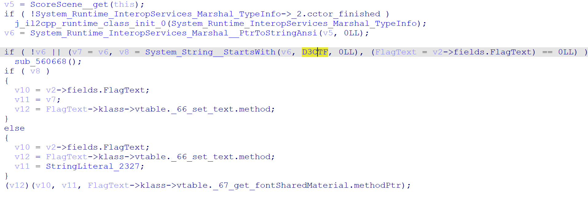
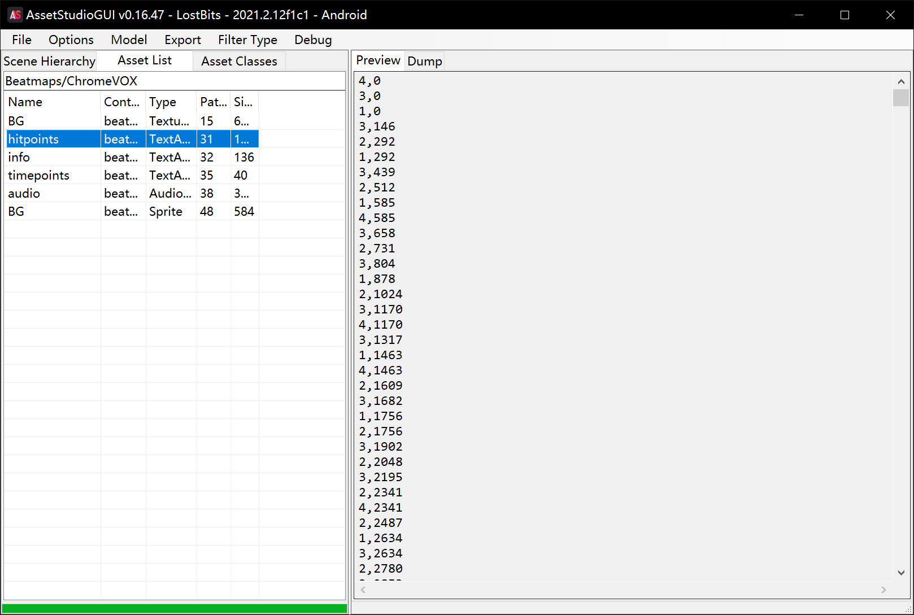
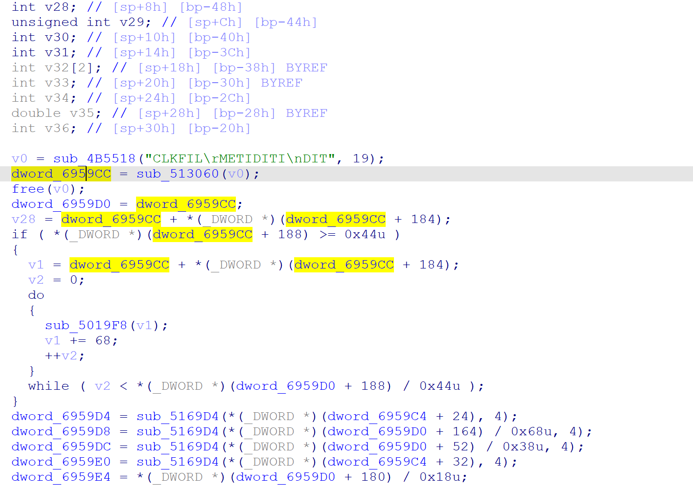

# IL2CPP 逆向

## Preface

il2cpp 将游戏 C# 代码转换为 C++ 代码，然后编译为各平台 Native 代码。


虽然游戏逻辑是以 Native 代码运行, 但依然要实现 C# 某些语言特性（如GC、反射)，il2cpp将所有的 C# 中的类名、方法名、属性名、字符串等地址信息记录在 global-metadata.dat 文件。

il2cpp启动时会从这个文件读取所需要的类名、方法名、属性名、字符串等地址信息。


Unity 使用 Mono 方式打包出来的 apk，那么此类逆向我们需要先解压apk，然后利用 IL2CPPDumper 来获取主逻辑代码符号

> https://github.com/Perfare/Il2CppDumper

### libil2cpp.so与global-metadata.dat

想要利用上述工具，首先是要拿到这两个文件

**Android**

源\lib\armeabi-v8a\libil2cpp.so

源\assets\bin\Data\Managed\Metadata\global-metadata.dat

**PC**

<app-name>_Data/il2cpp_data/Metadata/global-metadata.dat

UnityPlayer.dll

随后放入 input 目录


点击该.dat即可


随后我们去 output 目录查看


**dump.cs**

这个文件会把 C# 的 dll 代码的类、方法、字段列出来


**IL2cpp.h**

生成的 cpp 头文件，从头文件里可以看到相关的数据结构


**script.json**

以 json 格式显示类的方法信息


**stringliteral.json**

以 json 的格式显示所有字符串信息


**DummyDll**

进入该目录，可以看到很多dll，其中就有 Assembly-CSharp.dll 和我们刚刚的 dump.cs 内容是一致的


### IDA TIME

当进行 IL2CPP 打包时，选择 CPU 架构可以选择 ARMv7 和 ARM64，所以相对应我们在 apk 解压后所看到的就是 arm64-v8a 和 armeabi-v7a，简单来说就是 64位 和 32位

随后放入相对应的 IDA，再按 ALT + F7 选择该文件


再选该文件


再导入头文件


经过漫长的等待就成功恢复符号了


## Finding loaders for obfuscated global-metadata.dat files

> https://katyscode.wordpress.com/2021/02/23/il2cpp-finding-obfuscated-global-metadata/

然而刚刚那标准的一套用 IL2CPPDumper 的套路并不完全适用，很多厂商都采取了对抗措施，接下来讲解混淆 global-metadata.dat 的思路

### How do I know if global-metadata.dat is obfuscated?

当拿到我们的 metadata 文件后，放入查找十六进制的文件，如果开头魔术字依然是 AF 1B B1 FA，那么一般来说是没有被混淆的


那如果不是这个魔术字，一般来说也是被混淆了，而就像平常的逆向一样，程序运行起来肯定是会解密数据然后使用，这个思路同样使用于这，程序运行起来直接搜索该魔术字即可拿到 针对运行时解密的混淆手段

```js
function frida_Memory(pattern)
{
Java.perform(function ()
{
    console.log("头部标识:" + pattern);
    var addrArray = Process.enumerateRanges("r--");
    for (var i = 0; i < addrArray.length; i++)
    {
        var addr = addrArray[i];
        Memory.scan(addr.base, addr.size, pattern,
        {
            onMatch: function (address, size)
            {
                console.log('搜索到 ' + pattern + " 地址是:" + address.toString());
                console.log(hexdump(address,
                    {
                        offset: 0,
                        length: 64,
                        header: true,
                        ansi: true
                    }
                    ));
                //0x108，0x10C如果不行，换0x100，0x104
                var DefinitionsOffset = parseInt(address, 16) + 0x108;
                var DefinitionsOffset_size = Memory.readInt(ptr(DefinitionsOffset));

                var DefinitionsCount = parseInt(address, 16) + 0x10C;
                var DefinitionsCount_size = Memory.readInt(ptr(DefinitionsCount));

                //根据两个偏移得出global-metadata大小
                var global_metadata_size = DefinitionsOffset_size + DefinitionsCount_size
                    console.log("大小：", global_metadata_size);
                var file = new File("/data/data/" + get_self_process_name() + "/global-metadata.dat", "wb");
                file.write(Memory.readByteArray(address, global_metadata_size));
                file.flush();
                file.close();
                console.log('导出完毕...');
            },
            onComplete: function ()
            {
                //console.log("搜索完毕")
            }
        }
        );
    }
}
);
}
setImmediate(frida_Memory("AF 1B B1 FA")); //global-metadata.dat头部特征
```


### Metadata loader code path

然而也有几种情况是上述方法解决不了的，我们得了解一下 metadata 的加载过程，因为混淆手段就有可能混入其中

而加载的调用链如下

```
il2cpp_init
  -> il2cpp::vm::Runtime::Init
    -> il2cpp::vm::MetadataCache::Initialize
      -> il2cpp::vm::MetadataLoader::LoadMetadataFile
```

而在我们逆向中，这些都是不带符号的，然而我们可以对着源码来找到相对应的函数（不同版本的源码有一些差别）

il2cpp_init (located in il2cpp-api.cpp, comments elided):

```C++
int il2cpp_init(const char* domain_name)
{
    setlocale(LC_ALL, "");
    return Runtime::Init(domain_name, "v4.0.30319");
}
```

il2cpp::vm::Runtime::Init (located in vm/Runtime.cpp):

```C
bool Runtime::Init(const char* filename, const char *runtime_version)
{
    SanityChecks();
 
    os::Initialize();
    os::Locale::Initialize();
    MetadataAllocInitialize();
 
    s_FrameworkVersion = framework_version_for(runtime_version);
 
    os::Image::Initialize();
    os::Thread::Init();
    il2cpp::utils::RegisterRuntimeInitializeAndCleanup::ExecuteInitializations();
 
    if (!MetadataCache::Initialize())
        return false;
    Assembly::Initialize();
    gc::GarbageCollector::Initialize();
 
    Thread::Initialize();
    Reflection::Initialize();
 
    register_allocator(il2cpp::utils::Memory::Malloc);
 
    memset(&il2cpp_defaults, 0, sizeof(Il2CppDefaults));
 
    const Il2CppAssembly* assembly = Assembly::Load("mscorlib.dll");
 
    il2cpp_defaults.corlib = Assembly::GetImage(assembly);
    DEFAULTS_INIT(object_class, "System", "Object");
    DEFAULTS_INIT(void_class, "System", "Void");
    DEFAULTS_INIT_TYPE(boolean_class, "System", "Boolean", bool);
    DEFAULTS_INIT_TYPE(byte_class, "System", "Byte", uint8_t);
    DEFAULTS_INIT_TYPE(sbyte_class, "System", "SByte", int8_t);
    DEFAULTS_INIT_TYPE(int16_class, "System", "Int16", int16_t);
    DEFAULTS_INIT_TYPE(uint16_class, "System", "UInt16", uint16_t);
    DEFAULTS_INIT_TYPE(int32_class, "System", "Int32", int32_t);
    DEFAULTS_INIT_TYPE(uint32_class, "System", "UInt32", uint32_t);
    DEFAULTS_INIT(uint_class, "System", "UIntPtr");
    DEFAULTS_INIT_TYPE(int_class, "System", "IntPtr", intptr_t);
    DEFAULTS_INIT_TYPE(int64_class, "System", "Int64", int64_t);
    DEFAULTS_INIT_TYPE(uint64_class, "System", "UInt64", uint64_t);
    DEFAULTS_INIT_TYPE(single_class, "System", "Single", float);
    DEFAULTS_INIT_TYPE(double_class, "System", "Double", double);
    DEFAULTS_INIT_TYPE(char_class, "System", "Char", Il2CppChar);
    DEFAULTS_INIT(string_class, "System", "String");
    // ...
```

il2cpp::vm::MetadataCache::Initialize (located in vm/MetadataCache.cpp, comments elided):

```C
bool il2cpp::vm::MetadataCache::Initialize()
{
    s_GlobalMetadata = vm::MetadataLoader::LoadMetadataFile("global-metadata.dat");
    if (!s_GlobalMetadata)
        return false;
 
    s_GlobalMetadataHeader = (const Il2CppGlobalMetadataHeader*)s_GlobalMetadata;
    IL2CPP_ASSERT(s_GlobalMetadataHeader->sanity == 0xFAB11BAF);
    IL2CPP_ASSERT(s_GlobalMetadataHeader->version == 24);
 
    s_TypeInfoTable = (Il2CppClass**)IL2CPP_CALLOC(s_Il2CppMetadataRegistration->typesCount, sizeof(Il2CppClass*));
    s_TypeInfoDefinitionTable = (Il2CppClass**)IL2CPP_CALLOC(s_GlobalMetadataHeader->typeDefinitionsCount / sizeof(Il2CppTypeDefinition), sizeof(Il2CppClass*));
    s_MethodInfoDefinitionTable = (const MethodInfo**)IL2CPP_CALLOC(s_GlobalMetadataHeader->methodsCount / sizeof(Il2CppMethodDefinition), sizeof(MethodInfo*));
    s_GenericMethodTable = (const Il2CppGenericMethod**)IL2CPP_CALLOC(s_Il2CppMetadataRegistration->methodSpecsCount, sizeof(Il2CppGenericMethod*));
    s_ImagesCount = s_GlobalMetadataHeader->imagesCount / sizeof(Il2CppImageDefinition);
    s_ImagesTable = (Il2CppImage*)IL2CPP_CALLOC(s_ImagesCount, sizeof(Il2CppImage));
    s_AssembliesCount = s_GlobalMetadataHeader->assembliesCount / sizeof(Il2CppAssemblyDefinition);
    s_AssembliesTable = (Il2CppAssembly*)IL2CPP_CALLOC(s_AssembliesCount, sizeof(Il2CppAssembly));
    // ...
```

il2cpp::vm::MetadataLoader::LoadMetadataFile (located in vm/MetadataLoader.cpp):

```C
void* il2cpp::vm::MetadataLoader::LoadMetadataFile(const char* fileName)
{
    std::string resourcesDirectory = utils::PathUtils::Combine(utils::Runtime::GetDataDir(), utils::StringView<char>("Metadata"));
 
    std::string resourceFilePath = utils::PathUtils::Combine(resourcesDirectory, utils::StringView<char>(fileName, strlen(fileName)));
 
    int error = 0;
    os::FileHandle* handle = os::File::Open(resourceFilePath, kFileModeOpen, kFileAccessRead, kFileShareRead, kFileOptionsNone, &error);
    if (error != 0)
    {
        utils::Logging::Write("ERROR: Could not open %s", resourceFilePath.c_str());
        return NULL;
    }
 
    void* fileBuffer = utils::MemoryMappedFile::Map(handle);
 
    os::File::Close(handle, &error);
    if (error != 0)
    {
        utils::MemoryMappedFile::Unmap(fileBuffer);
        fileBuffer = NULL;
        return NULL;
    }
 
    return fileBuffer;
}
```

有了这些源码，我们只需要在 IDA 中对照他们识别出相对应的函数，而关键是后两个函数，分别是

il2cpp::vm::MetadataLoader::LoadMetadataFile 该函数将 metadata 的文件名文件映射入内存

il2cpp::vm::MetadataCache::Initialize 该函数将映射文件的指针存储在全局变量中，然后开始从这变量读取数据结构

所然！解混淆或是解密代码一般都在这两个函数里，我们只需要样本代码与源码对比差别即可。


特别指出在引用文中的一个例子，现在看一个 IDA 中的例子

```C++
char il2cpp::vm::MetadataCache::Initialize()
{
  v0 = sub_180261550("global-metadata.dat");
  *&xmmword_182B7C2D8 = v0;
  if ( v0 )
  {
    *(&xmmword_182B7C2D8 + 1) = v0;
    qword_182B7B948 = j_j__calloc_base(*(qword_182B7C2C0 + 48), 8i64);
    qword_182B7B950 = j_j__calloc_base(*(*(&xmmword_182B7C2D8 + 1) + 164i64) / 0x5Cui64, 8i64);
    qword_182B7B958 = j_j__calloc_base(*(*(&xmmword_182B7C2D8 + 1) + 52i64) >> 5, 8i64);
    qword_182B7B968 = j_j__calloc_base(*(qword_182B7C2C0 + 64), 8i64);
    dword_182B7B970 = *(*(&xmmword_182B7C2D8 + 1) + 172i64) / 0x28ui64;
    qword_182B7B978 = j_j__calloc_base(dword_182B7B970, 80i64);
    dword_182B7B980 = *(*(&xmmword_182B7C2D8 + 1) + 180i64) / 0x44ui64;
    qword_182B7B988 = j_j__calloc_base(dword_182B7B980, 96i64);
    v1 = *(&xmmword_182B7C2D8 + 1);
```

对比下源码不难发现 sub_180261550 就是 il2cpp::vm::MetadataLoader::LoadMetadataFromFile

需要注意的是这个 v0 指针十分重要，因为解混淆或是解密都会调用到这个指针（一般是在加载前解密，而不是在加载后解密，这样会导致未解密的数据残余在内存中影响性能），通常来说应用程序在访问 metadata 前执行解密，或是在 il2cpp: : vm: : MetadataLoader: : LoadMetadataFromFile 之前或之中。


### Finding the metadata loader: What if there is no il2cpp_init?

那么以上套路是针对我们能在 il2cpp 里找到 il2cpp_init 的函数，但是如果没有，我们就要继续往上找 UnityPlayer.dll 或者 libunity.so，而这个我们没有办法用源码对照，不过我们可以创建一个 Unity 项目生成 PDB，就可以看到名字和符号那些。

对于这种情况我们主要关心 il2cpp_init.cpp 到底是哪里被引用与调用，那么未被混淆的流程如此


UnityMainImpl 有很多函数调用，不过我们可以通过字符串来寻找

```C
  winutils::DisplayErrorMessagesAndQuit("Data folder not found");
}
DetectIL2CPPVersion();
v78.m_data = 0i64;
v78.m_size = 0i64;
v78.m_label.identifier = 68;
v78.m_internal[0] = 0;
core::StringStorageDefault<char>::assign(&v78, "GameAssembly.dll", 0x10ui64);
v27 = !LoadIl2Cpp(&v78);
if ( v78.m_data && v78.m_capacity > 0 )
  operator delete(v78.m_data, v78.m_label);
if ( v27 )
  winutils::DisplayErrorMessagesAndQuit("Failed to load il2cpp");
v78.m_data = 0i64;
v78.m_size = 0i64;
v78.m_label.identifier = 68;
v78.m_internal[0] = 0;
core::StringStorageDefault<char>::assign(&v78, "il2cpp_data", 0xBui64);
```

LoadIl2Cpp 也同样可以字符串快速寻找

```C
v2 = 1;
 il2cpp_init = LookupSymbol(v1, "il2cpp_init", kSymbolRequired);
 if ( !il2cpp_init )
 {
   v2 = 0;
   printf_console("il2cpp: function il2cpp_init not found\n");
 }
 il2cpp_init_utf16 = LookupSymbol(gIl2CppModule, "il2cpp_init_utf16", kSymbolRequired);
 if ( !il2cpp_init_utf16 )
 {
   v2 = 0;
   printf_console("il2cpp: function il2cpp_init_utf16 not found\n");
 }
 il2cpp_shutdown = LookupSymbol(gIl2CppModule, "il2cpp_shutdown", kSymbolRequired);
 if ( !il2cpp_shutdown )
 {
   v2 = 0;
   printf_console("il2cpp: function il2cpp_shutdown not found\n");
 }
```

InitializeIl2CppFromMain

```C
char __fastcall InitializeIl2CppFromMain(const core::basic_string<char,core::StringStorageDefault<char> > *monoConfigPath, const core::basic_string<char,core::StringStorageDefault<char> > *dataPath, int argc, const char **argv)
{
  v4 = argv;
  v5 = argc;
  v6 = dataPath;
  v7 = monoConfigPath;
  RegisterAllInternalCalls();
  il2cpp_runtime_unhandled_exception_policy_set(IL2CPP_UNHANDLED_POLICY_LEGACY);
  il2cpp_set_commandline_arguments(v5, v4, 0i64);
  v8 = v7->m_data;
  if ( !v7->m_data )
    v8 = &v7->8;
  il2cpp_set_config_dir(v8);
  v9 = v6->m_data;
  if ( !v6->m_data )
    v9 = &v6->8;
  il2cpp_set_data_dir(v9);
  v10 = GetMonoDebuggerAgentOptions(&result, 0);
  v11 = v10->m_data;
  if ( !v10->m_data )
    v11 = &v10->8;
  il2cpp_debugger_set_agent_options(v11);
  if ( result.m_data && result.m_capacity )
    operator delete(result.m_data, result.m_label);
  il2cpp_init("IL2CPP Root Domain");
  il2cpp_set_config("unused_application_configuration");
  profiling::ScriptingProfiler::Initialize();
  return 1;
}
```

然而有相当不同的变化在不同的版本中，他们的共同特点是对 il2cpp_init 的调用和 IL2CPP Root Domain 与 unused_application_configuration，所以通过这些我们也同样快速找到（如果没有混淆的话）。


## D3Mug

### 0x00 Daily Check Shell

IL2CPP逆向，无壳。

于是惯用套路查找 libil2cpp.so 和 global-metadata.dat 来恢复符号，metadata未被混淆，所以可以直接恢复。

接着可以配合 Assembly-CSharp.dll 或 dump.cs 来配合查看函数信息。


### 0x01 Track

尝试 hook IL2CPP 的函数，可是都不行，看别人博客都是模拟器跳这个，我真机跳这个是为什么，hook 未果


那么开始静态审计，既然是音游，通关调试肯定是全部按好即可，于是在 Assembly-CSharp.dll 很容易定位到 notehit notemiss 这些函数

```C
void __fastcall GameManager__NoteHit(GameManager_o *this, float preciseTime, int32_t level, const MethodInfo *method)
{
  struct TMPro_TMP_Text_o *PerfectText; // x19
  System_String_o *v6; // x0
  System_String_o *v7; // x0
  const MethodInfo *v8; // x1
  uint32_t v9; // w0
  int v10; // [xsp+Ch] [xbp-14h] BYREF

  v10 = 0;
  if ( level >= 1 )
  {
    PerfectText = this->fields.PerfectText;
    if ( PerfectText )
      goto LABEL_3;
LABEL_8:
    sub_560668();
  }
  PerfectText = this->fields.GoodText;
  if ( !PerfectText )
    goto LABEL_8;
LABEL_3:
  v6 = (PerfectText->klass->vtable._65_get_text.method)(
         PerfectText,
         PerfectText->klass->vtable._66_set_text.methodPtr,
         method);
  v10 = System_Int32__Parse(v6, 0LL) + 1;
  v7 = System_Int32__ToString(&v10, 0LL);
  (PerfectText->klass->vtable._66_set_text.method)(
    PerfectText,
    v7,
    PerfectText->klass->vtable._67_get_fontSharedMaterial.methodPtr);
  if ( (preciseTime * 1000.0) >= 0.0 )
    v9 = (preciseTime * 1000.0);
  else
    v9 = (preciseTime * 1000.0);
  GameManager__update(v9, v8);
}
```

共同点就是算好分数，就直接调用 GameManager__update，而该函数往里查找可以发现调用了 d3mug.so 文件里的 update 函数

那么可以得出结论每次点击到 preciseTime 就会正确 update，而该 update 函数会把值更新到 Server:instance 里

```C
__int64 __fastcall update(char note_bit)
{
  __int64 v2; // x8
  __int64 enc; // x0
  unsigned __int64 v4; // x10
  __int64 v5; // x9
  unsigned __int64 v6; // x10
  __int64 v7; // x9

  v2 = Server::instance;
  if ( !Server::instance )
  {
    enc = operator new(0x13B0uLL);
    v2 = enc;
    v4 = 0x1571LL;
    v5 = 6LL;
    *(enc + 32) = 0;
    *enc = *ENC;
    *(enc + 16) = *&ENC[16];
    do
    {
      v4 = v5 + 0x6C078965 * ((v4 >> 30) ^ v4) - 5;
      *(enc + 8 * v5++) = v4;
    }
    while ( v5 != 629 );
    v6 = 0xF44EB78ELL;
    v7 = 6LL;
    *(enc + 40) = 0xF44EB78ELL;
    do
    {
      v6 = v7 + 0x6C078965 * ((v6 >> 30) ^ v6) - 5;
      *(enc + 8 * v7++) = v6;
    }
    while ( v7 != 629 );
    *(enc + 5032) = 0LL;
    Server::instance = enc;
  }
  return Server::run(v2, note_bit);
}
```

而之后的分数结算的函数 ScoreScene__Start 只是检测了 Server::instance 前缀是否位 D3CTF



那么怎么点才是 preciseTime 呢，而音游落下的方法并不是随即的，而是固定的，所以我们可以找一下加载这个数据的地方

既然有符号，看到可疑的直接看即可，于是发现

```
void __fastcall BeatScroller__ParseBeatTampoMap(
        BeatScroller_o *this,
        System_String_o *map_data,
        System_String_o *hit_data,
        const MethodInfo *method)
```

往上找，于是发现加载路径


于是利用 AssetStudio 来提取数据



于是我们大概审一下生成地图的函数，可知后面那个就是我们要的 preciseTime

```C
// local variable allocation has failed, the output may be wrong!
void __fastcall BeatScroller__GenerateNote(BeatScroller_o *this, System_String_o *hit_data, const MethodInfo *method)
{
  __int64 v5; // x1
  __int64 v6; // x1
  UnityEngine_Transform_o *transform; // x0
  UnityEngine_Transform_o *v8; // x21
  UnityEngine_Transform_o *v9; // x0
  int v10; // s0
  __int64 v13; // x1
  UnityEngine_Transform_o *v14; // x21
  struct UnityEngine_Vector3_StaticFields *static_fields; // x8
  System_String_array *split_hit_data; // x0
  int max_length; // w8
  System_String_array *split_hit_data1; // x20
  unsigned int v19; // w24
  System_String_o *v20; // x0
  System_String_array *v21; // x0
  System_String_array *v22; // x22
  int32_t v23; // w0
  int v24; // w21
  float last; // s0
  Il2CppObject *PrefabNote; // x22
  float last1; // s8
  Il2CppObject *v28; // x0
  UnityEngine_GameObject_o *v29; // x22
  UnityEngine_Transform_o *v30; // x23
  UnityEngine_Transform_o *v31; // x0
  UnityEngine_Transform_o *v32; // x0
  float cameraXSize; // s11
  float OriginBeatTampo_k__BackingField; // s12
  UnityEngine_Transform_o *v35; // x23
  UnityEngine_Transform_o *v36; // x0
  int v37; // s2
  float last1_div_1000; // s8
  float v39; // s1
  float v40; // s0
  Il2CppObject *Component_object; // x0
  UnityEngine_Vector3_o v42; // 0:s0.4,4:s1.4,8:s2.4

  if ( (byte_198F173 & 1) == 0 )
  {
    sub_56055C(&Method_UnityEngine_GameObject_GetComponent_NoteObject___, hit_data);
    sub_56055C(&Method_UnityEngine_Object_Instantiate_GameObject___, v5);
    sub_56055C(&UnityEngine_Object_TypeInfo, v6);
    byte_198F173 = 1;
  }
  transform = UnityEngine_Component__get_transform(this, 0LL);
  if ( !this->fields.Line )
    goto LABEL_27;
  v8 = transform;
  v9 = UnityEngine_GameObject__get_transform(this->fields.Line, 0LL);
  if ( !v9 )
    goto LABEL_27;
  *&v10 = UnityEngine_Transform__get_position(v9, 0LL);
  if ( !v8 )
    goto LABEL_27;
  UnityEngine_Transform__set_position(v8, *&v10, 0LL);
  v14 = UnityEngine_Component__get_transform(this, 0LL);
  if ( !byte_198F1BC )
  {
    sub_56055C(&UnityEngine_Vector3_TypeInfo, v13);
    byte_198F1BC = 1;
  }
  if ( !v14 )
    goto LABEL_27;
  static_fields = UnityEngine_Vector3_TypeInfo->static_fields;
  v42.fields.x = static_fields->backVector.fields.x + static_fields->backVector.fields.x;
  v42.fields.y = static_fields->backVector.fields.y + static_fields->backVector.fields.y;
  v42.fields.z = static_fields->backVector.fields.z + static_fields->backVector.fields.z;
  UnityEngine_Transform__Translate_16881896(v14, v42, 0LL);
  if ( !hit_data )
    goto LABEL_27;
  split_hit_data = System_String__Split(hit_data, 0xAu, 0, 0LL);
  if ( !split_hit_data )
    goto LABEL_27;
  max_length = split_hit_data->max_length;
  split_hit_data1 = split_hit_data;
  if ( max_length >= 1 )
  {
    v19 = 0;
    while ( 1 )
    {
      if ( v19 >= max_length )
LABEL_28:
        sub_560670();
      v20 = split_hit_data1->m_Items[v19];
      if ( !v20 )
        break;
      v21 = System_String__Split(v20, 0x2Cu, 0, 0LL);
      if ( !v21 )
        break;
      v22 = v21;
      if ( !v21->max_length )
        goto LABEL_28;
      v23 = System_Int32__Parse(v21->m_Items[0], 0LL);
      if ( v22->max_length <= 1 )
        goto LABEL_28;
      v24 = v23;
      last = System_Single__Parse(v22->m_Items[1], 0LL);
      PrefabNote = this->fields.PrefabNote;
      last1 = last;
      if ( !UnityEngine_Object_TypeInfo->_2.cctor_finished )
        j_il2cpp_runtime_class_init_0(UnityEngine_Object_TypeInfo);
      v28 = UnityEngine_Object__Instantiate_object_(PrefabNote, Method_UnityEngine_Object_Instantiate_GameObject___);
      if ( !v28 )
        break;
      v29 = v28;
      v30 = UnityEngine_GameObject__get_transform(v28, 0LL);
      v31 = UnityEngine_Component__get_transform(this, 0LL);
      if ( !v30 )
        break;
      UnityEngine_Transform__set_parent(v30, v31, 0LL);
      v32 = UnityEngine_GameObject__get_transform(v29, 0LL);
      cameraXSize = this->fields.cameraXSize;
      OriginBeatTampo_k__BackingField = this->fields._OriginBeatTampo_k__BackingField;
      v35 = v32;
      v36 = UnityEngine_Component__get_transform(this, 0LL);
      if ( !v36 )
        break;
      *(&v37 - 2) = UnityEngine_Transform__get_position(v36, 0LL);
      if ( !v35 )
        break;
      last1_div_1000 = last1 / 1000.0;
      v39 = last1_div_1000 * OriginBeatTampo_k__BackingField;
      v40 = ((cameraXSize / 5.0) * v24) + (cameraXSize * -0.5);
      UnityEngine_Transform__set_position(v35, *(&v37 - 2), 0LL);
      Component_object = UnityEngine_GameObject__GetComponent_object_(
                           v29,
                           Method_UnityEngine_GameObject_GetComponent_NoteObject___);
      if ( !Component_object )
        break;
      *(&Component_object[1].monitor + 1) = last1_div_1000;
      max_length = split_hit_data1->max_length;
      if ( ++v19 >= max_length )
        return;
    }
LABEL_27:
    sub_560668();
  }
}
```


### 0x02 Get Flag

于是总结一下

1. 程序只有一个界面入口，也就是只有这一个地图，于是我们拿到 preciseTime 的数据
2. 随后程序检测我们的 notehit 是否和 preciseTime 吻合
3. 最后在 ScoreScene__Start 做了个检测是否正确解密为 D3CTF

所以其中一个解密思路就是我们主动调用每次 notehit 会调用的 update 函数，将 preciseTime 数据传入，最后再读取一下解密完的数据即可

于是用下 Frida 即可

```js
function main(){
    
    var soBase = Module.findBaseAddress("libd3mug.so");

    const update = new NativeFunction(soBase.add(0x0000780), "pointer", ["char"]);
    const instance = soBase.add(0x02D18); 

    instance.writePointer(new NativePointer(0)); 
    for (const t of hitpoints) {
        update(t);
    }
    console.log(instance.readPointer().readCString());
}


main();
```

```python
import frida

device = frida.get_usb_device()
session = device.attach(2327)

with open("hook.js", encoding='UTF-8') as f:
    script = session.create_script(f.read())
script.load()

input()
```

Get Flag!


## BabyUnity3d

### 0x00 Daily Check Shell

IL2CPP逆向，无壳。

但是这次 metadata 混淆了，可以发现一开始的魔术字的不是原来的样子了，于是两个思路

第一就是运行后内存中直接搜索魔术字

第二就是本文刚开始写的，对比源代码找加载 metadata 的部分既然加密了，在那也许就能找到解密的地方


### 0x01 Deobfuscate metadata

而该题没法直接在内存中直接搜索到原本的魔术字，于是采用第二种方法，再回忆下调用链

```
il2cpp_init
  -> il2cpp::vm::Runtime::Init
    -> il2cpp::vm::MetadataCache::Initialize
      -> il2cpp::vm::MetadataLoader::LoadMetadataFile
```

于是直接搜 init 即可找到 il2cpp::vm::Runtime::Init


随后进入该函数后一个个查找对比源码可以发现 sub_4B5564 为 il2cpp::vm::MetadataCache::Initialize



那么看该函数可以很明显发现，global-metadata.dat 字符串变成了其他字符串，但程序运行 sub_4B5518 会自动解密回去

于是对应着源码 sub_513060 就是 il2cpp::vm::MetadataLoader::LoadMetadataFile，返回一个指针完全吻合

那么解密的 metadata 的地方就只可能是 LoadMetadataFile 该函数了，于是将该函数与原函数对比说实话看不太出来到底哪里变了，当然我们也可以一个个点进去看看哪个比较可疑，当然还有个方法找个没被混淆的对比即可，如图


很明显 sub_512FDC 就是不一样的地方（刚刚调试了一下这几个符号全恢复了？？是巧合吗）

```C
char *__fastcall sub_C409CFDC(int a1, size_t a2)
{
  char *result; // r0
  size_t v5; // r2

  result = (char *)malloc(a2);
  if ( a2 )
  {
    v5 = 0;
    do
    {
      *(_DWORD *)&result[v5 & 0xFFFFFFFC] = *(_DWORD *)(a1 + (v5 & 0xFFFFFFFC)) ^ dword_C4166F6C[(v5 + v5 / 0x84) % 0x84];
      v5 += 4;
    }
    while ( v5 < a2 );
  }
  return result;
}
```

写出解密脚本

```python
import struct
f = open('global-metadata.dat', 'rb')
a = ""
a = f.read()
key = [0xF83DA249, 0x15D12772, 0x40C50697, 0x984E2B6B, 0x14EC5FF8, 0xB2E24927,
       0x3B8F77AE, 0x472474CD, 0x5B0CE524, 0xA17E1A31, 0x6C60852C, 0xD86AD267, 0x832612B7, 0x1CA03645, 0x5515ABC8,
       0xC5FEFF52, 0xFFFFAC00, 0x0FE95CB6, 0x79CF43DD, 0xAA48A3FB, 0xE1D71788, 0x97663D3A, 0xF5CFFEA7, 0xEE617632,
       0x4B11A7EE, 0x040EF0B5, 0x0606FC00, 0xC1530FAE, 0x7A827441, 0xFCE91D44, 0x8C4CC1B1, 0x7294C28D, 0x8D976162,
       0x8315435A, 0x3917A408, 0xAF7F1327, 0xD4BFAED7, 0x80D0ABFC, 0x63923DC3, 0xB0E6B35A, 0xB815088F, 0x9BACF123,
       0xE32411C3, 0xA026100B, 0xBCF2FF58, 0x641C5CFC, 0xC4A2D7DC, 0x99E05DCA, 0x9DC699F7, 0xB76A8621, 0x8E40E03C,
       0x28F3C2D4, 0x40F91223, 0x67A952E0, 0x505F3621, 0xBAF13D33, 0xA75B61CC, 0xAB6AEF54, 0xC4DFB60D, 0xD29D873A,
       0x57A77146, 0x393F86B8, 0x2A734A54, 0x31A56AF6, 0x0C5D9160, 0xAF83A19A, 0x7FC9B41F, 0xD079EF47, 0xE3295281,
       0x5602E3E5, 0xAB915E69, 0x225A1992, 0xA387F6B2, 0x7E981613, 0xFC6CF59A, 0xD34A7378, 0xB608B7D6, 0xA9EB93D9,
       0x26DDB218, 0x65F33F5F, 0xF9314442, 0x5D5C0599, 0xEA72E774, 0x1605A502, 0xEC6CBC9F, 0x7F8A1BD1, 0x4DD8CF07,
       0x2E6D79E0, 0x6990418F, 0xCF77BAD9, 0xD4FE0147, 0xFEF4A3E8, 0x85C45BDE, 0xB58F8E67, 0xA63EB8D7, 0xC69BD19B,
       0xDA442DCA, 0x3C0C1743, 0xE6F39D49, 0x33568804, 0x85EB6320, 0xDA223445, 0x36C4A941, 0xA9185589, 0x71B22D67,
       0xF59A2647, 0x3C8B583E, 0xD7717DED, 0xDF05699C, 0x4378367D, 0x1C459339, 0x85133B7F, 0x49800CE2, 0x3666CA0D,
       0xAF7AB504, 0x4FF5B8F1, 0xC23772E3, 0x3544F31E, 0x0F673A57, 0xF40600E1, 0x7E967417, 0x15A26203, 0x5F2E34CE,
       0x70C7921A, 0xD1C190DF, 0x5BB5DA6B, 0x60979C75, 0x4EA758A4, 0x078FE359, 0x1664639C, 0xAE14E73B, 0x2070FF03]
with open('decrypt', 'wb') as fp:
    n = 0
    while n < len(a):
        num = struct.unpack("<I", a[n:n + 4])[0]
        num = num ^ key[(n + n // 0x84) % 0x84]
        d = struct.pack('I', num)
        fp.write(d)
        n = n + 4
```

恢复了之后，魔术字还是不对，不过很明显是人为写上去的魔术字了，直接改回原来的魔术字即可


### 0x02 Get Flag

那么恢复了就很简单了，直接定位到关键函数


发现只是个AES加密，密钥 IV直接交叉引用找赋值给 Check_TypeInfo 即可

```C
bool __fastcall Check__CheckFlag(Check_o *this, System_String_o *input, const MethodInfo *method)
{
  Check_c *v4; // r0
  System_String_o *v5; // r4
  const MethodInfo *v7; // [sp+0h] [bp-18h]

  if ( !byte_C4226825 )
  {
    sub_C40422BC(1279);
    byte_C4226825 = 1;
  }
  v4 = Check_TypeInfo;
  if ( (Check_TypeInfo->_2.bitflags2 & 1) != 0 && !Check_TypeInfo->_2.cctor_finished )
  {
    il2cpp_runtime_class_init_0((int)Check_TypeInfo);
    v4 = Check_TypeInfo;
  }
  v5 = Check__AESEncrypt(
         (Il2CppObject *)v4->static_fields,
         input,
         v4->static_fields->AESKEY,
         v4->static_fields->AES_IV591,
         v7);
  if ( (string_TypeInfo->_2.bitflags2 & 1) != 0 && !string_TypeInfo->_2.cctor_finished )
    il2cpp_runtime_class_init_0((int)string_TypeInfo);
  return System_String__op_Equality(0, v5, (System_String_o *)StringLiteral_2814, 0);
}
```

于是搓一个解密脚本（cyberChef的AES是真不行啊）

```python
from Crypto.Cipher import AES
from Crypto.Util.Padding import unpad
import base64

def aes_decrypt(ciphertext, key):
    cipher = AES.new(key, AES.MODE_CBC, b'58f3a445939aeb79')
    ciphertext = base64.b64decode(ciphertext)
    plaintext = unpad(cipher.decrypt(ciphertext), AES.block_size)
    return plaintext.decode('utf-8')


key = b'91c775fa0f6a1cba'  
ciphertext = 'w0ZyUZAHhn16/MRWie63lK+PuVpZObu/NpQ/E/ucplc=' 

decrypted_text = aes_decrypt(ciphertext, key)
print(decrypted_text)
```

Get Flag!


**Reference**

> https://katyscode.wordpress.com/2021/02/23/il2cpp-finding-obfuscated-global-metadata/
>
> https://cloud.tencent.com/developer/article/2216959
>
> https://blog.shi1011.cn/ctf/2223
>
> https://blog.csdn.net/linxinfa/article/details/116572369
