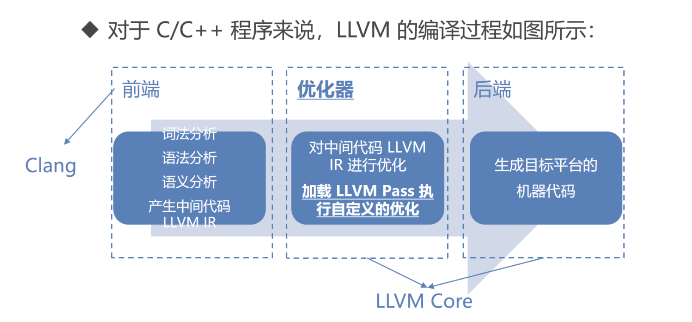
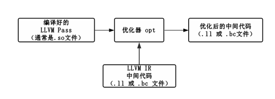

# LLVM

看雪课笔记

## CH01

**学习目标**

- LLVM 编译器框架基础知识
- 代码混淆的基本思想和基本原理
- 基于 LLVM Pass 框架编程实现代码混淆工具的能力


## CH02

### LLVM 环境搭建 & 基本用法



**第一步 将源代码转化成 LLVM IR**

LLVM IR 有两种表现形式

- .ll，人类可阅读
- .bc，机器方便处理的二进制格式

```
clang -S -emit-llvm hello.cpp -o hello.ll
clang -c -emit-llvm hello.cpp -o hello.bc
```


**第二步：优化 LLVM IR**

使用 opt 指令对 LLVM IR 进行优化

```
opt -load LLVMObfuscator.so -hlw -S hello.ll -o hello_opt.ll
```

- -load 加载特定的 LLVM Pass (集合)进行优化（通常为.so文件） 
- -hlw 是 LLVM Pass 中自定义的参数，用来指定使用哪个 Pass 进行优化


**第三步：编译 LLVM IR 为可执行文件**

从 LLVM IR 到可执行文件还有一系列复杂的过程，clang可以整合

```
clang hello_opt.ll -o hello
```


### 编写第一个 LLVM Pass

- LLVM Pass 框架是整个 LLVM 提供给用户用来干预代码优化过程的框架，也是我们编写代码混淆工具的基础。
- 编译后的 LLVM Pass 通过优化器 opt 进行加载，可以对 LLVM IR 中间代码进行**分析**和**修改**，生成新的中间代码。



llvm/include/llvm 目录

- llvm/include/llvm 文件夹存放了 LLVM 提供的一些公共头文件。
- 即我们在开发过程中可以使用的头文件。


llvm/lib 目录

- ullvm/lib 文件夹存放了 LLVM 大部分源代码（.cpp 文件）和一些不公开的头文件


llvm/lib/Transforms 目录

- llvm/lib/Transforms 文件夹存放**所有** **LLVM Pass** **的源代码**
- llvm/lib/Transforms 文件夹也存放了一些 LLVM 自带的 Pass


Pass类型

- 在设计一个新的 LLVM Pass 时，你最先要决定的就是选择 Pass 的类型。
- LLVM 有多种类型的 Pass 可供选择，包括：ModulePass、FuncitonPass、CallGraphPass、LoopPass等等。
- 本课程重点学习 FunctionPass。


FunctionPass

- FunctionPass 以函数为单位进行处理。
- FunctionPass 的子类必须实现 runOnFunction(Function &F) 函数。
- 在 FunctionPass 运行时，会对程序中的每个函数执行 runOnFunction 函数。

