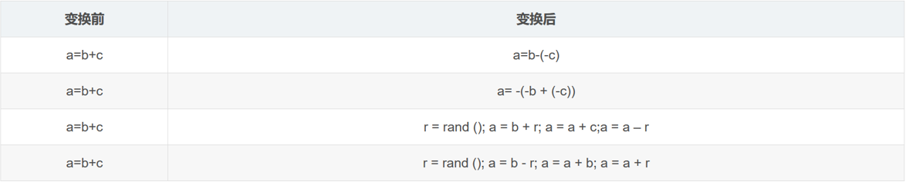
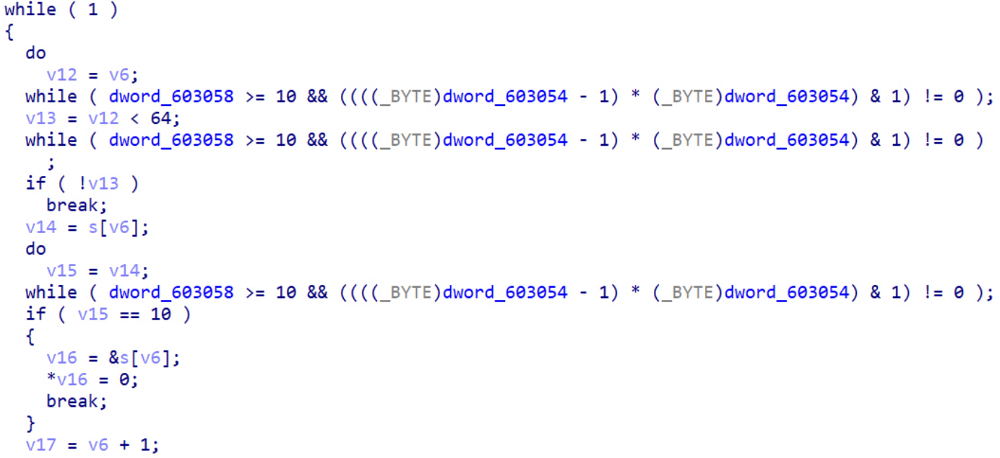
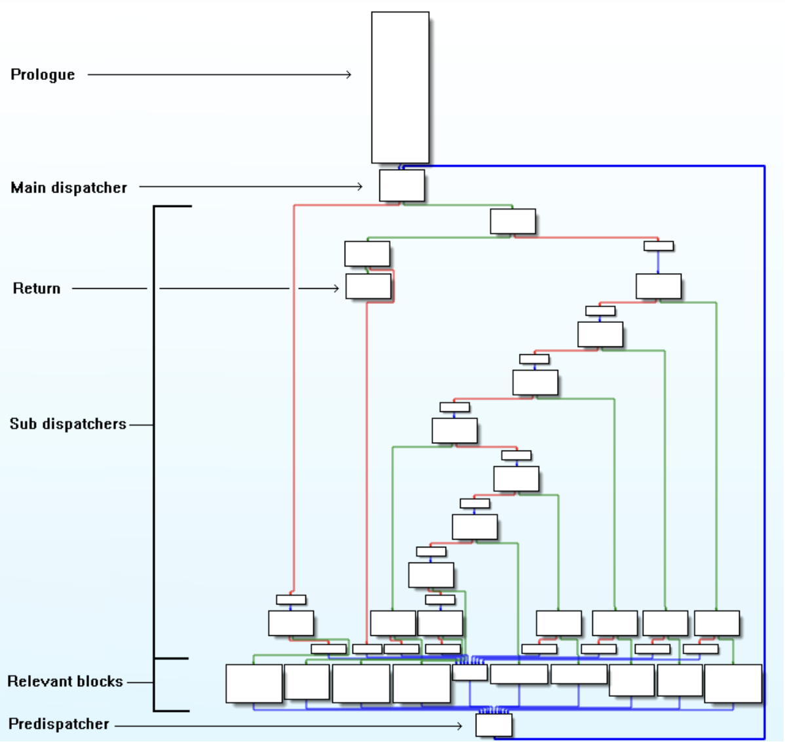

当初觉得不可能的事情随着时间终究会实现。--2022.7.13

# What is OLLVM?

首先，这不是VM虚拟机，OLLVM是一款是由瑞士西北科技大学开发的一套开源的针对LLVM的代码混淆工具

OLLVM有三大功能

- Instructions Substitution（指令替换）
- Bogus Control Flow（虚假控制流）
- Control Flow Flattening（控制流平坦化）


# Instructions Substitution

记得西北工业大学的有一题，就是指令替换，当时还觉得好神奇，原来是有官方名称

> https://ppppz.net/2022/01/13/NPUCTF2020-Baby-Obfuscation/

比如这样改了个花里胡哨的写法起到混淆作用



（后续再遇到好玩的就补上）


# Bogus Control Flow

虚假控制流！一眼真图，这些看似循环但其他恒真或恒假的控制流



参考每次CTF普通的平坦化控制流去掉之后剩下的虚假控制流，idapython一把扬了

> https://blog.csdn.net/weixin_50166464/article/details/121635877

（去年还在CSDN写的古老Write up）


# Control Flow Flattening

开这个笔记！最想记录的就是这个了！关于复现lnflated面对了魔改平坦化控制的现实（之前一直逃避

在扬掉魔改的平坦化之前，当然是要把正常的平坦化搞清楚

文章参考

> https://blog.csdn.net/qq_45323960/article/details/124440184
>
> https://bluesadi.github.io/0x401RevTrain-Tools/angr/10_%E5%88%A9%E7%94%A8angr%E7%AC%A6%E5%8F%B7%E6%89%A7%E8%A1%8C%E5%8E%BB%E9%99%A4%E6%8E%A7%E5%88%B6%E6%B5%81%E5%B9%B3%E5%9D%A6%E5%8C%96/

## 0x00 Build Environment

跟着第一篇文章即可

报错：

- 一个是要把gcc和g++改成8的版本就好了
- 另一个就是char改uint8_t

- angr-management


- keystone

前两个详情见文章

第三个第四个是库的问题（如果装keystone会报错）

```
pip3 install angr-management
pip3 install keystone-engine
```

接着以一个例题为例

```C++
#include <cstdio>
#include <cstring>
#include <cstdlib>

char input[100] = {0};
char enc[100] = "\x86\x8a\x7d\x87\x93\x8b\x4d\x81\x80\x8a\x43\x7f\x86\x4b\x84\x7f\x51\x90\x7f\x62\x2b\x6d\x2c\x91";

void encrypt(unsigned char *dest, char *src){
    int len = strlen(src);
    for(int i = 0;i < len;i ++){
        dest[i] = (src[i] + (32 - i)) ^ i;
    }
}


// flag{s1mpl3_v3x_1r_d3m0}
int main(){
    printf("Please input your flag: ");
    scanf("%s", input);
    if(strlen(input) != 24){
        printf("Wrong length!\n");
        exit(0);
    }
    unsigned char dest[100] = {0};
    encrypt(dest, input);
    if(!memcmp(dest, enc, 24)){
        printf("Congratulations~\n");
    }else{
        printf("Sorry try again.\n");
    }
}
```

Work Flow:

```
g++ OllvmTest.cpp -o OllvmTest

~/ollvm/bin/clang++ /home/pz/Desktop/OllvmTest.cpp -o /home/pz/Desktop/OllvmTest -mllvm -sub -mllvm -fla -mllvm -bcf
```


## 0x01 What do I do?

文章已经讲的很清楚了，这里我就写点关键点



总结来说，利用angr符号执行去除控制流平坦化的步骤可以归结为三个步骤：

1. 静态分析CFG得到序言/入口块（Prologue）、主分发器（Main dispatcher）、子分发器/无用块（Sub dispatchers）、真实块（Relevant blocks）、预分发器（Predispatcher）和返回块（Return）
2. 利用符号执行恢复真实块的前后关系，重建控制流
3. 根据第二步重建的控制流Patch程序，输出恢复后的可执行文件


## 0x02 To Get CFG

To be continue...
