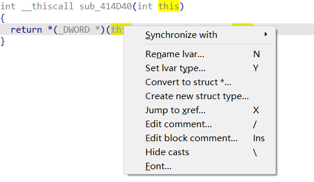
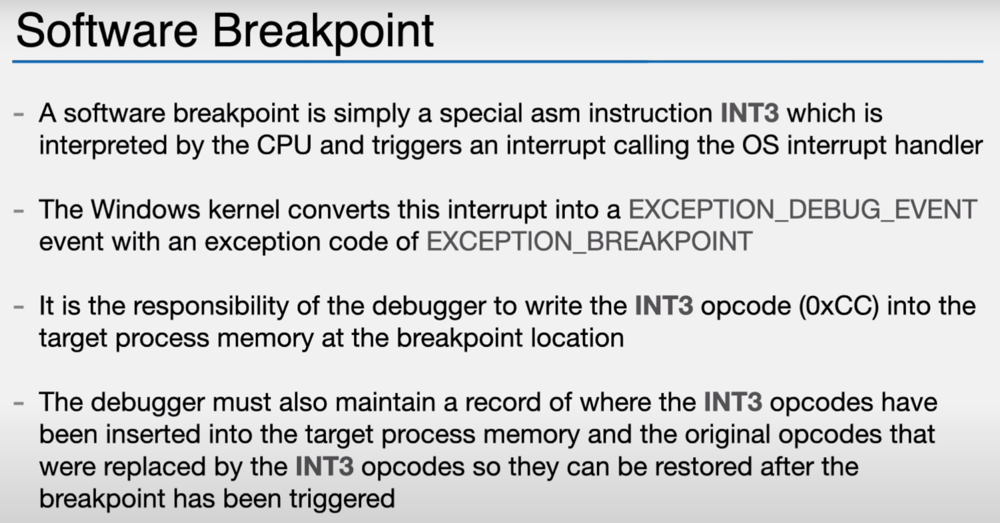
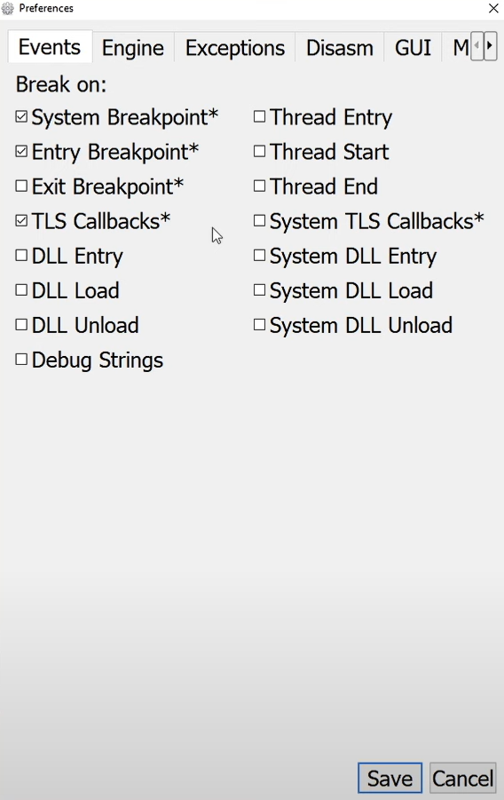
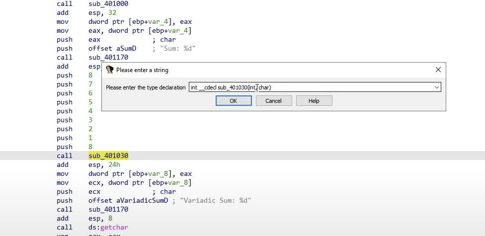

[OALABS系列小教程](https://www.youtube.com/c/OALabs/videos)，病毒分析的little tips!（还没搞懂名字是什么意思

# How to Identify Dynamic Imports In Malware

一个函数指向的地方是个空s的地方，那么可能以动态解析的形式填入

当调用这个地址时，这个地址会已经填入了函数地址

我们通过交叉引用查看这个地方的引用

1.  这里的地址是以导入地址表的方式动态解析
2.  这个地址可能只是一个大表中的一个条目（可能会被不通函数迭代解析


# Setup IDA Pro Type Librares For Windows Malware Analysis

识别Windows的恶意软件，里面一般会有一些WIN API，我们可以直接导入**类型库**，方便查看这些类型库，去解析代码


当我们不知道是什么，可以**首选这个**，**不用太接近到底是什么**


# How to view disassembly and pseudocode windows side-by-side in IDA Pro

同时查看反汇编和汇编窗口的命令


方便查看


# C++ Malware With IDA Pro

主要讨论的是这个，关于C++类和对象的关系，在IDA里会丢失类和对象的概念


必须要先实例化类，才能在内存中创建变量


在源代码里没什么问题，但IDA反编译之后不知道这是个结构体，只知道这是个指针


显然易见的流程图


于是要在IDA修复这个对象，先重置解析指针


然后创建结构体



这是根据内存自动创建的，不一定是对的，不过先去尝试到底是多大的字节什么类型变量，来逐步确定结构体中的变量


在这可以看自己创建的结构体，之前做的login是去本地结构库（shift + F9）去添加结构，这里是我们自己创建的


# Debugging a DLL Export

主要就是记录如何调试dll，首先要开始dll入口，这样就会停在加载dll的入口，后面通过查找关键函数的地址，直接改eip跳过去，然后提取数据即可 


# Why Is The PE Enter Point Not The Same As Main SEH and The_security_init_cookie

当我们调试程序时，调试器停了PE入口点，诗人困惑，然而此代码为样板代码，是作为逆向分析的首要目标

主要讲解的是在**start函数**的意思，注意这是**mscv Visual Studio编译的二进制文件，这就是mscv的标签，样板代码**

****

## _security_init_cookie

这边的cookie检查，里面没有很多有意思的代码，对于一个文件的逆向工程没有什么关系，看了[官网文档](https://docs.microsoft.com/en-us/cpp/c-runtime-library/reference/security-init-cookie?view=msvc-170)，有点像canary保护

(可以通过里面的一些常量来确认这是_security_init_cookie)

(32位的cookie和64位的cookie有些不一样)


## _scrt_common_main_seh

然后就是**结构化异常处理程序**

就是额外的一些异常，如果你的程序出现一些错误抛出异常，在该异常处理链中添加一些额外的信息，这对再次调试很有用

当jmp到这seh时，会有一长串代码，在**去掉符号表的情况下很难理解**

然而在这里面就是调用main函数的地方，而**32位和64位的main函数原型都是固有**的


# Bypassing BlackMatter Anti-Debug

先记录个简单小技巧，关于x64dbg的快捷键G


在BlackMatter中调用了此API，我们只要F7跟一下就能找到，不过要**装个插件silehide**（先复现Jump去了

### NtSetInformationThread() Anti Debug

[参考此文章](https://anti-debug.checkpoint.com/techniques/interactive.html#ntsetinformationthread)

该API会对调试器**隐藏线程**，当隐藏后，它将继续运行，但**调试器不会收到任何该线程的相关事件**

**该线程可以执行反调试检查，例如代码校验和调试标志验证等**

但是，如果**隐藏线程中有断点**，或者我们对调试器隐藏了主线程，那么进程就会崩溃，调试器就会卡住

（出个题不错嘿嘿，还想自己写Hook题）

```C++
#define NtCurrentThread ((HANDLE)-2)

bool AntiDebug()
{
    NTSTATUS status = ntdll::NtSetInformationThread(
        NtCurrentThread, 
        ntdll::THREAD_INFORMATION_CLASS::ThreadHideFromDebugger, 
        NULL, 
        0);
    return status >= 0;
}
```


# What is a Breakpoint

What is a breakpoint and how does it work under the hood(在底层) of debugger

This tips both of hardware and software breakpoints work!

## Software Breakpoint

每当有一个软件断点在windows内核中就有一个异常断点带有异常断点类型的异常调试事件

关于软件断点实质是向**目标进程要断下的字节改变成0xCC**



**当我们要设置一个软件断点**

1.  调试器将读取要设置断点的位置，并存储在断点表中
2.  再在断点的位置设置成0xCC，然后继续运行
3.  于是当CPU遇到CC值，就会触发INT 3，并将异常断点引发到debug
4.  然后debug发现这个是个用户
5.  当要继续执行时，将断点表中保存的值放回目标进程  
7.   然后再将把指令指针寄存器向回移动一格
7.   再执行原来要执行的代码

如果在做一些反调试什么，这实质上是在改变目标进程所执行代码，非常容易被检查到，这也就是软件断点的一个坏处


10 minutes + 1 hour + 1 hour 30 minutes + 2 hours + 3 hours + all the time left, Tomorrow will be hard. But I can do it! --4.20

## Hardware Breakpoints

**硬件断点实际上是CPU完成的**，并设置在CPU的寄存器中，有四个寄存器**DR0, DR1, DR2, DR3**，专门来存放硬件断点的地址

硬件断点有几个优点

1.  就算程序处于未解密状态，只要在该地方设置，当CPU运行就会断住
2.  不会改变目标进程的内存，所以更隐秘

**这些断点是注册在DR7寄存器**，使用一组标志控制，这些标志会记录每个断点如何设置已经是如何触发的


DR7的低八位以启用DR0 to DR3作为本地或全局断点

而在windows上是没有全局断点的，所以只用来设置本地断点


DR7的高十六位来设置

1.  断点类型
2.  断点如何触发 
3.  断点大小

低两位来告诉你断点的类型和断点如何触发


高两位来告诉你这个地址大小


但对于下一个硬件执行断点，就要设置一个本地断点、一个字节的可执行断点


# The Thread Context

你注入的进程，那到底是什么？

CPU只有有限的内核，一次只能运行有限的线程，而我们关注的是对进程的影响

当一个进程想插入进来直接执行时，它需要占用，于是会拍一个CPU的快照，这个信息我们称之为**Context**


1.  一旦准备继续执行这个进程，它可以恢复到CPU上继续执行

2.  Context是所有一个进程CPU所有寄存器的快照，每一个Context都绑定着一个线程

3.  我们可以dbg每个context，有两个API来调试使用context

4.  可以通过**GetThreadContext来获取Context**

5.  再用**SetThreadContext将修改过的Context重新放回内核**，告诉内核你可以继续**塔塔开**了


# How Dose Debugger Work

微软喜欢称调试为事件驱动的调试，你的调试器将会调试你的目标进程在内核的接收事件，也就是会冻结这一切，然后干了你想干的就继续执行了


调用WaitForDebugEvent去堵塞，直到你干了想做的事情然后可以调用ContinueDebugEvent继续从内核接收事件

现在从**等待事件返回的事件非常重要**，事实上这处理了如何处理核心调试器工作

事件的结构体就是**_DEBUG_EVENT**

1.  dwDebugEventCode，**事件代码**，告诉你**这是什么类型的事件**
2.  dwProcessId，**进程ID**，**以防你的调试器正在调试多个进程**
3.  dwThreadId，**线程ID**，这实际上就是**触发事件的线程**，这就是最重要的信息
4.  union，这具体取决于**触发事件的类型**


关于这个结构体的具体说明


在x64 debug，调试器可以选择在这里断不断，这样可以更清楚的选择这些选项




# x64dbg System Breakpoint

**主要是讲了到底什么是系统断点**，微软称为 loader breakpoint 或 loader do debugger break，这是个软件断点，是**编写在ntdll的的软件断点**

当程序加载会加载所有dll，这是个而图中的的int 3，就是我们的系统断点，系统断点不是总是触发，得有一个**调试器触发它**

在系统断点期间要注意的事情

1.  不要在系统断点的时候**设置任何寄存器**或者**硬件断点**，当系统断点一返回所有的操作都会被清空！

2.  系统断点期间可以**查看进程内存**，可以**设置软件断点**


# Control Flow Flattening Obfuscation Explained

先举例一个经过混淆的控制流这样


1.  最下面的一个个基本块是我们的控制流平坦化（是真正要执行的代码）
2.  中间的dispatcher是我们的调度程序（程序通过这来执行我们的每个基本块）
3.  而这个调度程序并不是直接一条条读，而是通过一个jmp表（也就是右边那块）从一块跳到另一块执行

所以我们想去掉这个混淆就得先去掉表，再去掉调度程序（根据jmp表），再恢复我们的基本块的执行流程（根据调度程序）


# Auto Comments

关于一些**不熟悉的架构**或者**标志位**不熟悉，又没有网的情况下（指浙江省省赛

这个8086架构还行，不过还能看标志位倒是挺新奇


xdbg也可以，挺详细的


# Assembly Calling Conventions

关于x86下的调用细节

（省流，多看MSDN）


记录一下windows编译器下cdecl的传参细节，调用者恢复堆栈


这期有意思的变长参数的识别（这还是学完C后的第一次碰到这个）


这本IDA无法正常识别，顺便记录按Y可以改变参数形式（当IDA识别错的时候），不过这里最多只能是记录后面是变长参数




# IDA Plugins For Malware

记录一下几个IDA插件的安装

首先是我们IDA的这里其实就是如CMD里的命令行一样


如果不确定现在IDA在用哪个，可以在IDA主目录看这个


这次视频留个链接https://www.youtube.com/watch?v=pfBA6y4VLwM

主要讲了5个插件，第二个第三个配套还有个视频https://www.youtube.com/watch?v=3FPY4cLaELU

第四个 flare ida目前还不知道干啥估计也是识别些什么东西

第五个 是根据病毒签名什么的识别


# How to ignore exceptions in IDA

做到zsky师傅的题，关于子进程报异常但被IDA拦了之后，该怎么让IDA忽略，让异常正确发到主进程


这样即可，选择你喜欢的异常！

