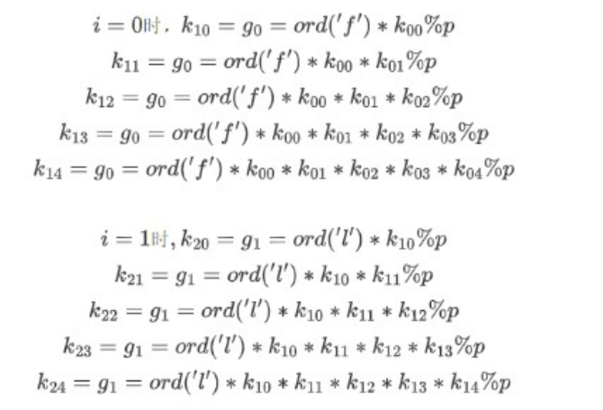
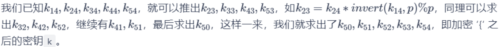
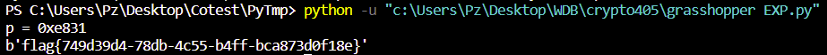
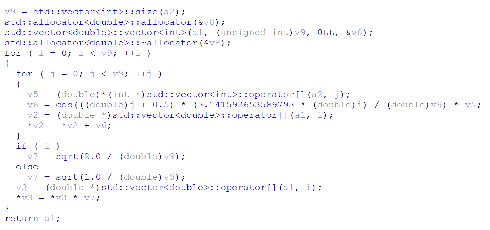

关于我觉得数论学习也挺好并且省赛需要我打密码所以就开始刷密码题这件事


# 网鼎杯2022-crypto405

给出附件，无法Z3

```PYTHON
from Crypto.Util.number import *
from random import randrange
from grassfield import flag

p = getPrime(16)

k = [randrange(1,p) for i in range(5)]

for i in range(len(flag)):
    grasshopper = flag[i]
    for j in range(5):
        k[j] = grasshopper = grasshopper * k[j] % p
    print('Grasshopper#'+str(i).zfill(2)+':'+hex(grasshopper)[2:].zfill(4))
```

剽窃图片，其实展开就是这个样子，可以通过**sagemath**会更方便理解，明天整一个





其实只是用到了乘法逆元的知识，再加上已知前五个字符即可边推边爆破得出key和p，杭师大的脚本还看的懂）

大白兔的是完全没看懂（只能说境界还没到

于是一个个逆回去即可

```python
from Crypto.Util.number import *
from random import randrange
import gmpy2


with open("output.txt","rb") as f:
    data = f.read().split()
enc = [int(t[-4:].decode('ascii'), 16) for t in data]

maxenc = max(enc)
know = b'flag{'

# a % b = c 所以b和c最大公约数为1
for p in range(maxenc, 2**16):
    g04 = enc[0]
    g14 = enc[1]
    if gmpy2.gcd(g04, p) != 1: # 加if是为了下面的invert能有结果，不然报错
        continue
    g13 = g14 * gmpy2.invert(g04, p) % p

    g24 = enc[2]
    if gmpy2.gcd(g14, p) != 1 or gmpy2.gcd(g13, p) != 1:
        continue
    g23 = g24 * gmpy2.invert(g14, p) % p
    g22 = g23 * gmpy2.invert(g13, p) % p

    g34 = enc[3]
    if gmpy2.gcd(g24,p) != 1 or gmpy2.gcd(g23,p) != 1 or gmpy2.gcd(g22,p) != 1:
        continue
    g33 = g34 * gmpy2.invert(g24, p) % p
    g32 = g33 * gmpy2.invert(g23, p) % p
    g31 = g32 * gmpy2.invert(g22, p) % p

    g44 = enc[4]
    if gmpy2.gcd(g34,p) != 1 or gmpy2.gcd(g33,p) != 1 or gmpy2.gcd(g32,p) != 1 or gmpy2.gcd(g31,p) != 1:
        continue
    g43 = g44 * gmpy2.invert(g34, p) % p
    g42 = g43 * gmpy2.invert(g33, p) % p
    g41 = g42 * gmpy2.invert(g32, p) % p
    g40 = g41 * gmpy2.invert(g31, p) % p

    k = [g40, g41, g42, g43, g44]
    flag = ''
    for i in range(5, 42):
        _k = k[0] * k[1] * k[2] * k[3] * k[4]
        if gmpy2.gcd(_k, p) != 1:
            break 
        ans = enc[i] * gmpy2.invert(_k, p) % p
        flag += chr(ans)
        for j in range(5):
            k[j] = ans = ans * k[j] % p
    if flag.endswith('}'):
        print(f'p = {hex(p)}')
        print(know + flag.encode())
```

GetFlag!



（吸取经验以后先列好式子，不要光想...还有要用上sagemath）


# Better2021 CTF-BabyEasyRSA

出现了e与phi逆元不存在的情况

```
ZeroDivisionError: invert() no inverse exists
```

于是此时可以把公约数约走，最后再m开方（不过只适用于小的值）

```python
gmpy2.gcd(e, phi)
>>> mpz(2)

d = gmpy2.invert(e // 2, phi)
d = int(d)
c = 22031559176543374728640339334054931648253693453381117136549944567189701860802517108710634492479218684835547003129670170376083909114432397511854085309671420580608252394632776066674053928844741549112544653270749642781059324238219974350800308481930210214663739252398726701397710127584184688605299539479559871686
n = 75719808455675214964836013011082573609078931406136709627765451773116006787576354055445613060486443568194878800539173667239010353605765521293937640504398876227010041765850695489148442018623799057413738264514237388232868489334139753039099280995394085561124291955871616114908277793725489112548644445780478488589
m2 = pow(c, d, n)
print(m2)
>>> 3573375446044527545641710628800734882403209158702131142028729999210250700529539295300765909450953661769570253955153546339052294037044179868938975815481711470687699654271022080357258698232632021405677592865723088490100233333801835319704476053216960649
m = gmpy2.iroot(m2, 2)
print(m)
>>> (mpz(59777716969156053121687146146519359715966087769161172676542250767040496999634730675795495377953546785493066987211962979532093), True)
m = int(m[0])
print(m)
>>> 59777716969156053121687146146519359715966087769161172676542250767040496999634730675795495377953546785493066987211962979532093
```

> https://zhuanlan.zhihu.com/p/350898885


# MOECTF2022-0rsa0

当e指数过小e方后依然比n小直接开方即可

```
def enc1(m):
    p = getPrime(512)
    q = getPrime(512)
    n = p * q
    e = 3
    c = pow(m,e,n)
    return n,e,c

def dec1(c):
    a = gmpy2.iroot(c, e1)[0]
    return long_to_bytes(a)
```

然后就是dp泄露

```python
import gmpy2

e = 65537
n = 248254007851526241177721526698901802985832766176221609612258877371620580060433101538328030305219918697643619814200930679612109885533801335348445023751670478437073055544724280684733298051599167660303645183146161497485358633681492129668802402065797789905550489547645118787266601929429724133167768465309665906113
dp = 905074498052346904643025132879518330691925174573054004621877253318682675055421970943552016695528560364834446303196939207056642927148093290374440210503657
c = 140423670976252696807533673586209400575664282100684119784203527124521188996403826597436883766041879067494280957410201958935737360380801845453829293997433414188838725751796261702622028587211560353362847191060306578510511380965162133472698713063592621028959167072781482562673683090590521214218071160287665180751
                            #得证 (p - 1)*x = dp * e - 1                x的取值范围是在1到e？
for i in range(1, e):
    if(dp * e - 1) % i == 0:             #证明p存在
        if n % ((dp * e - 1)//i + 1) == 0:  #+1还原p 然后n % p =0 就像3 * 7 = 21 21 % 7 = 0
            p = (dp * e - 1)//i+1
            q = n // p
            d = gmpy2.invert(e, (p-1)*(q-1))
            m = pow(c, d, n)
print(bytes.fromhex(hex(m)[2:]))

```


主要想把鹏城杯丢进归类里，然而想起还有个加密没做好笔记

关于被汪哥帮忙解加密意外认识Andy师傅这件事

关于为什么是未被定义的加密）其实就是移位加密，其实上次在EZMATH那篇里写过移位加密了，然而这次又出现了！？

于是就把平常遇到的一些加密放入随笔

# MT19937伪随机数

## 鹏城杯某pwn


例子，求原来的a1

```C
for ( i = 10; i > 0; --i )
    a1 ^= ((a1 ^ (48 * a1)) >> 21) ^ (48 * a1) ^ ((a1 ^ (48 * a1) ^ ((a1 ^ (48 * a1)) >> 21)) << 17);
return printf("%lx\n", a1);
```

那么起始外面两层逐步解是很方便，关键是解到最后的a1 ^ (48 ^ a1)，当时直接Z3解了，不得不说还是得动动脑子...

于是请教了Andy师傅，解答说：

乘48不是2次方的幂，但可以拆开16 * 3，也就是每次先移位4次再乘3

于是每四位加密就是

首先最低4位保持原样

大于等于低4位开始，高4位与低4位乘3异或

（a * 3 + b * 3 = (a + b) * 3）

于是恢复第一组4位，合并上原始4位，再乘3异或加密项依次恢复整条链子

```python
data = 0xC71F2E34
# C71F2E34 9ab4113f 2dc5a949 5b6bec23 1df9c0da f79486b8 bc2402bf cd16ef85 d992f5e5 bdaa6327

def shift17(data):
    ka = data & 0x7FFF # 底15位
    kb = (data >> 15) & 0x3 # 中2位
    kc = (data >> 17) & 0x7FFF # 高15位
    a = ka
    b = kb
    c = ka ^ kc
    return (c << 17) | (b << 15) | a

def shift21(data):
    ka = data & 0x7FF # 低11位
    kb = (data >> 11) & 0x3FF # 中10位
    kc = (data >> 21) & 0x7FF # 高11位
    a = ka ^ kc
    b = kb
    c = kc
    return (c << 21) | (b << 11) | a

def d48(data):
    b1 = data & 0xF
    b2 = (((b1 * 3) & 0xF) << 4) ^ (data & 0xFF)
    b3 = (((b2 * 3) & 0xFF) << 4) ^ (data & 0xFFF)
    b4 = (((b3 * 3) & 0xFFF) << 4) ^ (data & 0xFFFF)
    b5 = (((b4 * 3) & 0xFFFF) << 4) ^ (data & 0xFFFFF)
    b6 = (((b5 * 3) & 0xFFFFF) << 4) ^ (data & 0xFFFFFF)
    b7 = (((b6 * 3) & 0xFFFFFF) << 4) ^ (data & 0xFFFFFFF)
    b8 = (((b7 * 3) & 0xFFFFFFF) << 4) ^ (data & 0xFFFFFFFF)
    return b8

for i in range(10):
    data = d48(shift21(shift17(data)))
print(hex(data))
```

 原先的Z3脚本还出了点小插曲

```python
from z3 import *

# a1 = a1 ^ ((a1 ^ (48 * a1)) >> 21) ^ (48 * a1) ^ ((a1 ^ (48 * a1) ^ ((a1 ^ (48 * a1)) >> 21)) << 17)

data = 0xC71F2E34
# C71F2E34 9ab4113f 2dc5a949 5b6bec23 1df9c0da f79486b8 bc2402bf cd16ef85 d992f5e5 bdaa6327

def shift17(data):
    ka = data & 0x7FFF # 底15位
    kb = (data >> 15) & 0x3
    kc = (data >> 17) & 0x7FFF # 高15位
    a = ka
    b = kb
    c = ka ^ kc
    return (c << 17) | (b << 15) | a

def shift21(data):
    ka = data & 0x7FF # 低11位
    kb = (data >> 11) & 0x3FF # 中10位
    kc = (data >> 21) & 0x7FF # 高11位
    a = ka ^ kc
    b = kb
    c = kc
    return (c << 21) | (b << 11) | a

for i in range(10):
    num = BitVec('num', 32)
    sol = Solver()
    shiftData = shift21(shift17(data))
    enc = num ^ (48 * num) # num = num ^ (48 * num)

    sol.add( enc == shiftData )
    assert sat == sol.check()
    ans = sol.model()

    data = int(ans[num].as_long())
print(hex(data))
```

不过这是好的版本，原先写脚本把一开始申请的num的值改了，于是最后打印的时候一直出问题，因为结尾的num和一开始申请的已经不是同一个空间了


## DAS十月赛pycode

这次的移位加密，也就是之前我所解的方法不好用了，大白兔一做直接秒了，才知道这是MT19937的伪随机生成器

> https://www.anquanke.com/post/id/205861#h2-1

文章直接帮我解决了

关于之前的这种加密，老方法效率其实比较低

```
y = y ^ (y >> 18)
```

首先是老方法都可以用这个代替

> 我们可以发现这一步的运算对操作数y的高18位并没有产生影响，也就是说运算结束后y1 = y ^ ( y>> 18)，得到y1高18位其实就是y的高18位，那么我们就可以得到y>>18的高36位，进而得到y1的高36位，也就是说我们可以在有限步内，获得y的所有信息，即我们可以根据y1逆向y。代码如下

```python
o = 2080737669
y = o^o>>18
# 控制位移的次数
for i in range(32//18):
    y = y^(y>>18)
print(y==o)
```

然后这次比赛出现了新类型的，我脑子当时直接糊了

```
y = y ^ y << 15 & 4022730752
```

然而我还不是很理解这段话，总感觉 y1^4022730752 打错了，先留个坑

> 可以看到这一步位移的方向发生改变，而且增加了掩码，根据运算符的优先级，可以得到
>
> y1 = y^((y<<15)&4022730752)，实际上增加的掩码并没有太大的作用，因为y1的低15位实际上就是y的低15位和4022730752的低15位异或运算的结果，我们只需要y1^4022730752便可以得到y的低15位，于是得到y<<15的低30位，同理可以得到y1的低30位，经过有限步，最终可以得到y的全部信息。代码如下：

```python
o = 2080737669
y = o ^ o << 15 & 4022730752
tmp = y
for i in range(32 // 15):
    # (y<<15)&40022730752 每次可以恢复y的15位
    y = tmp ^ y << 15 & 4022730752
print(y==o)
```

于是就有了通杀脚本

```python
o = 2080737669

# right shift inverse
def inverse_right(res, shift, bits=32):
    tmp = res
    for i in range(bits // shift):
        tmp = res ^ tmp >> shift
    return tmp


# right shift with mask inverse
def inverse_right_mask(res, shift, mask, bits=32):
    tmp = res
    for i in range(bits // shift):
        tmp = res ^ tmp >> shift & mask
    return tmp

# left shift inverse
def inverse_left(res, shift, bits=32):
    tmp = res
    for i in range(bits // shift):
        tmp = res ^ tmp << shift
    return tmp


# left shift with mask inverse
def inverse_left_mask(res, shift, mask, bits=32):
    tmp = res
    for i in range(bits // shift):
        tmp = res ^ tmp << shift & mask
    return tmp


def extract_number(y):
    y = y ^ y >> 11
    y = y ^ y << 7 & 2636928640
    y = y ^ y << 15 & 4022730752
    y = y ^ y >> 18
    return y&0xffffffff

def recover(y):
    y = inverse_right(y,18)
    y = inverse_left_mask(y,15,4022730752)
    y = inverse_left_mask(y,7,2636928640)
    y = inverse_right(y,11)
    return y&0xffffffff

y = extract_number(o)
print(recover(y) == o)
```


# 春秋杯春季赛2023-BWBA

与gpt对线鉴定为 离散余弦变换（DCT）



纯纯脚本小子，不懂线代，上网四处搜寻没见到一个正常的，主要是不懂原理...（想学线代

cv2库，还是第一次用

```python
import numpy as np
import cv2

x = np.array([370.75,234.362,-58.0834,59.8212,88.8221,-30.2406,21.8316,49.9781,-33.5259,2.69675,43.5386,-30.2925,-28.0754,27.593,-2.53962,-27.1883,-5.60777,-0.263937,6.80326,8.03022,-6.34681,-0.89506,-6.80685,-13.6088,27.0958,29.8439,-21.7688,-20.6925,-13.2155,-37.0994,2.23679,37.6699,-3.5,9.85188,57.2806,13.5715,-20.7184,8.6816,3.59369,-4.5302,4.22203,-28.8166,-23.695,31.2268,6.58823,-39.9966,-20.7877,-19.7624,-22.031,16.3285,2.07557,-26.2521,16.1914,18.3976,-26.9295,3.03769,41.0412,20.2598,14.991,6.99392,-22.3752,-7.24466,8.96299,-10.4874], dtype=np.float64)
x = cv2.idct(x)
x = x.ravel()
flag=''

for i in range(len(x)):
    flag+=chr(round(x[i]))
print(flag)
```

C++版，这是GPT搓出来的

```C++
#include <iostream>
#include <cmath>
#include <vector>


std::vector<double> encrypt(std::vector<double>& output, std::vector<int>& input)
{
    double temp;
    int size = input.size();
    output.resize(size);

    for (int i = 0; i < size; ++i)
    {
        for (int j = 0; j < size; ++j)
        {
            double x = static_cast<double>(input[j]);
            double y = std::cos(((static_cast<double>(j) + 0.5) * 3.141592653589793 * static_cast<double>(i)) / static_cast<double>(size)) * x;
            output[i] += y;
        }
        double divisor = (i == 0) ? std::sqrt(1.0 / static_cast<double>(size)) : std::sqrt(2.0 / static_cast<double>(size));
        output[i] *= divisor;
    }

    return output;
}

std::vector<int> decrypt(std::vector<double>& input, std::vector<int>& output)
{
    int size = input.size();
    output.resize(size);

    for (int i = 0; i < size; ++i)
    {
        double sum = 0;
        for (int j = 0; j < size; ++j)
        {
            double divisor = (j == 0) ? std::sqrt(1.0 / static_cast<double>(size)) : std::sqrt(2.0 / static_cast<double>(size));
            double x = divisor * input[j] * std::cos(((static_cast<double>(i) + 0.5) * 3.141592653589793 * static_cast<double>(j)) / static_cast<double>(size));
            sum += x;
        }
        output[i] = static_cast<int>(sum+0.5);
    }

    return output;
}


std::vector<double> aa({ 370.75,234.362,-58.0834,59.8212,88.8221,-30.2406,21.8316,49.9781,-33.5259,2.69675,43.5386,-30.2925,-28.0754,27.593,-2.53962,-27.1883,-5.60777,-0.263937,6.80326,8.03022,-6.34681,-0.89506,-6.80685,-13.6088,27.0958,29.8439,-21.7688,-20.6925,-13.2155,-37.0994,2.23679,37.6699,-3.5,9.85188,57.2806,13.5715,-20.7184,8.6816,3.59369,-4.5302,4.22203,-28.8166,-23.695,31.2268,6.58823,-39.9966,-20.7877,-19.7624,-22.031,16.3285,2.07557,-26.2521,16.1914,18.3976,-26.9295,3.03769,41.0412,20.2598,14.991,6.99392,-22.3752,-7.24466,8.96299, -10.4874 }, std::allocator<double>());


int main() {

    std::vector<int> output = { 0 };
    decrypt(aa, output);

    for(int i =0;i<output.size();i++){
        // std::cout << output[i] << std::endl;
        printf("%c", output[i]);
    }


    return 0;
}

```

