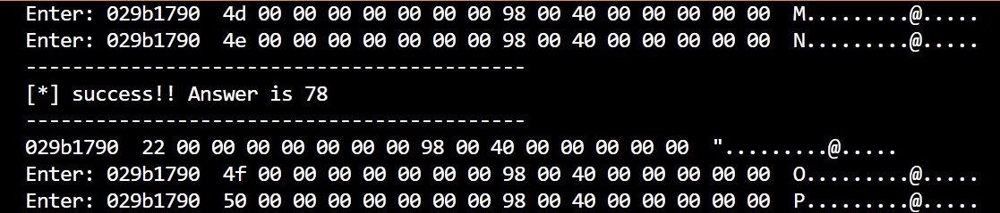

今天终于拿到了我的pixel，万物皆可公费，乐）毕业带不走就入手个Pixel4）

自从给模拟器折磨后我就很久没碰安卓题，碰到即逃避，然而大赛的趋向都是安卓题，从0开始的安卓TIME

感觉换了个新手机一样，呜呼，我的三星与大白兔面基那天不小心摔到，然后无线模块全部坏了，不扯废话了，开始记录！--2022.9.7

# IDA调试类

```
adb shell # 连接shell
su # 变井号提权
./data/local/tmp/android_server # 开启IDA远程调试文件

adb push android_server /data/local/tmp/  # 丢入文件
adb shell chmod 755 /data/local/tmp/android_server # 设置权限
adb forward tcp:23946 tcp:23946 # 转发端口，日后最后换个端口有些反调试会检测
```


```
adb install easy.apk # 先安装该应用
adb install -t *.apk # 有时候需要强制安装

adb shell am start -D -n com.a.easyapk/com.a.easyapk.MainActivity # 利用apktools以调试启动该文件
```

在so里下断直接attach上即可


## NewStarCTF-WEEK2-ur_so_naive

**0x00 Daily Shell Check**

​	无壳


**0x01 Native调试**

拉进jadx找到主函数可以发现只有个密文，我们的输入会作为passwd，进行 R.id.btn_check 的校验，而该函数是在我们的 native 层，于是解压apk，找到 ur_so_naive\lib\arm64-v8a 下的文件，验证函数都在里面了

找到 Java_com_new_1star_1ctf_u_1naive_MainActivity_encry 函数，很明显在实现一个加密逻辑，部分值我们没有，所以可以通过调试 so 文件获取

首先运行 ida 的远程调试文件

```
./data/local/tmp/android_server64
```

另起个 cmd 转发端口让手机上开启的端口IDA能找到

```
adb forward tcp:23946 tcp:23946
```

选择该选项设置本机调试


再以调试模式开启该 apk

```
adb shell am start -D -n com.new_star_ctf.u_naive/com.new_star_ctf.u_naive.MainActivity
```

此时手机自动开启了该程序（~~手机自己动了我不玩了~~

再去 IDA attach上该so文件


随后程序就跑起来了（记得先在so文件里下断点，这样在验证密码的时候就会断在此处）

按几下F9让程序跑起来，此时手机上可以输入，随意输入点就成功断住！


**0x02 GetFlag**

随后就是分析算法逆算法

```C
__int64 __fastcall Java_com_new_1star_1ctf_u_1naive_MainActivity_encry(
        __int64 a1,
        __int64 a2,
        __int64 a3,
        unsigned int len,
        __int64 a5)
{
  __int64 input; // x21
  unsigned __int8 *key; // x23
  __int64 v10; // x22
  __int64 idx; // x8
  unsigned int t; // w11
  __int64 idxxx; // x13
  unsigned int t1; // w11
  char t2; // w12
  char t3; // w12
  char t4; // w12
  bool v18; // zf

  input = (*(*a1 + 1352LL))(a1, a3, 0LL);
  key = (*(*a1 + 1352LL))(a1, a5, 0LL);
  v10 = (*(*a1 + 1408LL))(a1, len);
  if ( len )
  {
    idx = 0LL;
    do
    {
      t = *(input + idx);
      if ( len - 1LL == idx )
        idxxx = 0LL;
      else
        idxxx = idx + 1;
      *(input + idx) = (*(input + idx) >> 1) & 0x7F | (*(input + idx) << 7);// ROR1

      t1 = ((t >> 1) & 0xFFFF807F | (t << 7)) ^ *key;// ROR1 ^ key
      t2 = (t1 << 6) | (t1 >> 2);

      *(input + idx) = t2;

      t3 = (32 * (t2 ^ key[1])) | ((t2 ^ key[1]) >> 3);

      *(input + idx) = t3;

      t4 = (16 * (t3 ^ key[2])) | ((t3 ^ key[2]) >> 4);

      *(input + idx) = t4;

      LOBYTE(t1) = t4 ^ key[3];

      *(input + idx) = t1;
      v18 = len == idx + 1;
      *(input + idx++) = t1 ^ *(input + idxxx);
    }
    while ( !v18 );
  }
  (*(*a1 + 1664LL))(a1, v10, 0LL, len, input);
  return v10;
}
```

一堆ROR加异或的操作，直接反着来即可

```python
enc = [-36, 83, 22, -117, -103, -14, 8, 19, -47, 47, -110, 71, 2, -21, -52, -36, 24, -121, 87, -114, -121, 27, -113, -86]
key = b'FALL'
# enc = [0x57, 0x96, 0xD1, 0x11, 0x52, 0x93, 0xB3]
input = [0x31, 0x32]

enc = [t & 0xFF for t in enc]

def ROR(n, offset, idx):
    if idx == -1:
        return ((n >> offset) & 0x7F | (n << (8 - offset))) & 0xFF
    else:
        return (((n ^ key[idx]) >> offset) | ((n ^ key[idx]) << (8 - offset))) & 0xFF
# i = 0
# t = input[i]
# t1 = ROR(t, 1, -1) ^ key[0]
# print(hex(t1))
# t2 = ROR(t1, 2, -1)
# t3 = ROR(t2, 3, 1)
# t4 = ROR(t3, 4, 2)
# t1 = t4 ^ key[3]
# input[i] = t1 ^ input[i + 1]

for i in range(len(enc) - 1, -1, -1):
    if i == len(enc) - 1:
        ii = 0
    else:
        ii = i + 1
    t1 = enc[i] ^ enc[ii]
    t4 = t1 ^ key[3]
    t3 = ROR(t4, 4, -1) ^ key[2]
    t2 = ROR(t3, 5, -1) ^ key[1]
    t1 = ROR(t2, 6, -1)
    t = ROR(t1 ^ key[0], 7, -1) 
    enc[i] = t
print(bytes(enc))
```

GetFlag!


Frida RPC 远程调用

那么在看雪上发现一篇文章讲了用RPC直接爆破出来了，那么是什么个原理？

就是我们如果想调用 so 文件里的函数，可以通过 rpc 来实现远程调用，然后直接爆破即可

js部分如下，就是直接从主类中找到了对象随后调用该加密函数也就是encry

然后有个出口 rpc.exports 供给随后直接调用该函数（我是这样理解的，不过不知道是不是每次调用函数都去找了遍对象）

```js
var result;
var resutlt;

function ency(a, b, c){
    Java.perform(function(){
        var mainClass = Java.use("com.new_star_ctf.u_naive.MainActivity");

        Java.choose("com.new_star_ctf.u_naive.MainActivity",{
            onMatch:function(obj){
                result = obj.encry(a, b, c);
                resutlt = bytes2hexstr_2(result);
                send(result);
            },
            onComplete:function(obj){
            }
        })

    });
    return resutlt.toString();
};

function bytes2hexstr_2(arrBytes){
    var str_hex = JSON.stringify(arrBytes);
    return str_hex;
}
rpc.exports = {
    rpcfunc: ency
}
```

python代码如下，原作者代码截一半...弄得我找了好几篇文章才知道哪少了

```python
def frida_rpc(session):
    rpc_hook_js = """
        var result;
        var resutlt;

        function ency(a, b, c){
            Java.perform(function(){
                var mainClass = Java.use("com.new_star_ctf.u_naive.MainActivity");

                Java.choose("com.new_star_ctf.u_naive.MainActivity",{
                    onMatch:function(obj){
                        result = obj.encry(a, b, c);
                        resutlt = bytes2hexstr_2(result);
                        send(result);
                    },
                    onComplete:function(obj){
                    }
                })

            });
            return resutlt.toString();
        };

        function bytes2hexstr_2(arrBytes){
            var str_hex = JSON.stringify(arrBytes);
            return str_hex;
        }
        rpc.exports = {
            rpcfunc: ency
        }
        """
    # 添加 js 脚本
    script = session.create_script(rpc_hook_js)
#    消息监听，不过这里用不上
#    script.on('message', message_header)

    # 加载会话
    script.load()
    return script


# 连接安卓机上的frida-server
device = frida.get_usb_device()
session = device.attach(25485)
script = frida_rpc(session)


enc = [-36, 83, 22, -117, -103, -14, 8, 19, -47, 47, -110, 71, 2, -21, -52, -36, 24, -121, 87, -114, -121, 27, -113, -86]
flag = "flag{"
k = 5

for j in range(0, 16):
    for i in string.printable:
        test = flag + i
        ret = script.exports.rpcfunc(test, len(test), "FALL")
        json_obj = json.loads(ret)
        if json_obj[k - 1] == enc[k - 1]:
            k += 1
            flag = flag + i
            print(flag)
```

爆破flag的感觉真不错


## NewStarCTF-WEEK3-哈德兔的口

今日做一题发现，这个Native调试方法并不通用，还要一个JDB附加的操作？？之前都不用，发现搜寻文章并没有得到我想要的答案

那么 哈德兔的口 这题，就是等ida attach上去后需要jdb附加才能继续运行

```
jdb -connect com.sun.jdi.SocketAttach:port=8600,hostname=localhost
```

该端口号看ddms，jdb就用的java的jdk里的lib

随后要记得设置这个三个，让so文件加载的时候停止，这样是为了找到我们想要的libcheck


等看ida的底下的信息出现了该so文件，ida出了个弹窗，也就是两个模块名字重复，好像是apk加载时候又有个先相同的，这样选择same ida就会卡起来，随后就未响应了，估计是什么冲突了，所以选了not same

```
Debugger found two modules with same base name but different paths
This could happen if the program loads the module from a path different than the specified input file


Is the loaded file
'/data/app/com.newstarctf.decode-IlS4t4KPe_ksTzUFrzjD8Q==/lib/arm64/libcheck.so'
the same as the input file
'C:\Users\Pz\Desktop\NEW\哈德兔的口\lib\arm64-v8a\libcheck.so'?
```

而这新加载进来的so和我们当初下的在主函数下的断点已经不一样了，所以要重新定位到主函数下断点，那么学到个新办法就是在Modules里搜该so，然后点开再去里面搜函数即可！


随后再下个断点F9直接跑过去即可，这时候可以把suspend on process....三个按钮去掉，不用再管新载入的库等

还有这题获取加载字符串的事，就是直接hook decode函数打印即可

```js
function test(){
    Java.perform(function(){
        var mainClass = Java.use("com.newstarctf.decode.MainActivity");

        mainClass.decode.implementation = function(a){
            var result = this.decode(a)
            console.log(result)
            return a

        }

    })
};

test();
```


## 祥云杯-GetTheCorrectKey

这题Frida上不去so层直接找函数也调不了，现在知道调试so文件最开始是JNI_onLoad

还是按上个方法调到关键搜然后搜索JNI_onLoad开始调试，发现基本全是检测调试或者Frida的

只有这里才是真正的


由于不需要什么参数我调试过完检测Frida的之后就直接 Ctrl + N 过去了，随后就没有什么反调试了，一路跟着调试会发现有个SMC动态解密一段代码

如果按别人手写解密那么就是这样（有点好奇如何去掉 initArray加密）

我是动调过去的比较难看也可能是 Ctrl + N 的原因导致


动调可以直接提取出解密完的dex文件，这里解的就是 assets 下的 whoami 就成功解密成一个 dex 了

然后利用反射技术再 native层 调用 java层的函数，所以真正运行是这个文件

拉进 jadx 一眼丁真是 RC6 加 BASE58 解密即可

```
https://www.lddgo.net/encrypt/rc6
```


# Frida类

注意放到手机上的frida_server要和python版本的frida库一致

```
adb shell
su
./data/local/tmp/frida-server
```

## NewStarCTF-WEEK1-艾克体悟题

**0x00 Daily Shell Check**

无壳


**0x01 Frida hook**

这题jadx的话会把一些编译优化，所以我用JEB，看主程序可知只要点10000下，让FlagActivity.this.cnt变为10000即可

```java
package com.droidlearn.activity_travel;

import android.os.Bundle;
import android.view.View$OnClickListener;
import android.view.View;
import android.widget.Toast;
import androidx.appcompat.app.AppCompatActivity;

public class FlagActivity extends AppCompatActivity {
    private int cnt;

    public FlagActivity() {
        super();
        this.cnt = 0;
    }

    static int access$000(FlagActivity arg0) {
        return arg0.cnt;
    }

    static int access$004(FlagActivity arg1) {
        int v0 = arg1.cnt + 1;
        arg1.cnt = v0;
        return v0;
    }

    protected void onCreate(Bundle arg4) {
        super.onCreate(arg4);
        this.setContentView(0x7F0B002D);
        this.findViewById(0x7F080058).setOnClickListener(new View$OnClickListener(this.findViewById(0x7F080181), this.findViewById(0x7F080097)) {
            public void onClick(View arg3) {
                this.val$tv_cnt.setText(Integer.toString(FlagActivity.access$004(FlagActivity.this)));
                if(FlagActivity.this.cnt >= 10000) {
                    Toast.makeText(FlagActivity.this, this.val$str.getText().toString(), 0).show();
                }
            }
        });
    }
}


```


**0x02 GetFlag**

~~那么一个思路就是点一万下~~

另一个思路就是hook access$000 函数让该函数直接返回10000，判断就成立了，我们就GetFlag了

所以此时就可以用 Frida 了，就是在程序运行的时候 hook 返回值变为1000即可

```
./data/local/tmp/frida-server # 进入shell Frida启动！
```

再进入一个shell 启动指定控件

```
am start -n com.droidlearn.activity_travel/com.droidlearn.activity_travel.FlagActivity
```

查看我们启动控件的PID

```
C:\Users\Pz>frida-ps -aU
  PID  Name             Identifier
-----  ---------------  ---------------------------------------
10738  Activity_Travel  com.droidlearn.activity_travel
 9870  Android Auto     com.google.android.projection.gearhead
23407  Google           com.google.android.googlequicksearchbox
 9063  Google Play 商店   com.android.vending
 9022  Google Play 电影   com.google.android.videos
11206  Magisk           com.topjohnwu.magisk
```

接着我们就是 attach 上了

```python
import frida

# 连接安卓机上的frida-server
device = frida.get_usb_device()
session = device.attach(10738)
```

接着可以编写我们的 js 脚本用来重写要hook的类方法

```js
console.log("Script loaded successfully ");
Java.perform(function x() {
    console.log("Inside java perform function");
    //定位类
    var my_class = Java.use("com.droidlearn.activity_travel.FlagActivity");
    console.log("Java.Use.Successfully!");
    //在这里更改类的方法的实现（implementation）
    my_class.access$000.implementation = function(x){
        //打印替换前的参数
        console.log("Successfully!");
        return 10001;
    }
});
```

接着让我们的 js 脚本加载到该目标进程上即可

```python
import frida

# 连接安卓机上的frida-server
device = frida.get_usb_device()
session = device.attach(10738)

# 加载hooook.js脚本
with open("hooook.js", encoding='UTF-8') as f:
    script = session.create_script(f.read())
script.load()

# 脚本会持续运行等待输入
input()
```

运行脚本，再点击 CLICK ME 即可！

GetFlag!


## [网鼎杯 2020 青龙组]bang

历史遗留题，当初dexdump的报错一直不知道该怎么修，今日Frida学习过程中突然感觉又行了，于是真行了。--2023.7.31

**0x00 Daily Shell Check**

第一代壳，可以直接 dump 脱


随后我就在不断尝试 frida-dexdump 脱壳

> https://github.com/hluwa/FRIDA-DEXDump 

以一种 attach 的方式脱

```
frida-dexdump.exe -U -p 19757
```

但是不行，各种各样的报错，于是换了一个脱法

```
frida-dexdump.exe -U -f com.example.how_debug -o .
```

这样 spwan 挂起的方式就能成功 dump 了，估计是之前 attach 时机的问题，成功 dump 下来就能分析了，不过还发现一个把所有 dump 下来的 dex 打包的脚本

```python
import os
import zipfile
import argparse

def rename_class(path):
    files = os.listdir(path)
    dex_index = 0
    if path.endswith('/'):
        path = path[:-1]
        print(path)
    for i in range(len(files)):
        if files[i].endswith('.dex'):
            old_name = path + '/' + files[i]
            if dex_index == 0:
                new_name = path + '/' + 'classes.dex'
            else:
                new_name = path + '/' + 'classes%d.dex' % dex_index
            dex_index += 1
            if os.path.exists(new_name):
                continue
            os.rename(old_name, new_name)
    print('[*] 重命名完毕')

def extract_META_INF_from_apk(apk_path, target_path):
    r = zipfile.is_zipfile(apk_path)
    if r:
        fz = zipfile.ZipFile(apk_path, 'r')
        for file in fz.namelist():
            if file.startswith('META-INF'):
                fz.extract(file, target_path)
    else:
        print('[-] %s 不是一个APK文件' % apk_path)

def zip_dir(dirname, zipfilename):
    filelist = []
    if os.path.isfile(dirname):
        if dirname.endswith('.dex'):
            filelist.append(dirname)
    else:
        for root, dirs, files in os.walk(dirname):
            for dir in dirs:
                # if dir == 'META-INF':
                # print('dir:', os.path.join(root, dir))
                filelist.append(os.path.join(root, dir))
            for name in files:
                # print('file:', os.path.join(root, name))

                filelist.append(os.path.join(root, name))

    z = zipfile.ZipFile(zipfilename, 'w', zipfile.ZIP_DEFLATED)
    for tar in filelist:
        arcname = tar[len(dirname):]

        if ('META-INF' in arcname or arcname.endswith('.dex')) and '.DS_Store' not in arcname:
            # print(tar + " -->rar: " + arcname)
            z.write(tar, arcname)
    print('[*] APK打包成功，你可以拖入APK进行分析啦！')
    z.close()

if __name__ == '__main__':
    args = {
        'dex_path': 'C:\\Users\\PZ\\Desktop\\dex',
        'apk_path': 'C:\\Users\\PZ\\Desktop\\signed.apk',
        'output': 'Z:\\rev\\rev.apk'
    }

    rename_class(args['dex_path'])
    extract_META_INF_from_apk(args['apk_path'], args['dex_path'])
    zip_dir(args['dex_path'], args['output'])

```

不过好像是有点报错，不过雀氏合并了，java层 flag 就明文就不写辣


## [De1CTF2019]cplusplus

该check检测了我们的第一段输入

```C
void __fastcall check(_WORD *input)
{
  signed int input_mod; // r9d
  __int64 input_mod_copy; // r11
  __int64 t_src; // rax
  unsigned __int64 input_div; // r11
  __int64 copy_src_index312; // rax
  __int64 v7; // rdx
  unsigned int src_srcIndex312; // eax
  unsigned int v9; // r8d
  int input1[4]; // [rsp+20h] [rbp-E0h] BYREF
  __int64 copy_src[314]; // [rsp+30h] [rbp-D0h] BYREF
  __int64 Src[314]; // [rsp+A00h] [rbp+900h] BYREF

  if ( (unsigned __int16)*input > 111u )
    goto exit;
  input1[0] = (unsigned __int16)*input;
  init_src((__int64)Src, input1);
  input_mod = (unsigned __int16)*input % 12u;
  input_mod_copy = input_mod;
  if ( (unsigned __int64)input_mod <= 10000000 )
  {
    if ( input_mod )
    {
      t_src = Src[312];
      do
      {
        if ( t_src == 0x270 )
        {
          change_src((__int64)Src);
          t_src = Src[312];
        }
        Src[312] = ++t_src;                     // 加余数
        --input_mod_copy;
      }
      while ( input_mod_copy );                 // 余数循环
    }
  }
  else
  {
    sub_1400032E0(Src, input_mod);
  }
  memcpy(copy_src, Src, 0x9C8ui64);


  input_div = (unsigned __int16)*input / 12u;
  if ( input_div > 0x989680 )
  {
    sub_1400032E0(copy_src, (unsigned int)input_div);
LABEL_11:
    copy_src_index312 = copy_src[312];
    goto LABEL_12;
  }
  if ( !((unsigned __int16)*input / 12u) )
    goto LABEL_11;
  copy_src_index312 = copy_src[312];

  do
  {
    if ( copy_src_index312 == 624 )             // 检测下标越界
    {
      change_src((__int64)copy_src);
      copy_src_index312 = copy_src[312];
    }
    copy_src[312] = ++copy_src_index312;        // 变换
    --input_div;
  }
  while ( input_div );                          // 除数循环
LABEL_12:
  if ( copy_src_index312 == 624 )
  {
    change_src((__int64)copy_src);
    copy_src_index312 = copy_src[312];
  }
  v7 = copy_src_index312 + 1;
  src_srcIndex312 = *((_DWORD *)copy_src + copy_src_index312);
  copy_src[312] = v7;
  if ( ((((((((src_srcIndex312 >> 11) ^ src_srcIndex312) & 0xFF3A58AD) << 7) ^ (src_srcIndex312 >> 11) ^ src_srcIndex312) & 0xFFFFDF8C) << 15) ^ ((((src_srcIndex312 >> 11) ^ src_srcIndex312) & 0xFF3A58AD) << 7) ^ (src_srcIndex312 >> 11) ^ src_srcIndex312 ^ (((((((((src_srcIndex312 >> 11) ^ src_srcIndex312) & 0xFF3A58AD) << 7) ^ (src_srcIndex312 >> 11) ^ src_srcIndex312) & 0xFFFFDF8C) << 15) ^ ((((src_srcIndex312 >> 11) ^ src_srcIndex312) & 0xFF3A58AD) << 7) ^ (src_srcIndex312 >> 11) ^ src_srcIndex312) >> 18)) != 0xD4CBCF03 )
exit:
    _exit(0);
  if ( v7 == 624 )
  {
    change_src((__int64)copy_src);
    v7 = copy_src[312];
  }
  v9 = (((((((((*((_DWORD *)copy_src + v7) >> 11) ^ *((_DWORD *)copy_src + v7)) & 0xFF3A58AD) << 7) ^ (*((_DWORD *)copy_src + v7) >> 11) ^ *((_DWORD *)copy_src + v7)) & 0xFFFFDF8C) << 15) ^ ((((*((_DWORD *)copy_src + v7) >> 11) ^ *((_DWORD *)copy_src + v7)) & 0xFF3A58AD) << 7) ^ (*((_DWORD *)copy_src + v7) >> 11) ^ *((_DWORD *)copy_src + v7)) >> 18) ^ (((((((*((_DWORD *)copy_src + v7) >> 11) ^ *((_DWORD *)copy_src + v7)) & 0xFF3A58AD) << 7) ^ (*((_DWORD *)copy_src + v7) >> 11) ^ *((_DWORD *)copy_src + v7)) & 0xFFFFDF8C) << 15) ^ ((((*((_DWORD *)copy_src + v7) >> 11) ^ *((_DWORD *)copy_src + v7)) & 0xFF3A58AD) << 7) ^ (*((_DWORD *)copy_src + v7) >> 11) ^ *((_DWORD *)copy_src + v7);
  *input += 0x2D * (v9 / 0x2D) - v9;
}
```

源码，结果是系统函数代码展开了，我们的输入相当于种子

```C++
void boostFunc(unsigned short& num) {
    //随机数check
    //预期的num是78
    if (num > 111) {
        _exit(0);
    }
    boost::mt19937 rng(num);
    rng.discard(num % 12);
    //拷贝构造，保留了所有状态
    boost::mt19937 rng_(rng);
    rng_.discard(num / 12);
    //这里相当于丢弃了num个随机结果
    if (rng_() != 3570126595) {
        _exit(0);
    }
    num -= (rng_() % 45);   // 45
}
```

从别人拿得知 梅森旋转算法 可以直接搜索 1812433253 这个常量就可以确定是该算法了，那么在该IDA分析中我所标记的 init_src 就是初始化种子了，同样可以看到该常量，从此可以确定是随机数种子初始化（十六进制为 0x6C078965 也许下次是十六进制出现了）

```C
__int64 __fastcall sub_140003720(__int64 a1, _DWORD *input)
{
  int v2; // edx
  int v3; // edx
  __int64 result; // rax

  *(_DWORD *)a1 = *input;
  *(_QWORD *)(a1 + 2496) = 1i64;
  do
  {
    *(_DWORD *)(a1 + 4i64 * *(_QWORD *)(a1 + 2496)) = *(_QWORD *)(a1 + 2496)
                                                    + 1812433253
                                                    * (*(_DWORD *)(a1 + 4i64 * *(_QWORD *)(a1 + 2496) - 4) ^ (*(_DWORD *)(a1 + 4i64 * *(_QWORD *)(a1 + 2496) - 4) >> 30));
    ++*(_QWORD *)(a1 + 2496);
  }
  while ( *(_QWORD *)(a1 + 2496) < 0x270ui64 );
  v2 = *(_DWORD *)(a1 + 1584) ^ *(_DWORD *)(a1 + 2492);
  if ( v2 >= 0 )
    v3 = 2 * v2;
  else
    v3 = (2 * (v2 ^ 0x1908B0DF)) | 1;
  *(_DWORD *)a1 ^= (v3 ^ *(_DWORD *)a1) & 0x7FFFFFFF;
  result = 0i64;
  while ( !*(_DWORD *)(a1 + 4 * result) )
  {
    if ( (unsigned __int64)++result >= 0x270 )
    {
      *(_DWORD *)a1 = 0x80000000;
      return result;
    }
  }
  return result;
}
```

于是该函数直接 copy 实现比较麻烦，采用 frida 来主动调用爆破，因为在函数的开头就限定了输入只能在 111 以内，所以思路就是遍历所有值主动调用，那么通过我主动调用的观察，只要报错就是代码程序退出了，说明我们的输入也不对，所以直接 try catch 去掉报错，继续下一个遍历直接程序正常执行完就代表我输入的值对了

```js
function main() {
  const functionOffset = 0x29B0; 
  var baseAddr = Module.findBaseAddress("Cplusplus.exe");
  const check = new NativeFunction(baseAddr.add(functionOffset), "void", ["pointer"]);
  
  Interceptor.attach(check, {
    onEnter: function(args) {
        console.log("Enter: " + hexdump(args[0], {length: 16, header: false}));
        this.arg0 = Memory.readU16(args[0]);
        this.arg1 = args[0];
    },
    onLeave: function(retval) {
        console.log("-------------------------------------------");
        console.log("[*] success!! Answer is " + this.arg0);
        console.log("-------------------------------------------");
        console.log(hexdump(this.arg1, {length: 16, header: false}))
        // console.log("Leave: " + retval);
    }
  });

  
  for (let value = 0; value <= 111; value++) {
    const input = Memory.alloc(Process.pointerSize);
    Memory.writeU16(input, value);
    // console.log(input);
    // console.log("Input: " + hexdump(input, {length: 16, header: false}));
    try{
      check(input);
    } catch (error) {
      // console.error("Exception occurred: " + error);
      continue;
    }
    
  }
}


main();


// frida -n Cplusplus.exe -l hook.js
```

Get Flag!




# 安卓大一统类

其实能调都能 Frida，开始大一统类！

## D3CTF-Tetris

**0x00 Daily Shell Check**

无壳


**0x01 Track**

**Protocol**

拿到一个 apk 与一个流量包，打开流量包不难，数据不多，根据数据不难判断是个 Protocol 包


解包得到数据


**Java 层**

Java层进行了混淆，很难看，于是想到有流量包那也许可以通过 ip 搜到关键函数，发现只有一条


不难判断这就是程序关键点


翻阅那长长的一条可以发现一个混淆的 native 函数


第一个函数是类构造时候就会调用，第二个应该是分数到了 900000 会调用的函数。


**So层**

于是来到 so 层看这两个函数的源码，不过代码不好看，到处翻阅不难发现 oO0OooOo0oO 该函数中有 AES 加密与 RC4 加密，那么具体加密什么数据与密钥我们直接开始动调。

调试机开启

```sh
crosshatch:/ # ./data/local/tmp/7ad64
IDA Android 64-bit remote debug server(ST) v7.7.27. Hex-Rays (c) 2004-2022
Listening on 0.0.0.0:23946...
```

转发默认端口并以调试模式开启该 apk

```sh
adb forward tcp:23946 tcp:23946
adb shell am start -D -n com.jetgame.tetris/.MainActivity
```

随后 ida 设置


这里是为了加载每个 so 的时候断一下以防跑飞


随后直接 attach 上该进程，随后按下 F9，再 JDWP 继续运行该程序（这里设置的是进程 PID）


```
jdb -connect com.sun.jdi.SocketAttach:hostname=localhost,port=18367
```

安卓调试原理可参考

> https://bbs.kanxue.com/thread-266378.htm#msg_header_h1_0

随后 IDA 调试可以发现会闪退，原因是有有个检测，而这个检测就在 init_array 段的第一个函数，所以我们去 init_array 段先下个断点，ctrl + s 来到该段，点入再进入第一个函数第一行汇编下断点。


按几下 F9 即可跑到我们下断点（中间可能会问你 same or not same，直接 same 即可），而开启反调试的代码就在我们当前函数的最后一句。


 而我们只需要不启动这个线程即可，在这里直接 ctrl + n 到 xxxx8E84 或修改 eip 即可。


随后在旁边的 modules 里搜索该模块找到我们要分析的函数在开头下个断点，再按几下 F9 即可


稍许调试就可以找到第一处关键点，就是我们这题的目标找到 boot_id，这里就是取出自己手机的 boot_id


随后继续调试可以发现对我们的 bootid 进行了 AES 加密，其实 key 是固定的，而 iv 是根据 ANDROID_ID，再然后就是 RC4 加密，密钥直接调试就可以拿到了。


那么分析到这就可以整理一下目前的信息

1. 构造函数会自动调用刚刚我们分析的函数
2. 在该函数中取出了我们的目标 boot_id，进行了 AES 与 RC4 加密，其中密钥都已知，只有 iv 不知道
3. 另一个 so 层函数是分数到 90000 后会调用，并会发一个网络包
4. 而在那个函数的返回值稍加分析可以发现和我们当前函数生成 iv 的过程是一样的
5. 不难判断该网络包中就有我们的要的 iv 

也可以通过 hook + 抓包的方式来对比流量包里的数据，同样可以确定流量包里的有我们要的密文与 iv。


**Frida**

那么另一种获取的方法就是通过 Frida，通过刚刚的调试可以发现 init_array 的第一个函数就是反调试反检测函数，那么我们只需要在程序启动的时候 hook 绕过该检测函数，再去 hook 我们目标函数获取参数即可。

> 可参考：[DetectFrida/app/src/main/c/native-lib.c at master · darvincisec/DetectFrida · GitHub](https://github.com/darvincisec/DetectFrida/blob/master/app/src/main/c/native-lib.c)

Hook init_array 需要知道在 so 文件的加载过程，系统会自动调用 init、init_array 和 JNI_OnLoad 函数，其中 init 和 init_array 是在 dlopen 函数执行过程中调用， JNI_Onload 是在 dlopen 函数执行之后调用的，但我们想 Hook init，只 Hook dlopen 是做不到的，在 dlopen 的 onEnter 函数中， so 文件还没加载，无法 Hook init，在 onLeave 函数时，init 又加载完毕。

所以想要 Hook init 或是 init_array，需要在 dlopen 函数内部找一个 Hook 点，该函数必须满足两点

- 该函数执行之前 so 文件已经加载完毕
- so 文件中的 init 和 init_array 尚未被调用

于是 linker 中的 call_constructors 满足这些需求，该函数用于调用 so 文件中的 init 和 init_array，并且该函数在 linker 的符号表中，不需要通过偏移来计算函数地址。

于是在 linker 中找到该函数地址后，直接把我们想 hook 的函数写上即可。

```js
   function hook_call_constructors() {
    var _symbols = Process.getModuleByName('linker64').enumerateSymbols();
    var call_constructors_addr = null;
  
    for (let index = 0; index < _symbols.length; index++) {
      var _symbol = _symbols[index];
      if (_symbol.name.indexOf('call_constructors') != -1) {
        call_constructors_addr = _symbol.address;
        break;
      }
    }
  
    var detach_listener = Interceptor.attach(call_constructors_addr, {
      onEnter: function(args) {
        console.log('[*] now you can hook init_array');
        replace_init_array();
        hook_native_1();
        hook_native_2();
        hook_sub_189EC();
        hook_sub_17FB8();
        detach_listener.detach();
      }
    });
  }
```

完整代码

```js
function HookLibWithCallbackOnEnter(name, callback) {
  var android_dlopen_ext =
      Module.findExportByName('libdl.so', 'android_dlopen_ext');
  var detach_listener_II = Interceptor.attach(android_dlopen_ext, {
    onEnter: function(args) {
      var cur = args[0].readCString();
      console.log('[+] android_dlopen_ext called, name: ' + cur);
      if (cur.indexOf(name) != -1) {
        console.log('[+] Hook Lib success, name:', name);
        callback();
        detach_listener_II.detach()
      }
    }
  });
}

function LogModule(module) {
  console.log('Module name: ' + module.name);
  console.log('Module base: ' + module.base);
  console.log('Module size: ' + module.size);
}

function TraverseModules(mode, {name = '', name_array = []}) {
  if (mode == 'all') {
    var modules = Process.enumerateModules();
    for (var i = 0; i < modules.length; i++) {
      var module = modules[i];
      // LogModule(module);
    }
    return modules;
  } else if (mode == 'single') {
    var module = Process.getModuleByName(name);
    LogModule(module);
    return module;
  } else if (mode == 'multiple') {
    var modules = Process.enumerateModules();
    var target_modules = [];
    for (var i = 0; i < modules.length; i++) {
      var module = modules[i];
      if (name_array.indexOf(module.name) != -1) {
        LogModule(module);
        target_modules.push(module);
      }
    }
    return target_modules;
  }
}

function replace_init_array() {
  var libnative = TraverseModules('single', {name: 'libnative.so'});
  var sub_13900 = libnative.base.add(0x13900);
  Interceptor.replace(sub_13900, new NativeCallback(function() {
                        console.log('[*] anti-cheat had been removed');
                      }, 'void', []));
}

function hook_native_1() {
  var libnative = TraverseModules('single', {name: 'libnative.so'});
  var loc_14BEC = libnative.base.add(0x14BEC);
  Interceptor.attach(loc_14BEC, {
    onEnter: function(args) {
      console.log('[*] loc_14BEC (native_1) called');
    }
  });
}

function hook_native_2() {
  var libnative = TraverseModules('single', {name: 'libnative.so'});
  var loc_15F8C = libnative.base.add(0x15F8C);
  Interceptor.attach(loc_15F8C, {
    onEnter: function(args) {
      console.log('[*] loc_15F8C (native_2) called');
    }
  });
}

function hook_sub_189EC() {
  var libnative = TraverseModules('single', {name: 'libnative.so'});
  var sub_189EC = libnative.base.add(0x189EC);
  Interceptor.attach(sub_189EC, {
    onEnter: function(args) {
      console.log('[*] sub_189EC (maybe_aes) called');
      console.log(args[0].readByteArray(64));
      console.log(args[1].readCString());
      console.log(args[2]);
      console.log(args[3].readCString());
      console.log(args[4].readCString());
    }
  });
}

function hook_sub_17FB8() {
  var libnative = TraverseModules('single', {name: 'libnative.so'});
  var sub_17FB8 = libnative.base.add(0x17FB8);
  Interceptor.attach(sub_17FB8, {
    onEnter: function(args) {
      console.log('[*] sub_17FB8 (rc4_init) called');
      console.log(args[1].readCString());
    }
  });
}

function hook_call_constructors() {
  var _symbols = Process.getModuleByName('linker64').enumerateSymbols();
  var call_constructors_addr = null;

  for (let index = 0; index < _symbols.length; index++) {
    var _symbol = _symbols[index];
    if (_symbol.name.indexOf('call_constructors') != -1) {
      call_constructors_addr = _symbol.address;
      break;
    }
  }

  var detach_listener = Interceptor.attach(call_constructors_addr, {
    onEnter: function(args) {
      console.log('[*] now you can hook init_array');
      replace_init_array();
      hook_native_1();
      hook_native_2();
      hook_sub_189EC();
      hook_sub_17FB8();
      detach_listener.detach();
    }
  });
}

function HookNativeOnEnter() {
  hook_call_constructors()
}

function HookGetStaticMethodID() {
  var libart = TraverseModules('single', {name: 'libart.so'});
  var GetStaticMethodID = libart.base.add(0x3A87B4);
  Interceptor.attach(GetStaticMethodID, {
    onEnter: function(args) {
      var clazz = args[1];
      var name = args[2].readUtf8String();
      var sig = args[3].readUtf8String();

      // get clazz name
      var clazz_name = Java.vm.getEnv().getClassName(clazz);

      console.log(`[*] GetStaticMethodID called: ${clazz_name} ${name} ${sig}`);
    }
  });
}

function HookGetStringUTFChars() {
  var libart = TraverseModules('single', {name: 'libart.so'});
  var GetStringUTFChars = libart.base.add(0x3BF9D8);
  Interceptor.attach(GetStringUTFChars, {
    onEnter: function(args) {
      console.log('[*] GetStringUTFChars called:');
    },
    onLeave: function(ret) {
      console.log(ret.readCString());
    }
  });
}

function HookSetByteArrayRegion() {
  var libart = TraverseModules('single', {name: 'libart.so'});
  var SetByteArrayRegion = libart.base.add(0x3D04D4);
  Interceptor.attach(SetByteArrayRegion, {
    onEnter: function(args) {
      var byte_arr = args[4];
      console.log('[*] SetByteArrayRegion called:\n');
      console.log(byte_arr.readByteArray(32));
    }
  });
}

function HookGameViewModel() {
  Java.perform(function() {
    var GameViewModel_a = null;
    Java.choose('com.jetgame.tetris.logic.GameViewModel$a', {
      onMatch: function(matched) {
        console.log('[*] have matched');
        GameViewModel_a = matched;
      },
      onComplete: function() {
        console.log('[*] search ended');
      }
    });
    GameViewModel_a.p.implementation = function() {
      console.log('p called');
      var res = this.p();
      console.log(res);
      return 0x900000;
    }
  });
}

function main() {
  HookLibWithCallbackOnEnter('libnative.so', HookNativeOnEnter);
  HookGetStaticMethodID();
  HookGetStringUTFChars(); // 可以通过这几个 Hook 了解调用过程
  HookSetByteArrayRegion();
  HookGameViewModel();
}

main();
```


**0x02 Get Flag**

那么所需的数据都有了，就可以解密了，根据密钥长度与 AES 主函数可以确定是 AES-256 CBC，而该 AES 修改了一些地方

```C
__int64 __fastcall round(__int64 w, _BYTE *p, unsigned __int8 *a3, _BYTE *ww)
{
  // [COLLAPSED LOCAL DECLARATIONS. PRESS KEYPAD CTRL-"+" TO EXPAND]

  v84 = *(_ReadStatusReg(ARM64_SYSREG(3, 3, 13, 0, 2)) + 40);
  v7 = p[4];                                    // 状态矩阵
  v8 = p[8];
  v9 = p[12];
  v10 = *ww ^ *p;
  v11 = p[1];
  v12 = p[5];
  v13 = p[9];
  v14 = p[13];
  v15 = p[2];
  v16 = p[6];
  v17 = p[10];
  v18 = p[14];
  v19 = p[3];
  v20 = p[7];
  v21 = p[11];
  v22 = p[15];
  v68 = v10;
  v23 = 1;
  v24 = 16;
  v25 = ww[4] ^ v7;                             // 轮密钥加
  v69 = v25;
  v26 = ww[8] ^ v8;
  v70 = v26;
  v27 = ww[12] ^ v9;
  v71 = v27;
  v28 = ww[1] ^ v11;
  v72 = v28;
  v29 = ww[5] ^ v12;
  v73 = v29;
  v30 = ww[9] ^ v13;
  v74 = v30;
  v31 = ww[13] ^ v14;
  v75 = v31;
  v32 = ww[2] ^ v15;
  v76 = v32;
  v33 = ww[6] ^ v16;
  v77 = v33;
  v34 = ww[10] ^ v17;
  v78 = v34;
  v79 = ww[14] ^ v18;
  v80 = ww[3] ^ v19;
  v81 = ww[7] ^ v20;
  v82 = ww[11] ^ v21;
  for ( i = ww[15] ^ v22; ; i ^= v51[15] )
  {
    v35 = byte_75EF53F395[(v25 & 0xF0) + (v25 & 0xF)];// 字节代换
    v36 = byte_75EF53F395[(v26 & 0xF0) + (v26 & 0xF)];
    v37 = byte_75EF53F395[(v27 & 0xF0) + (v27 & 0xF)];
    v38 = byte_75EF53F395[(v28 & 0xF0) + (v28 & 0xF)];
    v39 = byte_75EF53F395[(v29 & 0xF0) + (v29 & 0xF)];
    v40 = byte_75EF53F395[(v30 & 0xF0) + (v30 & 0xF)];
    v41 = byte_75EF53F395[(v31 & 0xF0) + (v31 & 0xF)];
    v42 = byte_75EF53F395[(v32 & 0xF0) + (v32 & 0xF)];
    v43 = byte_75EF53F395[(v33 & 0xF0) + (v33 & 0xF)];
    v44 = *(w + 4) - 1;
    v45 = byte_75EF53F395[(v34 & 0xF0) + (v34 & 0xF)];
    v68 = byte_75EF53F395[(v10 & 0xF0) + (v10 & 0xF)];
    v69 = v35;
    v70 = v36;
    v71 = v37;
    v72 = v38;
    v73 = v39;
    v74 = v40;
    v75 = v41;
    v46 = byte_75EF53F395[(v79 & 0xF0) + (v79 & 0xF)];
    v47 = byte_75EF53F395[(v80 & 0xF0) + (v80 & 0xF)];
    v48 = byte_75EF53F395[(v81 & 0xF0) + (v81 & 0xF)];
    v49 = byte_75EF53F395[(v82 & 0xF0) + (v82 & 0xF)];
    v50 = byte_75EF53F395[(i & 0xF0) + (i & 0xF)];
    v76 = v42;
    v77 = v43;
    v78 = v45;
    v79 = v46;
    v80 = v47;
    v81 = v48;
    v82 = v49;
    i = v50;
    if ( v23 > v44 )
      break;
    mixColumns(v45, &v68);                      // 列混合
    shiftRows(w, &v68);                         // 行移位，这两个变了位置
    v51 = &ww[v24];
    v10 = *v51 ^ v68;
    v68 = v10;
    v25 = v51[4] ^ v69;
    v69 = v25;
    v26 = v51[8] ^ v70;
    v70 = v26;
    ++v23;
    v27 = v51[12] ^ v71;
    v71 = v27;
    v24 += 16;
    v28 = v51[1] ^ v72;
    v72 = v28;
    v29 = v51[5] ^ v73;
    v73 = v29;
    v30 = v51[9] ^ v74;
    v74 = v30;
    v31 = v51[13] ^ v75;
    v75 = v31;
    v32 = v51[2] ^ v76;
    v76 = v32;
    v33 = v51[6] ^ v77;
    v77 = v33;
    v34 = v51[10] ^ v78;
    v78 = v34;
    v79 ^= v51[14];
    v80 ^= v51[3];
    v81 ^= v51[7];
    v82 ^= v51[11];
  }
  shiftRows(w, &v68);                           // 新出的行移位
  v52 = &ww[16 * *(w + 4)];                     // 轮密钥加
  v68 ^= *v52;
  v69 ^= v52[4];
  v53 = v69;
  v70 ^= v52[8];
  v54 = v70;
  v71 ^= v52[12];
  v55 = v71;
  v72 ^= v52[1];
  v56 = v72;
  v73 ^= v52[5];
  v57 = v73;
  v74 ^= v52[9];
  v58 = v74;
  v75 ^= v52[13];
  v59 = v75;
  v76 ^= v52[2];
  v60 = v76;
  result = v52[6] ^ v77;
  v77 ^= v52[6];
  v78 ^= v52[10];
  v62 = v78;
  v79 ^= v52[14];
  v63 = v79;
  v80 ^= v52[3];
  v64 = v80;
  v81 ^= v52[7];
  v65 = v81;
  v82 ^= v52[11];
  v66 = v82;
  v67 = i;
  LOBYTE(v52) = v52[15];
  *a3 = v68;
  a3[4] = v53;
  a3[8] = v54;
  a3[12] = v55;
  a3[1] = v56;
  a3[5] = v57;
  a3[9] = v58;
  a3[13] = v59;
  a3[2] = v60;
  a3[6] = result;
  a3[10] = v62;
  a3[14] = v63;
  a3[3] = v64;
  a3[7] = v65;
  a3[11] = v66;
  a3[15] = v52 ^ v67;
  return result;
}
```

拿别的师傅整理好的，这是所有修改的地方

> ASE模板：https://github.com/kokke/tiny-AES-c

```C
static const uint8_t sbox[256] = { 144, 122, 80, 239, 240, 156, 47, 125, 160, 52, 35, 202, 79, 33, 102, 107, 61, 224, 194, 179, 252, 105, 8, 255, 127, 22, 72, 213, 235, 89, 216, 12, 243, 228, 168, 234, 185, 129, 1, 40, 19, 184, 108, 203, 220, 138, 39, 25, 210, 164, 211, 153, 73, 87, 135, 223, 45, 74, 193, 88, 180, 104, 222, 199, 148, 123, 170, 226, 140, 83, 173, 30, 4, 197, 24, 0, 237, 241, 121, 67, 81, 176, 132, 90, 238, 151, 136, 38, 182, 115, 157, 91, 254, 229, 84, 244, 177, 6, 63, 188, 49, 96, 161, 133, 201, 248, 198, 231, 174, 195, 130, 159, 251, 206, 253, 50, 141, 46, 65, 191, 55, 183, 236, 119, 2, 128, 59, 118, 146, 20, 208, 76, 56, 137, 28, 70, 43, 11, 196, 114, 14, 205, 98, 16, 111, 9, 143, 124, 212, 215, 109, 247, 155, 172, 32, 18, 100, 221, 204, 250, 112, 249, 53, 29, 154, 82, 245, 13, 175, 186, 166, 48, 41, 139, 126, 192, 131, 149, 97, 68, 163, 34, 117, 94, 167, 85, 42, 145, 242, 66, 162, 86, 181, 95, 219, 54, 71, 190, 134, 165, 64, 21, 93, 142, 189, 200, 26, 209, 60, 7, 17, 51, 187, 110, 158, 150, 58, 218, 57,92, 44, 31, 23, 230, 37, 106, 10, 62, 147, 233, 116, 101, 171, 77, 207, 232, 120, 15, 178, 225, 246, 113, 3, 169, 27, 214, 99, 78, 217, 36, 152, 103, 69, 5, 227, 75 };
static const uint8_t rsbox[256] = { 75, 38, 124, 242, 72, 253, 97, 209, 22, 145, 226, 137, 31, 167, 140, 237, 143, 210, 155, 40, 129, 201, 25, 222, 74, 47, 206, 244, 134, 163, 71, 221, 154, 13, 181, 10, 249, 224, 87, 46, 39, 172, 186, 136, 220, 56, 117, 6, 171, 100, 115, 211, 9, 162, 195, 120, 132, 218, 216, 126, 208, 16, 227, 98, 200, 118, 189, 79, 179, 252, 135, 196, 26, 52, 57, 255, 131, 233, 247, 12, 2, 80, 165, 69, 94, 185, 191, 53, 59, 29, 83, 91, 219, 202, 183, 193, 101, 178, 142, 246, 156, 231, 14, 251, 61, 21, 225, 15, 42, 150, 213, 144, 160, 241, 139, 89, 230, 182, 127, 123, 236, 78, 1, 65, 147, 7, 174, 24, 125, 37, 110, 176, 82, 103, 198, 54, 86, 133, 45, 173, 68, 116, 203, 146, 0, 187, 128, 228, 64, 177, 215, 85, 250, 51, 164, 152, 5, 90, 214, 111, 8, 102, 190, 180, 49, 199, 170, 184, 34, 243, 66, 232, 153, 70, 108, 168, 81, 96, 238, 19, 60, 192, 88, 121, 41, 36, 169, 212, 99, 204, 197, 119, 175, 58, 18, 109, 138, 73, 106, 63, 205, 104, 11, 43, 158, 141, 113, 234, 130, 207, 48, 50, 148, 27, 245, 149, 30, 248, 217, 194, 44, 157, 62, 55, 17, 239, 67, 254, 33, 93, 223, 107, 235, 229, 35, 28, 122, 76, 84, 3, 4, 77, 188, 32, 95, 166, 240, 151, 105, 161, 159, 112, 20, 114, 92, 23 };


static void Cipher(state_t* state, const uint8_t* RoundKey)
{
    uint8_t round = 0;

    // Add the First round key to the state before starting the rounds.
    AddRoundKey(0, state, RoundKey);
    
    for (round = 1; ; ++round)
    {
        SubBytes(state);
        if (round == Nr) {
            break;
        }
        // These two change the order
        MixColumns(state);
        ShiftRows(state);
        
        AddRoundKey(round, state, RoundKey);
    }
    // Add round key to last round
    ShiftRows(state);
    AddRoundKey(Nr, state, RoundKey);
}


static void InvCipher(state_t* state, const uint8_t* RoundKey)
{
    uint8_t round = 0;

    // Add the First round key to the state before starting the rounds.
    AddRoundKey(Nr, state, RoundKey);
    InvShiftRows(state);
    
    for (round = (Nr - 1); ; --round)
    {
        InvSubBytes(state);
        AddRoundKey(round, state, RoundKey);
        if (round == 0) {
            break;
        }
        InvShiftRows(state);
        InvMixColumns(state);
    }
}
```

ase.h 文件修改成 AES256


main.c

```C
#include <stdio.h>
#include <string.h>
#include <stdint.h>

#define CBC 1

#include "aes.h" 

int main() {
    uint8_t plaintxt[48] = { 166, 98, 46, 98, 247, 122, 195, 92, 107, 245, 116, 68, 109, 138, 246, 178, 164, 132, 68, 240, 247, 142, 161, 208, 221, 9, 198, 98, 39, 8, 116, 233 };
    uint8_t rc4_key[32] = { 0xe5,0xc5,0xc8,0x6f,0xd4,0x04,0x84,0x75,0x0f,0x46,0xcd,0xca,0x65,0x7d,0x9a,0x7c,0x37,0x04,0x3c,0x56,0xec,0x4c,0x9a,0xe2,0xb8,0x31,0xa3,0x81,0x88,0x25,0x8b,0x10 };
    for (int i = 0; i < 32; i++) {
        plaintxt[i] ^= rc4_key[i];
    }
    uint8_t key[32] = "A SIMPLE KEY!!!!!!!!!!!!!!!!!!!!";
    uint8_t iv[16] = "3d354e98963a69b2";

    struct AES_ctx ctx;

    AES_init_ctx_iv(&ctx, key, iv);
    AES_CBC_decrypt_buffer(&ctx, plaintxt, 32);
    
    puts(plaintxt);

    return 0;
}
```

Get Flag!


# 记录报错	

**一**

crosshatch:/ # ./data/local/tmp/frida-server

```

{"type":"error","description":"Error: invalid address","stack":"Error: invalid address\n    at Object.value [as patchCode] (frida/runtime/core.js:200:1)\n    at qt (frida/node_modules/frida-java-bridge/lib/android.js:994:1)\n    at Bt.activate (frida/node_modules/frida-java-bridge/lib/android.js:1047:1)\n    at Ht.replace (frida/node_modules/frida-java-bridge/lib/android.js:1094:1)\n    at Function.set [as implementation] (frida/node_modules/frida-java-bridge/lib/class-factory.js:1010:1)\n    at Function.set [as implementation] (frida/node_modules/frida-java-bridge/lib/class-factory.js:925:1)\n    at installLaunchTimeoutRemovalInstrumentation (/internal-agent.js:424:24)\n    at init (/internal-agent.js:51:3)\n    at c.perform (frida/node_modules/frida-java-bridge/lib/vm.js:11:1)\n    at y._performPendingVmOps (frida/node_modules/frida-java-bridge/index.js:238:1)","fileName":"frida/runtime/core.js","lineNumber":200,"columnNumber":1}
```

改为permissive 0

```
Ccrosshatch:/ # getenforce
Enforcing
crosshatch:/ # setenforce 0
crosshatch:/ # getenforce
Permissive
crosshatch:/ # ./data/local/tmp/frida-server
```


**二**

使用 am start -D -n 程序没有进行 waiting for debugger 状态

解决办法

> https://blog.csdn.net/jinmie0193/article/details/111355867

临时解决办法

```
adb shell 
su
magisk resetprop ro.debuggable 1
stop;start;
```

（重启后失效）
