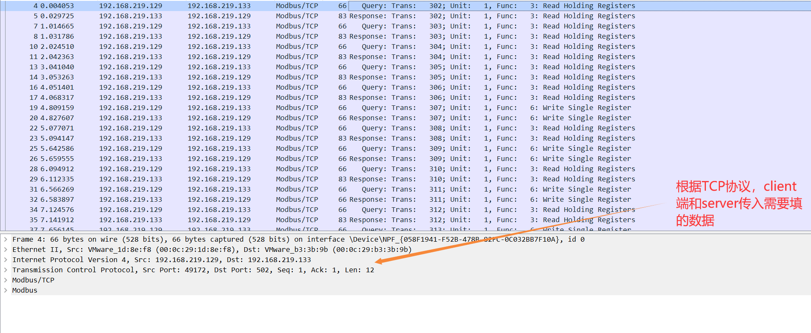
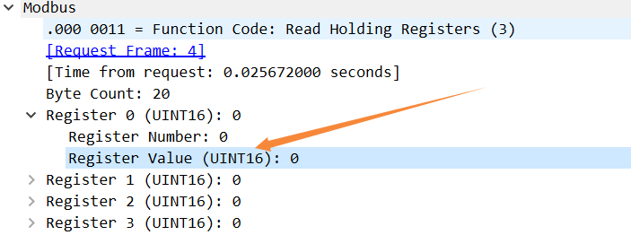
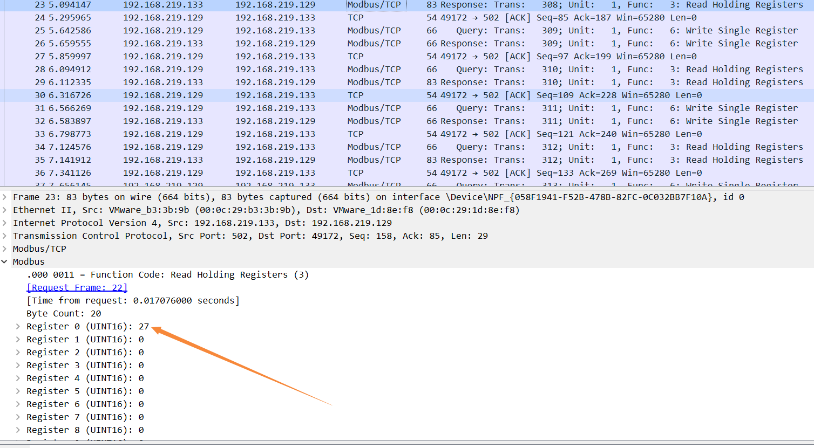

从百草园到三味书屋，我从逆向到流量分析

最近的逆向题天天整这个流量分析，之前学病毒分析的时候就想学了，今日qsdz师傅给我讲了个入门，大概是了解一点了，也可以准备从最近的题目学习一下该题目。--9.2


# 极客巅峰-easy_mb

首先这是签到题的流量，不过和那题逆向是有关联的，像流浪包丢入都是追踪该流


那么根据TCP协议进行交换数据



一个query，请求，一个response，回复

根据Src与Dst标识哪里发到哪里

下面就是具体的相应体了


得去学的

- wireshark的各种操作
- 自己写个自定义协议
- 自己开的socket连上去抓包

- 流量包里有各种流量（流量有各种协议，如TCP、UDP...）
  - TCP流量里又细分modbus流量...

靠做题慢慢积累了，那么这个流量主要是为了告诉你寄存器的小端序存储

这题主要是就是这几个函数，解析的不完全，Encrypt应该就在client里的创建新对象所调用


而Encrypt就要一眼丁真RC5加密（才发现当初西电那题算有点魔改RC5了

在client拿到key和密文即可

```C++
#include <stdio.h>
#include <iostream>
#include <stdio.h>
#include <string>
#include <iostream>
#include <cstring>
#include <stdint.h>

using namespace std;
#define ROTL32(x, c) (((x) << (c)) | ((x) >> (32 - c)))
#define ROTR32(x, c) (((x) >> (c)) | ((x) << (32 - c)))
#define ROTL(x, y) (((x) << (y & (32 - 1))) | ((x) >> (32 - (y & (32 - 1)))))
#define ROTR(x, y) (((x) >> (y & (32 - 1))) | ((x) << (32 - (y & (32 - 1)))))
int w = 32; //字长 32bit 4字节
int r = 12; // 12;//加密轮数12
int b = 16; //主密钥(字节为单位8bit)个数  这里有16个
int t = 26; // 2*r+2=12*2+2=26
int c = 4;  //主密钥个数*8/w = 16*8/32


void generateChildKey(uint8_t *KeyK, uint32_t *ChildKeyS)
{
  // const double e = 2.718281828459;
  // const double Phia = 1.618033988749;

  int PW = 0xB7E15163; // 0xb7e1;
  int QW = 0x9E3779B9; // 0x9e37;//genggai
  int i;
  int u = w / 8; // b/8;
  uint32_t A, B, X, Y;
  uint32_t L[4]; // c=16*8/32
  A = B = X = Y = 0;
  //初始化数组S
  ChildKeyS[0] = PW;
  printf("\n初始子密钥（没有主密钥的参与）：\n%.8X ", ChildKeyS[0]);
  for (i = 1; i < t; i++) // t=26
  {
    if (i % 13 == 0)
      printf("\n");
    ChildKeyS[i] = (ChildKeyS[i - 1] + QW);
    printf("%.8X ", ChildKeyS[i]);
  }
  printf("\n");

  //将K数组转换为L数组
  for (i = 0; i < c; i++) //初始化L数组c=8
  {
    L[i] = 0;
  }

  for (i = b - 1; i != -1; i--) // b=16  转换主密钥数组（16个 单位为8bit）为L数组（8个单位为16bit），数组L每一元素长为16bit，数组K每一元素长为8bit
  {
    L[i / u] = (L[i / u] << 8) + KeyK[i];
  }
  printf("\n把主密钥变换为4字节单位：\n");
  for (i = 0; i < c; i++) // 16进制输出gaidong
  {
    printf("%.8X ", L[i]);
  }
  printf("\n\n");

  //产生子密钥，存储在ChildKeyS中
  for (i = 0; i < 3 * t; i++)
  {
    X = ChildKeyS[A] = ROTL(ChildKeyS[A] + X + Y, 3);
    A = (A + 1) % t;
    Y = L[B] = ROTL(L[B] + X + Y, (X + Y));
    B = (B + 1) % c;
  }
  printf("生成的子密钥（初始主密钥参与和初始子密钥也参与）：");
  for (i = 0; i < t; i++) // 16进制输出
  {
    if (i % 13 == 0)
      printf("\n");
    printf("0X%.8X, ", ChildKeyS[i]);
  }
  printf("\n\n");
}


void Encipher(uint32_t *In, uint32_t *Out, uint32_t *S)
{
  uint32_t X, Y; //定义两个16位存储器
  int i, j;
  for (j = 0; j < 2; j += 2)
  {
    X = In[j] + S[0];     // In[j]+S[0];
    Y = In[j + 1] + S[1]; // In[j+1]+S[1];
    for (i = 1; i <= 12; i++)
    {
      X = ROTL((X ^ Y), Y) + S[2 * i];     // X=ROTL((X^Y),Y) + S[2*i];   异或，循环移位，相加 //ROTL(x,y) (((x)<<(y&(w-1))) | ((x)>>(w-(y&(w-1)))))
      Y = ROTL((Y ^ X), X) + S[2 * i + 1]; // Y=ROTL((Y^X),X) + S[2*i+1];
    }
    Out[j] = X;
    Out[j + 1] = Y; //密文
  }
}
void Decipher(uint32_t *In, uint32_t *Out, uint32_t *S)
{
  	int i = 0, j;
  	uint32_t X, Y;
  	
  	for (j = 0; j < 2; j += 2)
  	{
    	X = In[j];
    	Y = In[j + 1];
	    for (i = 12; i > 0; i--)
	    {
	      	Y = ROTR(Y - S[2 * i + 1], X) ^ X; // Y = ROTR(Y-S[2*i+1],X)^X;相减，循环移位，异或  //ROTR(x,y) (((x)>>(y&(w-1))) | ((x)<<(w-(y&(w-1)))))
	      	X = ROTR(X - S[2 * i], Y) ^ Y;     // X = ROTR(X-S[2*i],Y)^Y;
	    }
    	Out[j] = X - S[0];     // Out[j]=X - S[0];
    	Out[j + 1] = Y - S[1]; //明文 Out[j+1]=Y - S[1];
  	}
}
int main()
{
  	uint8_t inkey[16] = { 0x2D, 0xD6, 0x45, 0x9F, 0x82, 0xC5, 0xB3, 0x00, 0x95, 0x2C, 0x49, 0x1E, 0x48, 0x81, 0xFF, 0x48 };
    uint32_t key[26] = {0};
    
  	generateChildKey(inkey, key);
  	uint32_t v[2] = {0x73189ACE, 0x7C282BAA};
  	uint32_t t[3] = {0};
  	// decode(v, key);
  	Decipher(v, t, key);
  	puts((char *)t);
}
```

打印出来的数据再小端序排序一下即可，因为流量包的缘故



参考ltlly师傅的文章

> https://www.cnblogs.com/FW-ltlly/p/16623930.html


# 极客巅峰-liuliang

好吧我也不知道名字是什么，不过好像是签到题的后面一题，题目提示说是温度传感器有异常数据

查看寄存器发现不同流量的寄存器值不一样，有些特别高，鉴定为异常流量



于是到出到json，搜索一下发现很多异常流量，有些是重复的，所以排除正常温度和重复异常温度

```python
with open("1.json", "r", encoding="utf-8") as f:
  data = f.read().split("\n")

flag = []

for t in data:
  if "Register 0 (UINT16):" in t and "Register 0 (UINT16): 27" not in t and "Register 0 (UINT16): 0" not in t and int(t[-9:-4], 10) not in flag:
    flag.append(int(t[-9:-4], 10))
#    print(int(t[-9:-4], 10), end=", ")

for t in flag:
  print(hex(t)[2:].zfill(4), end="")
```

然后出货）


