# 《第一行代码》

## CH01

### 1.1 Android 王国简介

#### 1.1.3 Android 应用开发特色

**四大组件**

Android系统四大组件分别是活动、服务、广播接收器和内容提供器

- 活动 是所有Android应用程序的门面，凡是看的到的东西，都是放在活动中
- 服务 是没法看到的，但会在后台默默运行。即使用户退出应用，服务仍然是可以继续运行
- 广播接收器 允许你的应用接收来自各处的广播消息，比如电话、短信等，当然我们的应用同样可以向外发出广播消息
- 内容提供器 则是为应用程序之间共享数据提供了可能，比如想要读取电话本里的联系人，就需要内容提供其来实现


### 1.2 搭建开发环境

没啥好记录的


### 1.3 创建我的第一个 Android 项目


#### 1.3.1 创建项目

首先是创建一个工程的过程中要注意设置包名为唯一，因为Android系统通过不同包名来区分不同的应用程序。


#### 1.3.2 启动模拟器

运行我们的程序需要一个载体，所以要么用实体机或者Android的模拟器，该按钮就是用于启动和创建模拟器的


书上用该设备，也可以创建平板、手表、电视等等


接着就是选择操作系统版本，现在是学习 Android 7.0 随即安装即可。

左边的锤子是用来编译项目，下拉列表用来选择运行哪个项目，右边的三角形就是用来运行项目。


#### 1.3.4 分析第一个安卓程序

对这个目标进行了项目的解释（书P18）


首先查看 AndroidManifest.xml，看到如下代码

- 这段代码表示对 MainActivity 这个活动进行注册，没有在 AndroidManifest.xml 里注册的活动是不能使用的
- 其中 intent-filter 标签里的两行代表了 MainActivity 是这个项目的主活动，也就是手机上点击应用图标，首先启动的就是这个活动

```xml
        <activity android:name=".MainActivity">
            <intent-filter>
                <action android:name="android.intent.action.MAIN" />
                <category android:name="android.intent.category.LAUNCHER" />
            </intent-filter>
        </activity>
```

随后来看 MainActivity.java 代码

- MainActivity 继承 AppCompaActivity，这是一个向下兼容的 Activity
- Activity 是 Android 系统提供的一个活动基类，我们项目所有的活动都必须继承它或者它的子类才能拥有活动的特性
- 可以看到有一个 onCreate() 方法，这个方法是一个活动创建时必定要执行的方法

```java
public class MainActivity extends AppCompatActivity {
    private static final String TAG = "MainActivity";
    @Override
    protected void onCreate(Bundle savedInstanceState) {
        super.onCreate(savedInstanceState);
        setContentView(R.layout.activity_main);
    }
}
```

Android 程序讲究**逻辑与视图分离**，不推荐在活动里写界面，所以更加通用的做法是布局文件里编写界面，然后在活动里引用进来。

可以发现代码中还有一行 setContentView() 方法，这里就是这个活动引入了一个 activity_main 布局，该文件就在 res/layout 目录下。


#### 1.3.5 详解项目中的资源

打开 res 目录可以看到


- drawable 开头的文件夹放图片
- mipmap 开头的文件夹用来放图标
- values 开头的文件夹用来放字符串、样式、颜色等配置
- layout 文件夹用来放布局文件

打开 res/values/strings.xml

```xml
<resources>
    <string name="app_name">HelloWorld</string>
</resources>
```

定义了应用程序名的字符串，我们有以下两种方式来引用

- 在代码中通过 R.string.hello_world
- 在 xml 中通过 @string/hello_world

其中的 string 部分是可以替换的，如果要图片就是 drawable，如果是图标就是 mipmap，布局就是 layout

再查看 AndroidManifest.xml 可以清楚

- android:icon 用来指定图标
- android:label 用来指定程序名

如果我们要换的话只需要改引用的值即可

```
        android:allowBackup="true"
        android:icon="@mipmap/ic_launcher"
        android:label="@string/app_name"
        android:roundIcon="@mipmap/ic_launcher_round"
        android:supportsRtl="true"
        android:theme="@style/AppTheme">
```


#### 1.3.6 详解 build.gradle 文件

好多，下次用到再记录 XD（书P23）


### 1.4 日志工具的使用

Android 日志工具类是 Log (android.util.Log)，这个类提供了五个方法，级别从低到高排序为

- Log.v()，用于打印最琐碎、意义最小的日志，对应是 verbose
- Log.d()，用于打印调试信息，对应为 debug
- Log.i()，用于打印比较重要的数据，可以分析用户行为，对应是 info
- Log.w()，用于打印程序中的警告信息，对应 warn
- Log.e()，用于打印程序错误信息，比如程序进入了 catch 语句中，对应 error

于是在代码里添加一句，第一个参数是 tag，一般传入类名，主要用于打印信息进行过滤，第二个是 msg，用于打印想打印的具体内容

```java
    protected void onCreate(Bundle savedInstanceState) {
        super.onCreate(savedInstanceState);
        setContentView(R.layout.activity_main);
        Log.d("MainActivity", "onCreate execute");
    }
```

现在按按钮重新运行或者 Shift + F10，再点击底部的 logcat 即可查看到


由于 Log 的所有打印方法都要传入一个 tag 参数太过麻烦，所以有个**小技巧是在 onCreate 方法外面输入 logt再按下 tab 键**，就会定义 tag 的常量

```java
private static final String TAG = "MainActivity";
```

logcat 并且还有个过滤器功能，之后可以再 log 的tag里用 data 这个过滤器


## CH02

### 2.1 活动是什么

Activity（即答）

### 2.2 活动的基本用法

#### 	2.2.1 & 2.2.2 手动创建活动和布局

这三小节中详细讲述了从一个空项目，主代码，主界面的创建过程。（书P31）

其中几个需要记录的步骤

**创建 Button**

创建的时候有一条语句 android:id="@+id/button_1"，这里的 + 可以理解为增加了一个 id

之后我们进行这个按钮引用的时候就是 @id/button_1 即可


#### 2.2.3 AndroidManifest 文件中注册

所有活动都必须在这里注册，<activity> 标签来进行注册，使用 android:name 来指定具体注册哪个活动，而这里填入的 .FirstActivity 其实是 com.pz.activitytest.FirstActivity 的缩写

```
<activity android:name=".FirstActivity"> </activity>
```

随后需要用 <intent-filter> 标签来设定程序运行起来启动的活动，还能用 android:lable 来指定活动中标题栏的内容

```xml
<activity
            android:name=".FirstActivity"
            android:label="This is FirstActivity">
            <intent-filter>
                <action android:name="android.intent.action.MAIN" />
                <category android:name="android.intent.category.LAUNCHER" />
            </intent-filter>
        </activity>
```


#### 2.2.4 在活动中使用 Toast

Toast 是 Android 系统提供的一种非常好的题型方式，在程序中可以使用它将一些短小的信息通知给用户，这些信息会在一段时间后自动消息，并且不占用屏幕任何空间。

首要需要一个触发点，那就是用刚刚生成的按钮了

```java
    protected void onCreate(Bundle savedInstanceState) {
        super.onCreate(savedInstanceState);
        Log.d("FirstActivity", this.toString());
        setContentView(R.layout.first_layout);
        Button button1 = (Button) findViewById(R.id.button_1);
        button1.setOnClickListener(new View.OnClickListener(){
            @Override
            public void onClick(View v){
                    Toast.makeText(FirstActivity.this, "WOWOW", Toast.LENGTH_SHORT).show();
            }
        });
    }
```

过程为

1. findViewById() 方法获取到在布局文件中定义的元素，这里传入 R.id.button_1 来得到按钮的实例
2. 该方法返回一个 View 对象，向下转型将它转成 Button 对象
3. 得到按钮的实例后调用 setOnClickListener() 方法为按钮注册一个监听器
4. 按按钮时就会执行监听器中的 onClick() 方法

因此，弹出 Toast 功能就在 onClick() 方法中编写了

Toast 函数接收三个参数，第一个是上下文，第二个是文本内容，第三个是显示的时长。


#### 2.2.5 在活动中使用 Menu

菜单的创建如下

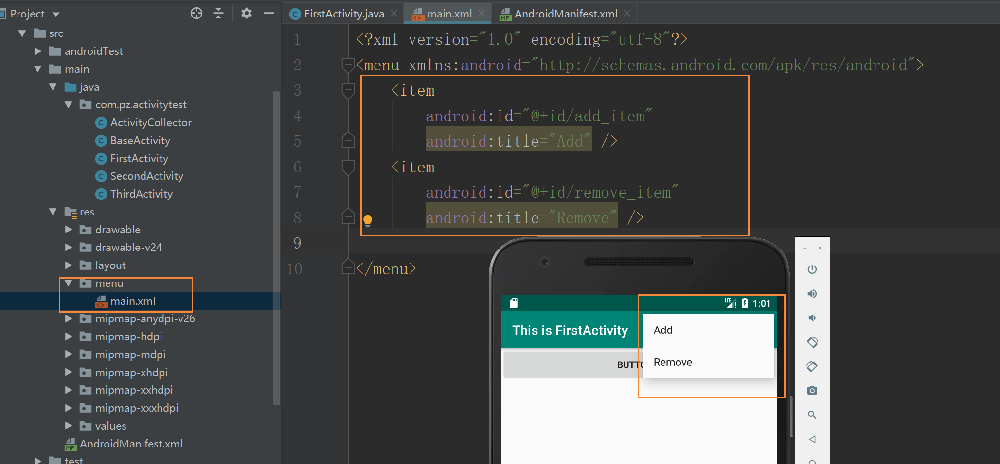

同时我们得重写 onCreateOptionMemu() 方法才可以，按 ctrl + o 可以快速重写


写入代码

```java
    @Override
    public boolean onCreateOptionsMenu(Menu menu) {
        getMenuInflater().inflate(R.menu.main, menu);
        return true;
    }
```

过程为

- 通过 getMemuInflater() 方法能够得到 MenuInflater 对象

- 再调用它的 inflater() 方法就可以给当前活动创建菜单了
- inflate() 方法接收两个参数，第一个参数指定通过哪一个资源文件来创建菜单，第二个参数指定我们的菜单传入到哪一个 Menu 对象当中

最后返回 true 代表可以显示出来，返回了 false 就是不显示了

那么当然还要菜单能用才行，所以重写 onOptionsItemSelevted() 方法

```java
    public boolean onOptionsItemSelected(@NonNull MenuItem item) {
        switch (item.getItemId()) {
            case R.id.add_item:
                Toast.makeText(this, "You click Add", Toast.LENGTH_SHORT).show();
            case R.id.remove_item:
                Toast.makeText(this, "You click Remove", Toast.LENGTH_SHORT).show();
            default:
        }
        return true;
    }
```


#### 2.2.6 销毁一个活动

点击 back 就可以销毁一个活动，在代码中可以用 finish() 方法来销毁一个活动，在监听器中的改成这样就可以点击按钮销毁一个活动。

```java
 button1.setOnClickListener(new View.OnClickListener(){
            @Override
            public void onClick(View v){
                finish();
            }
        });
```


### 2.3 使用 Intent 在活动之间穿梭

如何在主活动跳转到其他活动？


#### 2.3.1 使用显示 Intent

创建 SecondActivity ...

创建 second_layout ...

AndroidManifest.xml 已经自动完成，因为不是主活动所以也不需要配置 intent-filter 标签

于是第二个活动创建好，该如何启动第二个活动，于是引入一个新的概念：Intent

Intent 大致分分为两种，显示 Intent 和隐式 Intent

Intent 有多个构造函数的重载，其中一个是 Intent(Context packageContext, Class<?>)，这个构造函数接收两个参数

- 第一个要求启动活动的上下文
- 第二个要求想要启动的目标活动

通过这个构造函数就可以构建出 Intent 传入 startActivity() 方法就可以启动目标活动

```java
        button1.setOnClickListener(new View.OnClickListener(){
            @Override
            public void onClick(View v){
                Intent intent = new Intent(FirstActivity.this, SecondActivity.class);
                startActivity(intent);
            }
        });
```

如果想返回上一个活动怎么办？按下 Back 键就可以销毁当前活动，从而返回上个活动了。


#### 2.3.2 使用隐式 Intent

隐式 Intent 并不明确指出我们想要启动哪一个活动，而是指定一系列更为抽象的 action 和 category 等信息，然后由系统去分析这个 Intent，并帮我们找出合适的活动去启动。

通过 <activity> 标签下配置 <intent-filter> 的内容，可以指定能够相应的 action 和 category

```xml
        <activity android:name=".SecondActivity">
            <intent-filter>
                <action android:name="com.pz.activitytest.ACTION_START" />
                <category android:name="android.intent.category.DEFAULT" />
            </intent-filter>
        </activity>
```

- action 标签中指定了当前活动可以响应 com.pz.activitytest.ACTION_START 这个 action
- category 标签更精确的指明了当前的活动能够相应的 Intent 中还可能带有 category

只要该 action 和 category 能同时匹配上 Intent 指定的 action 和 category，这个活动才能响应该 Intent

于是在 onClick 写入即可启动该活动

```java
                Intent intent = new Intent("com.pz.activitytest.ACTION_START");
                startActivity(intent);
```

- 这里也用了 Intent 的另一个构造函数

- 由于在 xml 的 category 设置的是 DEFAULT，所以 startActivity() 方法会自动把这个 category 添加到 Intent

每个 Intent 中只能指定一个 action，但却能指定多个 category，所以添加一句自己的 category

```java
intent.addCategory("com.pz.activitytest.MY_CATEGORY");
```

而就这样添加了会报错，因为没有任何这个活动有这个 category，所以去 xml 里设置该 category 即可

```
        <activity android:name=".SecondActivity">
            <intent-filter>
                <action android:name="com.pz.activitytest.ACTION_START" />
                <category android:name="android.intent.category.DEFAULT" />
                <category android:name="com.pz.activitytest.MY_CATEGORY" />
            </intent-filter>
        </activity>
```


#### 2.3.3 更多隐式 Intent 的用法

使用隐式 Intent，不仅可以启动自己程序的活动，还可以启动其他程序内的活动，这让 Android 多个应用程序之间的功能共享成为了可能。

启动一个网页

```java
        button1.setOnClickListener(new View.OnClickListener(){
            @Override
            public void onClick(View v){
                Intent intent = new Intent(Intent.ACTION_VIEW);
                intent.setData(Uri.parse("http://www.baidu.com"))
                startActivity(intent);
            }
        });
```

- Android 系统内置动作 Intent.ACTION.VIEW
- Uri.parse() 将网址地址串解析成一个 Uri 对象
- 再调用 Intent.setData() 方法将这个 Uri 对象传入

与此相应，也可以在 intent-filter 标签再配置一个 data 标签，用于更精确的指定 活动 能够响应什么类型的数据

- android:scheme 用于指定协议部分，如 http 部分
- android:host 用于指定数据的主机名部分，如上例的 www.baidu.com 部分
- android:port 用于指定数据的端口部分，一般紧跟主机名之后
- android:path 用于指定端口之后的部分
- android:mimeType 用于指定可以处理的数据类型，允许使用通配符的方式指定

接着创建 ThridActvitiy，AndroidManifest.xml 设置

```xml
        <activity android:name=".ThirdActivity">
            <intent-filter>
                <action android:name="android.intent.action.VIEW" />
                <category android:name="android.intent.category.DEFAULT" />
                <data android:scheme = "http" />
            </intent-filter>
        </activity>
```

随后按下 button1 会弹出所有可以相应这个 Intent 的程序，虽然也弹出 ThirdActivity，但并没有解析网页的功能


除了 http 协议外，还有 geo 表示地址位置、tel 表示拨打电话

```java
        button1.setOnClickListener(new View.OnClickListener(){
            @Override
            public void onClick(View v){
                Intent intent = new Intent(Intent.ACTION_DIAL);
                intent.setData(Uri.parse("tel:10086"));
                startActivity(intent);
            }
        });
```


#### 2.3.4 向下一个活动传递数据

首先是在启动活动时传递数据，Intent 中提供了一系列 putExtra() 方法的重载，可以把我们想要传递的数据存在 Intent 中，启动另一个活动后，再从 Intent 中取出即可。

```java
        button1.setOnClickListener(new View.OnClickListener(){
            @Override
            public void onClick(View v){
                String data = "hello Second";
                Intent intent = new Intent(FirstActivity.this, SecondActivity.class);
                intent.putExtra("extra_data", data);
                startActivity(intent);
            }
        });
```

这里使用显示 Intent 的方式来启动 SecondActivity，并通过 putExtra() 方法来传递一个字符串，注意第一个参数是 键，第二个参数才是真正传递的数据。

随后在 SecondActivity 获取并打印

```java
        Intent intent = getIntent();
        String data = intent.getStringExtra("extra_data");
        Log.d(TAG, data);
```

如果传递整形数据，使用 getIntExtra() 方法；如果传递布尔型数据，则使用 getBooleanExtra() 方法；以此类推。


#### 2.3.5 返回数据给上一个活动

返回上一个活动只需要按一下 back 键，并没有用于启动 Intent 来传递数据。

所以还有一个方法 startActivityForResult() 方法也用于启动活动，不过这个方法是活动销毁的时候能够返回一个结果给上一个活动，该方法接收两个参数，第一个参数还是 Intent，第二个参数是请求码。

```java
        button1.setOnClickListener(new View.OnClickListener(){
            @Override
            public void onClick(View v){
                String data = "hello Second";
                Intent intent = new Intent(FirstActivity.this, SecondActivity.class);
                startActivityForResult(intent, 1);
            }
        });
```

接下来给 SecondActivity 注册点击事件，并在点击事件中添加返回数据的逻辑

```java
        Button button2 = (Button) findViewById(R.id.button_2);
        button2.setOnClickListener(new View.OnClickListener(){
            @Override
            public void onClick(View v) {
                Intent intent = new Intent();
                intent.putExtra("data_return", "Hello FirstActivity");
                setResult(RESULT_OK, intent);
                finish();
            }
        });
```

可以看见还构建了一个 Intent，不过这个 Intent 仅仅用于传递数据，没有指定任何 “意图”。

随后调用 setResult() 方法，该方法接收两个参数

- 第一个用于向上一个活动返回处理结果，一般只使用 RESULT_OK 或 RESULT_CANCELED
- 第二个把有参数的 Intent 传递回去

然后调用 finish() 来销毁当前活动。

由于我们是使用 startActivityForResult() 方法来启动 SecondActivity，所以在 SecondActivity 被销毁之后会调用上一个活动的 onActivityResult() 方法，因此需要在 FirstActivity 中重写这个方法

```java
    protected void onActivityResult(int requestCode, int resultCode, Intent data){
        switch (requestCode){
            case 1:
                if (resultCode == RESULT_OK){
                    String returnedData = data.getStringExtra("data_return");
                    Log.d("FirstActivity", returnedData);
                }
                break;
            default:
        }
    }
```

- 第一个参数是 requestCode，即我们在启动活动传入的请求码
- 第二个参数是 resultCode，即返回参数时传入的处理结果
- 第三个参数 data，即携带返回数据的 Intent

由于每个活动中可能会调用 startActivityForResult() 方法去启动很多不同的活动，每一个活动返回的数据都会调到 onActivityResult() 这个方法，所以要检查 requestCode 的值来判断数据来源，再通过 resultCode 的值来判断处理结果是否成功。

还有情况是用户直接点击 Back 键回到 FirstActivity，这时候要在 SecondActivity 中重写 onBackPressed() 方法来解决这个问题

```java
    public void onBackPressed(){
        Intent intent = new Intent();
        intent.putExtra("data_return", "Hello FirstActivity");
        setResult(RESULT_OK, intent);
        finish();
    }
```

当用户按下 Back 键，就会执行 onBackPressed() 方法中的代码，我们在这里添加返回的数据即可。


### 2.4 活动的生命周期

#### 2.4.1 返回栈

Android 中的活动是层叠的，每启动一个活动就会覆盖到原活动之上，点击 Back 销毁最上面的活动，这就是返回栈。

（详情看书P53）

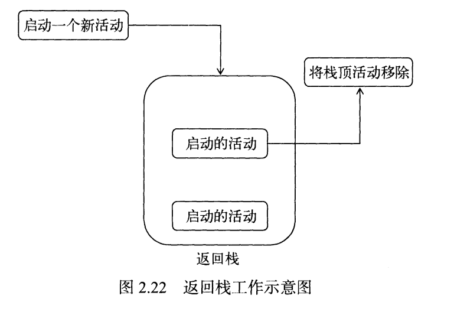


#### 2.4.2 活动状态

每个活动在其生命周期最多可能会有4个状态。

**运行状态**

当一个活动位于返回栈顶，就是运行状态。


**暂停状态**

当一个活动不再处于栈顶位置，但仍然可见，这时活动就进入了暂停状态。


**停止状态**

当一个活动不再处于栈顶位置，并且完全不可见的时候，就进入了停止状态。


**销毁状态**

当活动从返回栈移除后就变成了销毁状态。


#### 2.4.3 活动的生存期

Activity 类定义了 7个回调方法，覆盖了活动生命周期的每一个环节

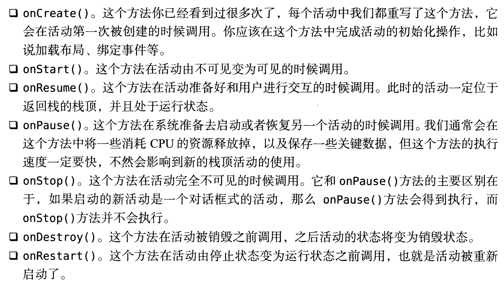

除了onRestart() 方法，其他都是两两相对，又可以分成 3种生存期

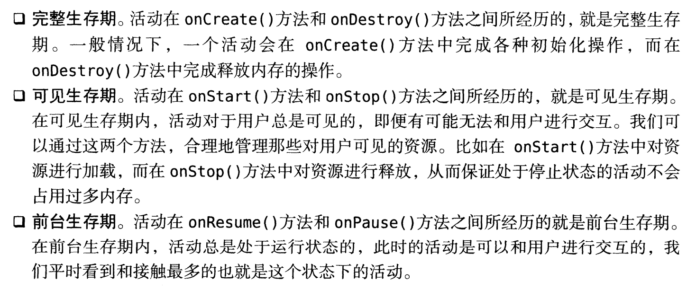

Android 方法提供了一张活动生命周期的示意图

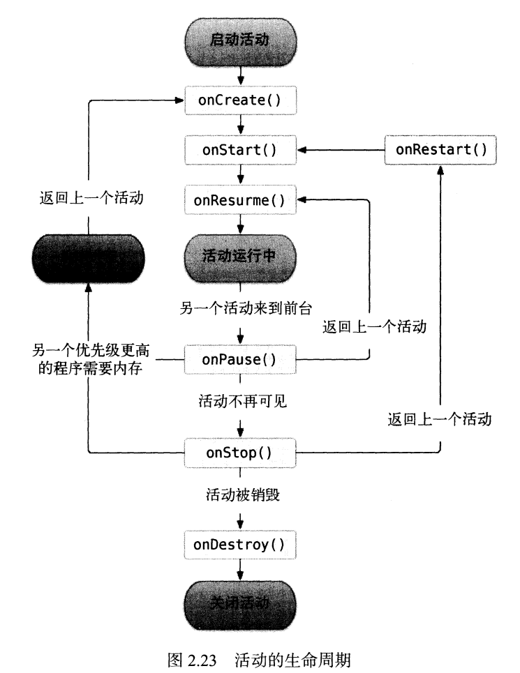

- 左边看不清的是 kill process
- 下面看不清的是 close activity


#### 2.4.4 体验活动的生命周期

创建了一个新的工程文件，随后起了两个网页，并重写了主函数中上述的那些方法，打印出来让我们感受一下上述那图。

（书 P56 页）


#### 2.4.5 活动被回收了怎么办

如果活动A进入到停止状态有可能会被系统回收的，那么如果活动A中可能存在临时数据和状态就会影响用户体验。

所以应对这种情况，Activity 中还提供了一个 onSaveInstanceState() 回调方法，这个方法可以提供回收之前一定被调用，因此我们可以通过这个方法来解决被回收时临时数据得不到保存的问题。

onSaveInstanceState() 方法会携带一个 Bundle 类型的参数，Bundle 提供了一系列的方法用于保存数据，比如使用 putString() 方法来保存字符串， putInt() 用来保存整形，以此类推，每个保存方法都需要传入两个参数

- 第一个参数是 键，用于后面从 Bundle 取值
- 第二个参数是 真正要保存的内容

在 MainActivity 中可以这样保存数据

```java
    protected void onSaveInstanceState(Bundle outState){
        super.onSaveInstanceState(outState);
        String tempData = "emmmmmmm";
        outState.putString("data_key", tempData);
    }
```

那么数据保存下来了还如何恢复？onCreate() 方法其实也有一个 Bundle 类型的参数，这个参数一般情况下都是 null，但是活动被系统回收前有通过 onSavaInstanceState() 方法来保存数据的话，这个参数就会带有之前保存的数据

```java
        if (savedInstanceState != null){
            String tempData = savedInstanceState.getString("data_key");
            Log.d(TAG, tempData);
        }
```

之后就做相对应的恢复即可。

我们在使用 Intent 传递数据时也是用的类似的方法，Intent 还可以结合 Bundle 一起传递数据，首先传递的数据都保存在 Bundle 对象中，然后再讲 Bundle 对象放在 Intent 里，到了目标活动之后先对 Intent 中取出 Bundle，再从 Bundle 中一一取出数据。


### 2.5 活动的启动模式

需要在特定的需求为每个活动指定恰当的启动模式。启动模式有4种，分别是 standard、singleTop、singleTask 和 singleInstance，可以在 AndroidManifest.xml 中通过给 activity 标签指定 android:launchMode 属性来选择启动模式。


#### 2.5.1 standard

在该模式下的活动是由返回栈来管理活动的，每当启动一个活动，就在会返回栈中入栈，并在栈顶的位置。

**所以在该模式下，系统不会在乎这个活动是否在返回栈中已经存在，每次启动都会创建该活动的一个新的实例。**

于是做个实验，在 FirstActivity 里再启动一次 FirstActivity

```java
    protected void onCreate(Bundle savedInstanceState) {
        super.onCreate(savedInstanceState);
        Log.d("FirstActivity", this.toString());
        setContentView(R.layout.first_layout);
        Button button1 = (Button) findViewById(R.id.button_1);
        button1.setOnClickListener(new View.OnClickListener(){
            @Override
            public void onClick(View v){
                Intent intent = new Intent(FirstActivity.this, FirstActivity.class);
                startActivity(intent);
            }
        });
    }
```

连续点击两次可以发现

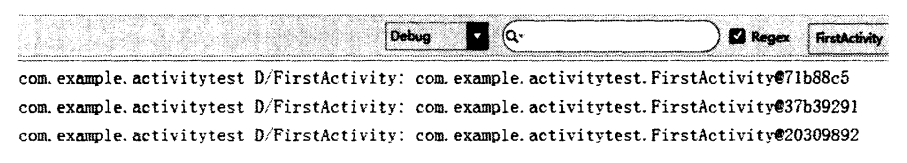

所以要退出这个程序需要按三次 Back 键

standard 模式原理示意图

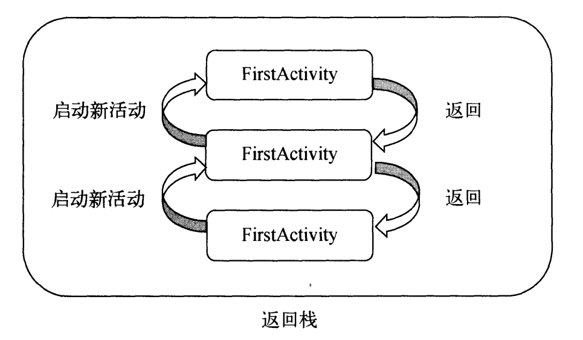


#### 2.5.2 singleTop

如果觉得 standard 模式不合理，可以用 singleTop，**该模式下启动活动会检测返回栈的栈顶里是否已经有该活动了**，如果有就直接使用，不会像标准模式下的反复启动了，**如果不在栈顶，还是会创建新的实例的**。

```xml
<activity
            android:name=".FirstActivity"
            android:launchMode = "singleTop"
            android:label="This is FirstActivity">
            <intent-filter>
                <action android:name="android.intent.action.MAIN" />
                <category android:name="android.intent.category.LAUNCHER" />
            </intent-filter>
        </activity>
```

相关代码（书 P66）

singleTop 模式原理示意图

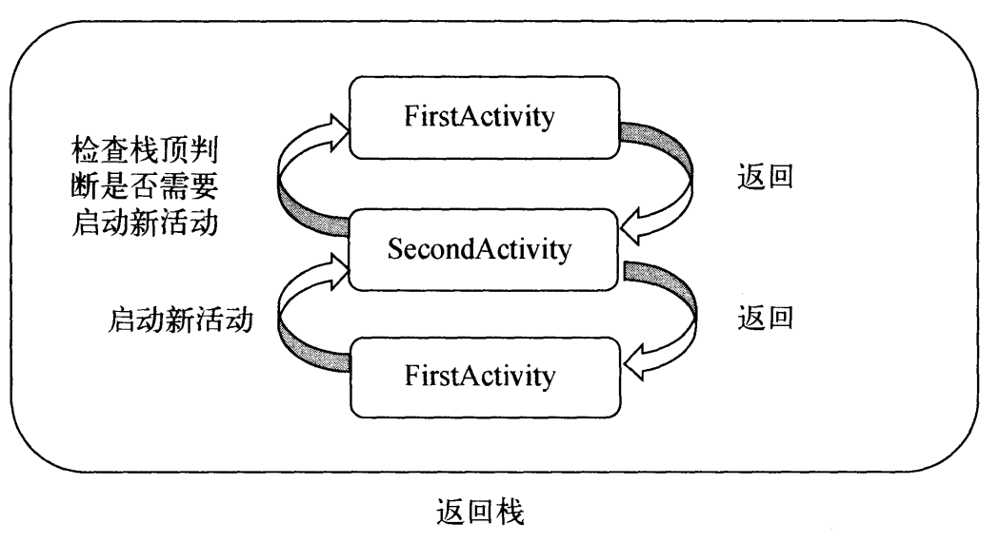


#### 2.5.3 singleTask

**该方法是解决整个返回栈只有唯一一个实例，在返回栈找到之后，把活动之上的所有活动统统出栈，如果没有发现就创建一个新的实例。**

```xml
<activity
            android:name=".FirstActivity"
            android:launchMode = "singleTask"
            android:label="This is FirstActivity">
            <intent-filter>
                <action android:name="android.intent.action.MAIN" />
                <category android:name="android.intent.category.LAUNCHER" />
            </intent-filter>
</activity>
```

相关代码（书 P67）

singleTask 相关示意图

​	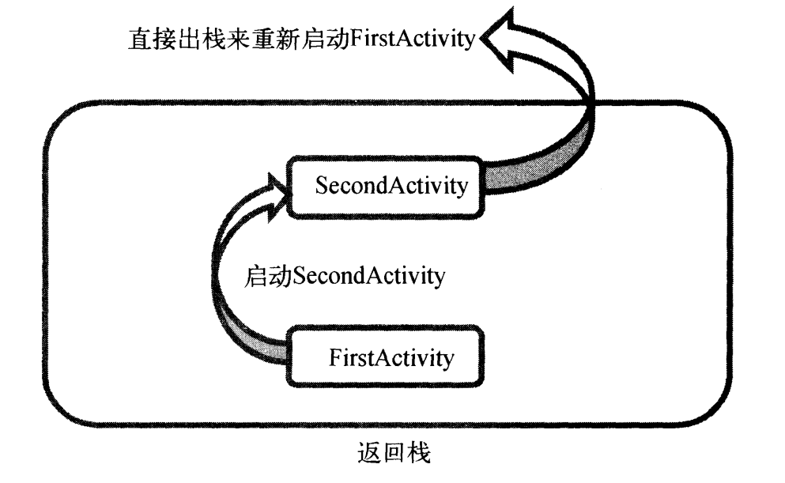


#### 2.5.4 singleInstance

不同与前三种启动模式，**该模式的活动会启用一个新的返回栈来管理该活动**（如果 singleTask 模式指定了不同的 taskAffinity，也会启动一个新的返回栈）。

该模式主要是解决与其他程序共享这个活动的实例，比如 A 和 B 程序都有自己的返回栈，而同一个实例在不同返回栈入栈必然是创建了新的实例，所以用该模式启动该实例时创建了一个新的返回栈，这不管是哪个程序访问这个活动，都共用一个返回栈，解决了共享实例的问题。

设置该活动为该模式

```xml
<activity android:name=".SecondActivity"
            android:launchMode="singleInstance">
            <intent-filter>
                <action android:name="com.pz.activitytest.ACTION_START" />
                <category android:name="android.intent.category.DEFAULT" />
                <category android:name="com.pz.activitytest.MY_CATEGORY" />
            </intent-filter>
</activity>
```

在每个活动里打印当前返回栈的 id

```java
    @Override
    protected void onCreate(Bundle savedInstanceState) {
        super.onCreate(savedInstanceState);
        Log.d("FirstActivity", "Task id is" + getTaskId());
        setContentView(R.layout.first_layout);
        Button button1 = (Button) findViewById(R.id.button_1);
        button1.setOnClickListener(new View.OnClickListener(){
            @Override
            public void onClick(View v){
                Intent intent = new Intent(FirstActivity.this, SecondActivity.class);
                startActivity(intent);
            }
        });
    }
```

```java
    protected void onCreate(Bundle savedInstanceState) {
        super.onCreate(savedInstanceState);
        Log.d(TAG, "Task id is" + getTaskId());
        setContentView(R.layout.second_layout);
        Button button2 = (Button) findViewById(R.id.button_2);
        button2.setOnClickListener(new View.OnClickListener(){
            @Override
            public void onClick(View v) {
                Intent intent = new Intent(SecondActivity.this, ThirdActivity.class);
                startActivity(intent);
            }
        });
    }
```

```java
    protected void onCreate(Bundle savedInstanceState) {
        super.onCreate(savedInstanceState);
        Log.d(TAG, "Task id is " + getTaskId());
        setContentView(R.layout.third_layout);
    }
```

启动程序按按钮可以发现

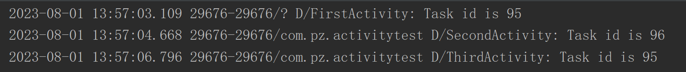

这时候按返回键，会发现 ThirdActvitiy 直接返回到 FirstActivity，再按下 Back 又返回到 SecondActivity。

因为 First 和 Third 是同一个返回栈，Third 出栈，First 就成了栈顶，First 再返回这时候返回栈就空了，于是显示了另一个返回栈的栈顶活动即 Second，这时候再按返回就退出了程序。

singleInstance 模式原理示意图

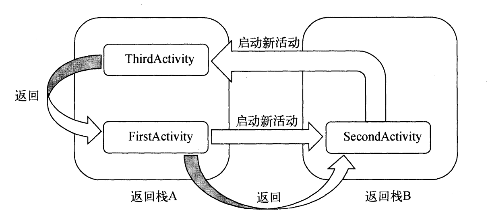


### 2.6  活动的最佳实践

#### 2.6.1 知晓当前是在哪一个活动

看自己代码当然知道在哪一个活动，但是看别人代码就可能找不到了，本节就是讲解这个。

首先需要创建一个 BaseActivity 类，直接找到该包 -> new -> Java Class，注意这个活动和普通活动创建不太一样，因为不需要在 xml 里面注册，所以创建一个普通的 Java 类就可以了。

```java
    protected void onCreate(Bundle savedInstanceState){
        super.onCreate(savedInstanceState);
        Log.d("BaseActivity", getClass().getSimpleName());
        ActivityCollector.addActivity(this);
    }
```

在 onCreate 方法中获取了当前实例的类名，并通过 Log 打印出来了。

接下来让所有的活动修改继承结构，不再继承 AppCompatActivity，而是继承 BaseActivity，由于该活动继承 AppCompatActivity 的，所以所有活动的现有功能不受影响，它们仍然继承了 Activity 中的所有特性。

现在每当我们进入到一个活动的界面，该活动的类名就会被打印出来，这样就可以时时刻刻知晓当前界面对应的是哪一个活动了。

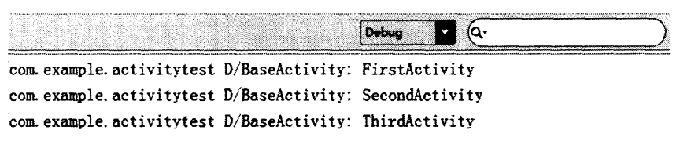


#### 2.6.2 随时退出程序

当手机界面到了 Third，就需要按三次返回才能退出，其实这也牵扯了**如果我们需要一个程序注销或退出的功能该怎么写**，必须要有一个随时随地退出程序方案。

新建一个 ActivityCollector 类作为活动管理器

```java
package com.pz.activitytest;

import android.app.Activity;

import java.util.ArrayList;
import java.util.List;

public class ActivityCollector {

    public static List<Activity> activities = new ArrayList<>();

    public static void addActivity(Activity activity){
        activities.add(activity);
    }

    public static void removeActivity(Activity activity){
        activities.remove(activity);
    }

    public static void finishAll(){
        for (Activity activity : activities){
            if (!activity.isFinishing())
                activity.finish();
            }
        }
    }
}
```

在该活动管理器中

- 通过一个 List 来暂存活动
- 提供一个 addActivity() 方法用于向 List 中添加一个活动
- 提供一个 removeActivity() 方法用于从 List 中移除活动
- 最后提供一个 finishAll() 方法用于将 List 中存储的活动全部销毁

接下来修改 BaseActivity 代码

```java
public class BaseActivity extends AppCompatActivity {

    @Override
    protected void onCreate(Bundle savedInstanceState){
        super.onCreate(savedInstanceState);
        Log.d("BaseActivity", getClass().getSimpleName());
        ActivityCollector.addActivity(this);
    }

    @Override
    public void onDestroy(){
        super.onDestroy();
        ActivityCollector.removeActivity(this);
    }

}
```

每次创建与销毁都会对应修改活动管理器，之后不管想在什么地方退出只需要调用 finishAll 即可。

当然还可以在销毁所有活动的代码后面再加上关掉当前进程的代码，以保证进程完全退出，其方法是 killProcess()，该方法接收一个进程的 id，可以用 myPid() 方法获取，需要注意的是该关进程方法只能用于关当前进程，不能用这个方法关其他进程。


#### 2.6.3 启动活动的最佳方法

作者提供了一个思维矫正，当我们启动一个活动传递的数据该怎么写，比如我们 First 要启动 Second，而且带有两个数据

首先在 Second 里添加一个方法

```java
    public static void actionStart(Context context, String data1, String data2) {
        Intent intent = new Intent(context, SecondActivity.class);
        intent.putExtra("param1", data1);
        intent.putExtra("param2", data2);
        context.startActivity(intent);
    }
```

这样写在 First 里也简化了代码

```java
            public void onClick(View v){
                SecondActivity.actionStart(FirstActivity.this, "data1", "data2");
            }
```

养成这个好习惯，以后编写的每个活动都添加类似的方法。


